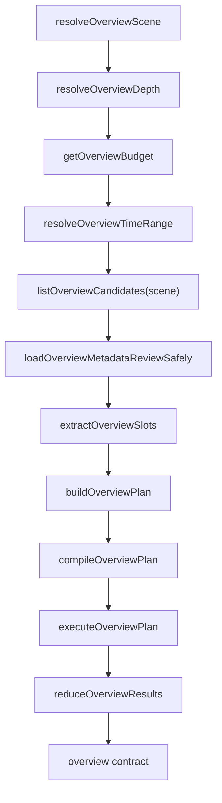

# Overview Candidate Planner 重构说明

日期：2026-05-07

## 1. 本次改造目标

本次改造的目标，是把原来 `overview-module.js` 里“按 scene 展开固定概览查询列表”的实现，改造成：

- 以 `candidate query knowledge base` 为中心
- 运行时由 `overview planner` 按上下文动态选题
- 执行阶段不自由试错
- 单个 candidate 失败不拖垮整个 overview
- 输出天然支持 partial result

这次改造后，概览链路不再依赖 `template / hardcoded template` 语义，也不再把固定查询列表直接当作执行计划。

## 2. 新增模块

本次新增 6 个模块：

- [OverviewCandidateRegistry.js](g:\my_file\项目测试\观枢·智维平台-GAIOP\project_3\NAPM_Semantic_Gateway\skills\openclaw-napm-query\scripts\OverviewCandidateRegistry.js)
- [OverviewPlanner.js](g:\my_file\项目测试\观枢·智维平台-GAIOP\project_3\NAPM_Semantic_Gateway\skills\openclaw-napm-query\scripts\OverviewPlanner.js)
- [OverviewPlanCompiler.js](g:\my_file\项目测试\观枢·智维平台-GAIOP\project_3\NAPM_Semantic_Gateway\skills\openclaw-napm-query\scripts\OverviewPlanCompiler.js)
- [OverviewBudget.js](g:\my_file\项目测试\观枢·智维平台-GAIOP\project_3\NAPM_Semantic_Gateway\skills\openclaw-napm-query\scripts\OverviewBudget.js)
- [OverviewExecution.js](g:\my_file\项目测试\观枢·智维平台-GAIOP\project_3\NAPM_Semantic_Gateway\skills\openclaw-napm-query\scripts\OverviewExecution.js)
- [OverviewResultReducer.js](g:\my_file\项目测试\观枢·智维平台-GAIOP\project_3\NAPM_Semantic_Gateway\skills\openclaw-napm-query\scripts\OverviewResultReducer.js)

主入口仍然是：

- [overview-module.js](g:\my_file\项目测试\观枢·智维平台-GAIOP\project_3\NAPM_Semantic_Gateway\skills\openclaw-napm-query\scripts\overview-module.js)

但它现在只负责编排，不再自己维护固定概览查询表。

## 3. 新链路

`overview-module.js` 现在线路如下：

```text
resolveOverviewScene()
-> resolveOverviewDepth()
-> getOverviewBudget()
-> resolveOverviewTimeRange()
-> listOverviewCandidates(scene)
-> loadOverviewMetadataReviewSafely()
-> extractOverviewSlots()
-> buildOverviewPlan()
-> compileOverviewPlan()
-> executeOverviewPlan()
-> reduceOverviewResults()
-> 返回 overview contract 数据
```

### 3.1 流程图



对应职责如下：

- `resolveOverviewScene()`
  根据 `payload / intent / prompt / resolvedQuery.groups` 推断概览场景。

- `resolveOverviewDepth()`
  解析 `fast / standard / deep` 深度。

- `getOverviewBudget()`
  返回本次概览允许消耗的 query、child、超时和重试预算。

- `listOverviewCandidates(scene)`
  从 candidate registry 取出本 scene 下可参与规划的候选项。

- `loadOverviewMetadataReviewSafely()`
  基于 `NapmMetadataService` 对候选查询做 metadata review，但这一步是 safe review，不会因为 review 失败中断整个 overview。

- `extractOverviewSlots()`
  从 `prompt / resolvedQuery / semanticConstraints / anchorObject` 中抽取规划槽位。

- `buildOverviewPlan()`
  按候选优先级、scene、depth、问题类型、metadata 健康度、查询成本、依赖关系、预算做选择。

- `compileOverviewPlan()`
  将 planner 选中的 candidate 编译成真实待执行 query，并分配 child 预算。

- `executeOverviewPlan()`
  执行 root query 和有限 child query，记录跳过原因、失败原因和执行统计。

- `reduceOverviewResults()`
  把执行数据归约成最终 overview contract。

## 4. Candidate Registry 设计

`OverviewCandidateRegistry.js` 负责承载概览知识库。

每个 candidate 至少包含这些信息：

- `id`
- `label`
- `scenes`
- `role`
- `priority`
- `minDepth`
- `request`
- `capability`
- `cost`

部分 candidate 还会携带：

- `childCandidateIds`
- `dependsOnCandidateIds`
- `deriveArgument`
- `recommendedMaxChildren`
- `slotRequirements`

当前 registry 已将《概览构建.md》里的系统、业务、应用、网络、安全概览项转成 candidate 形式，并去掉了以下旧模式：

- 固定 URL
- 固定 host
- 固定 start/end
- 固定执行顺序

也遵守了下面这些限制：

- 不默认把 `HTTP` 当 `applicationName`
- 不默认执行前五个 trend child query
- 不把概览执行做成执行时自由试错

## 5. Budget 设计

`OverviewBudget.js` 中已落地三档预算：

### 5.1 fast

```text
maxQueries=3
maxChildren=0
timeoutMs=8000
maxRetriesPerQuery=0
```

### 5.2 standard

```text
maxQueries=5
maxChildren=2
timeoutMs=15000
maxRetriesPerQuery=0
```

### 5.3 deep

```text
maxQueries=8
maxChildren=4
timeoutMs=30000
maxRetriesPerQuery=1
```

当前策略下：

- `fast` 不跑 child
- `standard` 可以跑少量 child
- `deep` 才会较积极地下钻

## 6. Planner 设计

`OverviewPlanner.js` 负责两个核心动作：

- `extractOverviewSlots()`
- `buildOverviewPlan()`

### 6.1 slot 抽取

当前 planner 会抽这些信息：

- `scene`
- `questionType`
- `metricCodes`
- `metricDomains`
- `objectTypes`
- `requestedTopCount`
- `focusObject`
- `anchorGroups`
- `slotValues`
- `metadataAvailableGroupTypes`

其中 `slotValues` 当前支持：

- `focusDefinedApp`
- `focusWebApplication`
- `focusBusinessGroup`
- `focusIpAddress`

### 6.2 root candidate 评分

root candidate 当前综合这些因素评分：

- scene 匹配
- questionType 匹配
- metric 精确命中
- metric domain 命中
- object type 命中
- focus object 命中
- metadata 健康度
- query cost

同时也会因为以下原因直接不选：

- 缺失 slot
- 深度不足
- metadata hard issue
- root query 预算不足

### 6.3 child candidate 选择

child candidate 选择受这些约束：

- 必须依赖某个已选 root candidate
- `fast` 默认不跑 child
- `standard` 不会无脑展开低优先级 child
- `deep` 才更容易拿到更多 child 预算

这样做的目的，是避免旧逻辑里“默认把 topN 后面的趋势全展开”的问题。

## 7. Metadata Review 设计

`loadOverviewMetadataReviewSafely()` 当前复用了 `NapmMetadataService` 的能力：

- `getFlattenedGroups()`
- `getGranularities()`
- `reviewQuery()`

设计原则是：

- metadata review 尽量在 planner 之前完成
- metadata review 结果参与 candidate 筛选和打分
- metadata review 失败只记 warning，不中断整个 overview

当前区分了两类 metadata issue：

- hard issue
- soft issue

hard issue 会阻断 candidate 入选，soft issue 只会降分。

## 8. Plan Compiler 设计

`OverviewPlanCompiler.js` 负责把“候选计划”变成“可执行计划”。

它做了这些事情：

- 将 selected root candidate 编译成真实 query
- 将 selected child candidate 绑定到已选 parent
- 按 budget 分配 child query 名额
- 将 slot 值填充到 query groups
- 将 seed group 上下文锚点带入 query
- 根据 metadata review 调整 granularity

这一层是为了确保执行阶段只执行已编译计划，不在运行时现场“猜”下一步。

## 9. Execution 设计

`OverviewExecution.js` 的原则是：

- 只执行编译后的计划
- 受预算和超时控制
- root 和 child 都统计成功/失败
- 某一条失败只影响本 candidate，不影响整个 overview

当前执行层具备这些行为：

- 支持 `maxRetriesPerQuery`
- 支持 `timeoutMs`
- 支持 child budget 消耗
- 如果 root 失败，则依赖该 root 的 child 会被标记为 skipped
- 如果 child 没有可派生对象，会记为 skipped

明确禁止的旧行为已经去掉：

- 查询失败后继续“再试一次看看”式自由试错
- 某个模块失败导致整个 overview 失败

## 10. Result Reducer 与输出契约

`OverviewResultReducer.js` 负责把执行结果整理成 overview contract。

当前输出保证包含：

- `selectedCandidates`
- `skippedCandidates`
- `modules`
- `warnings`
- `executionMeta.queryCount`
- `executionMeta.successCount`
- `executionMeta.failedCount`
- `renderPolicy.allowPartialResult = true`

同时 overview 顶层还会保留：

- `scene`
- `depth`
- `start`
- `end`
- `queries`
- `topFindings`
- `planning`

`executionMeta` 当前包含：

- `queryCount`
- `successCount`
- `failedCount`
- `durationMs`
- `timeoutMs`
- `childBudgetUsed`
- `remainingChildBudget`

## 11. 与旧版的关键差异

旧版概览的核心问题是：

- `scene -> 固定查询数组`
- 选哪些查项基本是写死的
- child 展开方式比较机械
- 执行层承担了部分“边查边决定”的责任

新版的关键差异是：

- 从“固定概览模板”变成“candidate knowledge base”
- 从“固定 scene 列表”变成“planner 动态选题”
- 从“执行时顺手扩展 child”变成“先 compile 再 execute”
- 从“失败影响总链路”变成“partial result 优先”

## 12. 当前已知限制

这次重构已经把骨架搭稳，但还有一些后续可以继续增强的点：

- candidate 多样性约束还比较基础
- metadata review 目前主要做可执行性和 granularity 约束
- reducer 当前主要归约 root module，child 仍偏轻量摘要
- planner 还没有引入跨 scene 的组合覆盖策略
- 部分摘要文本仍受原文件编码历史影响，后续可以统一做 UTF-8 清理

## 13. 后续建议

建议后续按这个顺序继续迭代：

1. 增强 planner 的 scene 内多样性约束  
   避免同一轮概览全被某一类排行项占满。

2. 增强 metadata compatibility 评分  
   不只是能不能跑，还要区分“强支持”“弱支持”“高风险支持”。

3. 增加 candidate registry 注释规范  
   明确每个 candidate 的业务意图、适用场景、风险和 child 策略。

4. 增强 child reducer  
   让 child query 的结果也能更稳定地进入最终 top findings。

5. 做真实联调回归  
   重点覆盖：
   - fast 不跑 child
   - standard 不默认展开全部趋势
   - deep 能受预算约束下做有限下钻
   - 局部失败仍返回 overview

## 14. 如何新增一个 overview candidate

如果后续需要增加新的概览候选项，建议按下面顺序做。

### 14.1 第一步：在 registry 中定义 candidate

文件：

- [OverviewCandidateRegistry.js](g:\my_file\项目测试\观枢·智维平台-GAIOP\project_3\NAPM_Semantic_Gateway\skills\openclaw-napm-query\scripts\OverviewCandidateRegistry.js)

最小字段建议包含：

- `id`
- `label`
- `scenes`
- `role`
- `priority`
- `minDepth`
- `request`
- `capability`
- `cost`

如果是 root candidate，通常这样定义：

```js
{
  id: 'exampleTopCandidate',
  label: '示例排行',
  scenes: ['network'],
  role: 'standalone',
  priority: 80,
  minDepth: 'standard',
  request: {
    service: 'topValues',
    groups: [{ type: 'IPAddress' }],
    metrics: ['TPIO'],
    topMetric: 'TPIO',
    topCount: 5
  },
  capability: {
    questionTypes: ['overview', 'topn'],
    metricDomains: ['network', 'traffic'],
    objectTypes: ['IPAddress']
  },
  cost: {
    rootQueries: 1
  }
}
```

### 14.2 第二步：如果需要下钻，再新增 child candidate

child candidate 需要额外定义：

- `dependsOnCandidateIds`
- `recommendedMaxChildren`
- `deriveArgument`

示例：

```js
{
  id: 'exampleTrendChild',
  label: '示例趋势',
  scenes: ['network'],
  role: 'child',
  priority: 70,
  minDepth: 'standard',
  dependsOnCandidateIds: ['exampleTopCandidate'],
  recommendedMaxChildren: 3,
  request: {
    service: 'timeValues',
    groups: [{ type: 'IPAddress' }],
    metrics: ['TPIO'],
    granularity: 3600
  },
  deriveArgument: {
    source: 'group',
    targetParam: 'groupArgument1'
  },
  capability: {
    questionTypes: ['overview', 'trend'],
    metricDomains: ['network', 'traffic'],
    objectTypes: ['IPAddress']
  },
  cost: {
    childQueries: 1
  }
}
```

### 14.3 第三步：确认是否需要 slot

如果这个 candidate 必须依赖某个焦点对象，比如：

- 某个已知应用
- 某个 WebApplication
- 某个业务组

则应该：

- 在 candidate 中加 `slotRequirements`
- 在 planner 的 `extractOverviewSlots()` 中确认对应 slot 能被抽到

当前已支持的 slot：

- `focusDefinedApp`
- `focusWebApplication`
- `focusBusinessGroup`
- `focusIpAddress`

### 14.4 第四步：确认 metadata review 是否可通过

新增 candidate 后，重点检查：

- group path 是否真实存在
- metric 是否支持该 group path
- timeValues 的 granularity 是否合理
- 是否存在会被 planner 识别为 hard issue 的 metadata 问题

如果一个 candidate 常年被 metadata block，优先修正 candidate 定义，而不是放宽执行层。

### 14.5 第五步：确认 budget 行为

新增 candidate 时要明确它属于哪类成本：

- 只消耗 root query
- 还是会额外带出 child query

需要特别注意：

- `fast` 默认不跑 child
- `standard` child 非常有限
- `deep` 才适合高成本 candidate

如果某个 candidate 必须依赖大量 child 才有意义，应该把它的 `minDepth` 设为 `deep`，而不是让 `fast/standard` 误选。

### 14.6 第六步：补测试

至少建议补两类测试：

- planner 选择测试
  验证在特定 scene/depth/questionType 下会不会选中它

- execution/reducer 测试
  验证它执行成功、失败、无数据时 overview contract 是否稳定

### 14.7 新增 candidate 的维护原则

建议长期坚持下面这些规则：

- candidate 要表达“业务意图”，不是只表达底层 service
- 不要把固定 URL、固定 host、固定时间参数写进 candidate
- 不要把执行层当成试错器
- 不要默认把 child 展开当成 root 的必然后续动作
- 如果 metadata 不稳定，宁可 planner 跳过，也不要在执行时硬试

## 15. 当前结论

这次重构后，概览模块已经从“固定场景查询展开器”转成“candidate-driven overview planner”。

当前链路的核心特点是：

- 知识库前置
- 预算前置
- metadata review 前置
- 计划编译前置
- 执行保守
- 结果允许部分返回

这使得 overview 更接近“受控的自主决策”，而不是“硬编码查询列表”或“执行时临场试错”。
