# 项目进度总结

日期：2026-05-06

> 说明（2026-05-08 更新）：
> 这份文档保留了 2026-05-07 阶段的大量过程性分析，适合追溯历史收口过程。
> 但其中部分描述已经不是当前最新生效口径，尤其是：
> 1. `run_napm_query.js` 仍会本地处理 explanation 元问题；
> 2. skill 仍保留 prompt-only overview 本地兜底；
> 3. 企业微信插件仍作为第一层稳定边界入口。
>
> 截至当前最新实现，应以以下文档为准：
>
> - `docs/2026-05-08-Skill执行链路专业化收口说明.md`
> - `skills/openclaw-napm-query/SKILL.md`
> - `skills/openclaw-napm-query/references/openclaw-integration.md`
>
> 当前最新口径：
>
> - OpenClaw 主链负责边界判断、追问理解、澄清判定、`resolvedQuery` 构造；
> - Skill 只负责消费结构化 `resolvedQuery`、执行查询、输出 narration contract；
> - Skill 已移除 prompt-only overview 和本地 explanation prompt 分流；
> - 缺少 `resolvedQuery` 时，Skill 返回中文 fallback，而不是继续本地猜 query。

## 1. 当前项目的真实定位

当前 `NAPM_Semantic_Gateway` 已经完成一轮明确的架构收口。

现在它不再承担“本地把自然语言 `prompt` 解析成查询”的职责，而是收敛为一个**结构化查询执行 Skill**：

- 上游 `OpenClaw` 负责理解自然语言；
- 上游必须产出结构化 `resolvedQuery`；
- 本仓库负责消费 `resolvedQuery`；
- 本仓库负责访问 NAPM / NetInside；
- 本仓库负责把执行结果整理为 `OpenClaw` 可消费的 narration contract；
- 最终由 `OpenClaw` 面向用户输出中文回答。

也就是说，当前系统的真实边界已经变成：

```text
企业微信入口边界：只放行 NAPM 领域问题，非 NAPM 问题在入口直接拦截
自然语言理解：OpenClaw 负责
结构化查询执行：本仓库负责
结果叙述输出：本仓库产出 contract，OpenClaw 最终表达
```

补充说明：

- 文档前面的“边界”如果只看 Skill，会容易误解成只有 `run_napm_query.js` 在做判断；
- 但按当前远端实际运行链路，**第一层边界**已经前移到企业微信插件入口；
- 企业微信入口先判断当前消息是否属于 NAPM 领域；
- 如果不是 NAPM 问题，直接返回边界提示，不再进入通用 OpenClaw 问答链；
- 如果命中系统类/越界类硬边界，也在入口直接拦截；
- 只有通过这一层的 NAPM 问题，才继续进入 `OpenClaw -> resolvedQuery -> Skill` 主链。

## 1.1 完整架构图

下面这张图描述的是当前系统的**完整运行架构**，不是历史版本，也不是设想架构。

```mermaid
flowchart LR
    U["用户
    提出自然语言问题"] --> W["企业微信入口边界
    判断是否属于 NAPM 领域
    判断是否命中硬边界"]

    W -->|通过| A["OpenClaw / 上游
    负责自然语言理解
    产出 resolvedQuery"]
    W -->|不通过| WX["直接返回边界提示
    不进入 NAPM 主链"]

    A --> B["run_napm_query.js
    Skill 统一入口
    读取 payload / resolvedQuery / decision / intent / session"]

    B --> C["边界判断层
    负责输入完整性校验
    执行前分流
    运行边界保护"]

    C --> C1{"是否存在 resolvedQuery"}
    C1 -->|否| C2["抛出
    UPSTREAM_RESOLVED_QUERY_REQUIRED"]
    C1 -->|是| C3{"是否解释型问题"}

    C3 -->|是| D["buildExplanationContract
    直接输出 explanation contract"]
    C3 -->|否| C4{"clarificationGate.required"}

    C4 -->|是| E["buildClarificationContract
    直接输出 clarification contract"]
    C4 -->|否| C5{"executionGuard.blockExecution"}

    C5 -->|是| F["buildClarificationContract
    直接输出 block contract"]
    C5 -->|否| C6{"是否 overview"}

    C6 -->|普通查询| G["RequirementParserService.executeGatewayRequest
    执行普通结构化查询"]
    C6 -->|overview 查询| H["overview-module.js
    编排 overview 子查询"]

    G --> I{"执行层"}
    H --> I

    I -->|metadata 查询| J["NapmMetadataService.js
    查询 groups / groupArguments / metricsForGroup"]
    I -->|真实数据查询| K["NapmClient.js
    请求 NAPM WebService"]

    K --> L["RequirementParserService.parseNapmPayload
    统一解析 JSON / CSV"]
    J --> M["执行结果收口"]
    L --> M
    H --> M

    M --> N["OpenClawNarrationContractService.js
    生成 summary / narrationInput / renderPolicy"]

    N --> O["OpenClaw
    消费 narration contract
    输出最终中文回答"]
```

## 1.2 分层架构图

下面这张图强调的是“系统分层”和“每层由谁负责”。

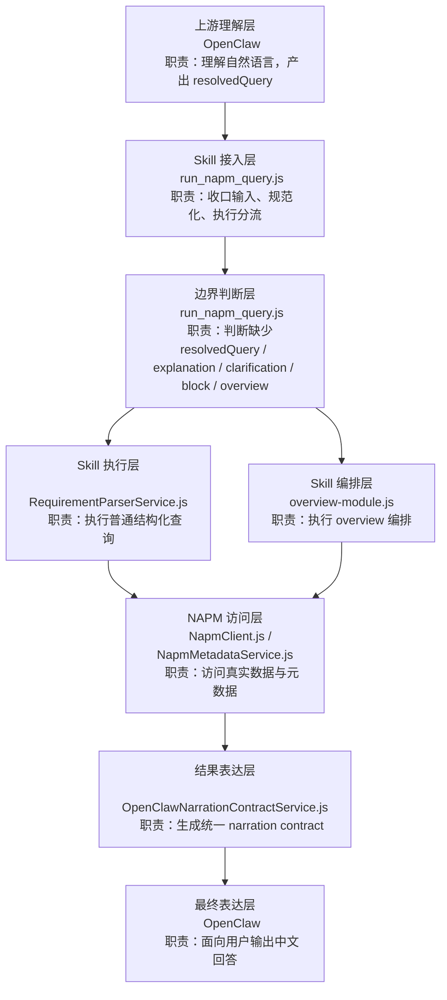

## 2. 当前项目进度判断

截至当前代码状态，项目已经不再处于“语义解析链搭建阶段”，而处于“执行链稳定化阶段”。

当前已经完成的部分：

- `OpenClaw -> resolvedQuery -> Skill 执行` 这一条主链已经成立；
- 本地 `prompt -> resolvedQuery` 解析入口已经移除；
- `run_napm_query.js` 已经只接受上游结构化输入；
- 普通查询执行链已经可以跑通；
- `overview` 概览型查询链已经可以跑通；
- narration contract 统一输出层已经形成；
- 本地测试已经覆盖入口、follow-up、overview、contract 等主路径。

当前项目仍在持续推进的重点：

- 继续清理历史命名和历史文档；
- 继续提升 `resolvedQuery` 契约稳定性；
- 继续验证更多真实业务问法在远端环境中的效果；
- 继续减少“历史遗留组件”对新接手人员的理解干扰。

一句话概括当前进度：

> 这个项目已经从“自然语言语义网关原型”收口为“由 OpenClaw 驱动的 NAPM 结构化执行 Skill”，主运行链已成型，当前重点是稳定执行链、稳定契约、稳定联调。

## 2.1 企业微信侧链路已回收到 OpenClaw 主链

这一点需要单独写明，因为它直接关系到当前链路到底由谁决定“怎么调用 Skill”。

当前已经落地的原则是：

- 企业微信插件不再直接调用 NAPM Skill；
- 企业微信插件不再把裸 `userQuery` 直接塞给 Skill；
- 企业微信插件只负责消息接收、入口边界判断、上下文整理和消息回传；
- 真正的自然语言理解、`resolvedQuery` 生成、Skill 调度，都统一回到 `OpenClaw` 主链。

这样调整的原因是：

- Skill 当前正式契约已经收口为“只消费结构化 `resolvedQuery`”；
- 企业微信插件历史上的 NAPM 直连逻辑，传的是 `userQuery`，不是 `resolvedQuery`；
- 这会导致插件层绕开 `OpenClaw` 的结构化理解职责；
- 一旦直连失败，就容易把“我先试试、让我看看、返回 400/403”这类中间过程暴露给用户。

因此当前真实链路应该理解为：

```text
企业微信消息
  -> 企业微信入口边界
  -> OpenClaw 主链
  -> OpenClaw 产出 resolvedQuery
  -> Skill 执行
  -> OpenClaw 消费 contract
  -> 企业微信回复用户
```

而不再是历史上的：

```text
企业微信消息
  -> 插件特判像不像 NAPM
  -> 裸 userQuery 直连 Skill
  -> 失败后回退
```

## 3. 当前真实运行流程

## 3.1 阶段划分总览

当前真实流程如果按“谁在执行、这一层判断什么、下一层产出什么”来写，可以表达成下面这个结构：

这段流程不是通用模板，而是根据当前项目真实代码路径整理出来的：

- 企业微信插件入口已经只保留边界判断和主链放行职责；
- 上游理解层对应 `OpenClaw`；
- 输入收口层、边界判断层对应 `run_napm_query.js`；
- 普通执行链对应 `RequirementParserService.js`；
- `overview` 编排链对应 `overview-module.js`；
- 元数据与 NAPM 访问层对应 `NapmMetadataService.js` 与 `NapmClient.js`；
- 表达层收口对应 `OpenClawNarrationContractService.js`。

```text
用户提问
  ↓
企业微信接收消息
  → 企业微信入口边界
  → 判断是否属于 NAPM 领域
  → 判断是否命中硬边界
  → 不再执行历史上的 NAPM 直连 Skill 特判
  ↓
观枢 AI / OpenClaw 入口
  ↓
OpenClaw 上游理解层
  → 将自然语言收敛为 resolvedQuery / decision / intent / session
  → 决定是否调度 NAPM Skill
  ↓
run_napm_query.js 输入收口层
  → 读取 --payload / --resolvedQuery / --query / --decision / --intent / --session
  → resolveInput(args, payload)
  → 如果没有 resolvedQuery：
     - 直接抛出 UPSTREAM_RESOLVED_QUERY_REQUIRED
  → 如果有 resolvedQuery：
     - applySessionContinuationToResolvedQuery()
     - normalizeResolvedQueryShape()
     - RequirementParserService.buildIntentResult()
     - RequirementParserService.buildSemanticResolutionResult()
  ↓
run_napm_query.js 边界判断层
  → 判断是否为 explanation 元问题
  → 判断 clarificationGate.required
  → 判断 executionGuard.blockExecution
  → 判断是否为 overview
  ↓
执行路径分流
  → 如果是 explanation：
     - buildExplanationContract()
     - 直接输出 decision_result
  → 如果需要澄清：
     - buildClarificationContract()
     - 直接输出 clarification contract
  → 如果执行阻断：
     - buildClarificationContract()
     - 直接输出 block contract
  → 如果是 overview：
     - executeOverviewModule()
  → 如果是普通查询：
     - RequirementParserService.executeGatewayRequest()
  ↓
RequirementParserService 执行收口层
  → 根据 service 判断执行 metadata 查询还是数据查询
  → 对结构化请求做 validateGatewayRequest()
  → 用 GroupBuilder 构造 groupType/groupArgument 参数
  → 必要时对 group type 做标准化
  ↓
元数据与参数复核层
  → NapmMetadataService.getMetricsForGroupPath()
  → NapmMetadataService.getApplications() / getBusinessGroups() / getGroupArguments()
  → 校验 group path 是否可查询
  → 校验对象类型、参数候选、指标支持情况
  ↓
Execution Guard 执行期守卫
  → QueryValidator 校验 service/start/end/metrics/granularity
  → buildUpstreamPathGuard 判断 NAPM 是否拒绝当前 group path
  → parseNapmPayload 判断响应是否可被正常归一
  ↓
构造 NetInside / NAPM API
  → 普通数据查询：
     - type=topValues / averageValues / timeValues
     - metrics=...
     - topMetric=...
     - topCount=...
     - granularity=...
     - groupType1/groupArgument1/.../numGroups
  → metadata 查询：
     - type=metricsForGroup / groups / groupArguments / applications / businessGroups
  ↓
HTTP 调用 NAPM
  → NapmClient.get() / NapmClient.getJson()
  ↓
接收原始结果
  → JSON 或 CSV
  ↓
结果事实归一
  → RequirementParserService.parseNapmPayload()
  → rows / data / requestUrl / requestParamsMasked / error
  → buildGatewayRequestSummary()
  → buildExecutionDataSummary()
  ↓
OpenClawNarrationContractService 表达层收口
  → buildOpenClawReplyContract()
  → 生成 summary / narrationInput / narrationStructure / followUp / renderPolicy
  ↓
OpenClaw 表达层优化
  → 消费 narration contract
  → 组织最终中文回答
  ↓
企业微信返回用户
```

## 3.1.1 总流程图

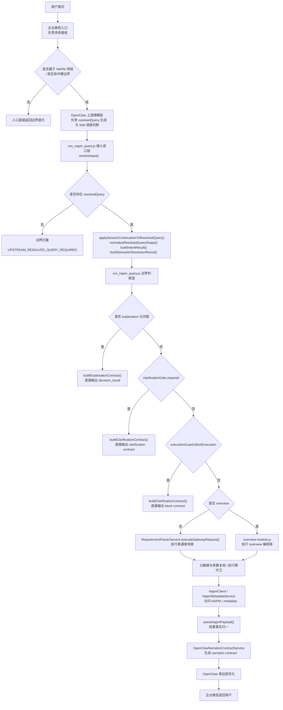

## 3.2 阶段 1：上游理解阶段

这一阶段**不在本仓库内执行**，由 `OpenClaw` 负责。

职责：

- 接收用户自然语言；
- 识别用户意图；
- 识别对象、指标、时间范围、查询模式；
- 产出结构化 `resolvedQuery`；
- 可选附带 `decision`、`intent`、`session` 等上下文。

这一阶段产出的结果，才是本仓库真正消费的输入。

这里要特别明确：

- 在当前远端运行链路中，用户问题在进入 `OpenClaw` 主链前，还会先经过企业微信入口边界判断；
- 企业微信入口只放行 NAPM 相关问题；
- 非 NAPM 问题或命中硬边界的问题，会在入口直接结束，不再进入 Skill；
- 企业微信插件历史上的 `tryHandleNapmQuery(...) -> requestNapmSkillQuery(...)` 直连主路径，已经从当前主流程中下线；
- 也就是说，当前企业微信插件不再承担“先特判，再替 OpenClaw 直调 Skill”的职责；
- 正常架构下，`resolvedQuery` 是 `OpenClaw` 对自然语言理解后的产物；
- 本仓库当前已经不再负责把裸 `prompt` 解析成 `resolvedQuery`；
- 如果上游没有给出 `resolvedQuery`，Skill 会直接报错，而不是自己补做本地语义解析。

## 3.3 阶段 2：Skill 入口收口阶段

执行文件：

- `skills/openclaw-napm-query/scripts/run_napm_query.js`

这一阶段负责把上游输入收口成统一的运行时输入对象。

入口主流程如下：

```text
main()
  -> parseArgs()
  -> parseJsonArg('--payload')
  -> resolveInput(args, payload)
      -> 读取 resolvedQuery / decision / intent / session
      -> 如果存在 resolvedQuery：
         - applySessionContinuationToResolvedQuery()
         - normalizeResolvedQueryShape()
         - buildIntentResult()
         - buildSemanticResolutionResult()
      -> 如果不存在 resolvedQuery：
         - 抛出 UPSTREAM_RESOLVED_QUERY_REQUIRED
  -> 继续进入后续判断
```

这里每一步的作用如下：

- `parseArgs()`
  作用：解析命令行参数，如 `--payload`、`--resolvedQuery`、`--query`、`--decision`、`--intent`、`--session`。

- `parseJsonArg()`
  作用：把命令行中的 JSON 字符串解析成对象。

- `resolveInput(args, payload)`
  作用：统一从参数和 payload 中取出 `resolvedQuery`、`decision`、`intent`、`session`，形成后续统一输入。

- `applySessionContinuationToResolvedQuery()`
  作用：在已有 `resolvedQuery` 的前提下，结合 session 做上下文续接，比如补时间范围、补指标、补 group path、做 follow-up drilldown。

- `normalizeResolvedQueryShape()`
  作用：把 `resolvedQuery` 规范化成执行期统一形态，比如补 `metrics`、补 `topMetric`、补 `topCount`、补 `granularity`、补 `format`。

- `RequirementParserService.buildIntentResult()`
  作用：生成给上游看的“意图摘要结构”，方便 narration 和调试。

- `RequirementParserService.buildSemanticResolutionResult()`
  作用：生成给上游看的“语义收敛结果摘要”，说明当前执行对象、指标、路径、时间、执行保护等信息。

这一阶段的关键边界是：

- 它只接收结构化输入；
- 它不会再做本地 prompt 解析；
- 它做的是“收口和规范化”，不是“重新理解用户语义”。

## 3.3.1 入口阶段流程图

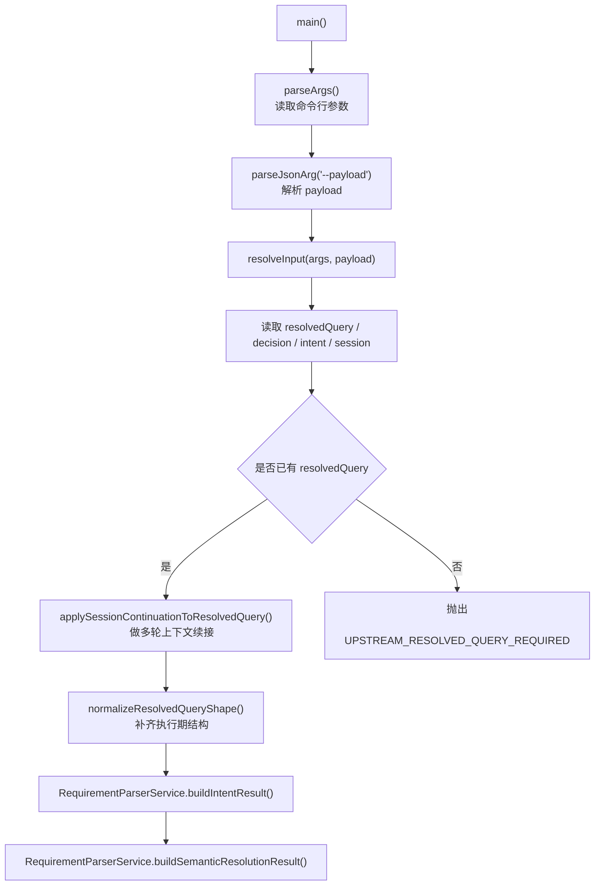

## 3.4 阶段 3：执行分流阶段

仍然由：

- `skills/openclaw-napm-query/scripts/run_napm_query.js`

负责。

在完成输入收口后，入口脚本会做 4 类分流判断：

1. 解释型输出分支
2. 澄清分支
3. 阻断分支
4. 执行分支

流程如下：

```text
main()
  -> maybeBuildMetaExplanationText()
      -> 如果是“解释为什么刚才这么执行”的元问题
         - buildExplanationContract()
         - 直接输出
  -> 判断 clarificationGate.required
      -> 是
         - buildClarificationContract()
         - 直接输出
  -> 判断 executionGuard.blockExecution
      -> 是
         - buildClarificationContract()
         - 直接输出
  -> executeResolvedQuery()
```

说明如下：

- `maybeBuildMetaExplanationText()`
  作用：识别这次输入是不是在追问“刚才为什么这么查”“这个 group path 为什么这样”“为什么进入 overview”等解释型问题。

- `buildExplanationContract()`
  作用：把解释文本包装成 `decision_result` 类型 contract，直接返回给上游。

- `buildClarificationContract()`
  作用：把“还需要补充信息”或者“当前不能执行”的情况包装成可消费的澄清 contract。

- `clarificationGate.required`
  含义：当前信息不足，需要用户补充。

- `resolvedQuery.executionGuard.blockExecution`
  含义：当前结构化查询虽然存在，但由于范围、参数或保护条件，不允许继续执行。

也就是说，本仓库真正打到 NAPM 之前，已经先完成了一轮**执行前分流保护**。

## 3.4.1 边界判断是怎么做的

当前系统的边界判断，实际上集中发生在两个位置：

1. 企业微信插件入口
2. `run_napm_query.js`
3. `RequirementParserService.js`

两者分工不同：

- 企业微信插件入口
  负责**领域边界判断**，决定“这条消息是不是 NAPM 问题，是否允许进入 NAPM 主链”。

- `run_napm_query.js`
  负责**入口边界判断**，决定“这次请求能不能进入执行层”。

- `RequirementParserService.js`
  负责**执行期边界判断**，决定“进入执行层后，这个结构化请求是否合法、是否能被 NAPM 接受”。

企业微信入口边界的真实条件如下：

- `looksLikeNapmQuery(...)` 是否命中 NAPM 领域
- `detectWeComHardBoundary(...)` 是否命中系统类/越界类硬边界
- 未通过时是否直接返回边界提示，而不是放入通用问答链

入口边界判断的真实条件如下：

- 是否存在 `resolvedQuery`
- 是否属于 explanation 元问题
- `clarificationGate.required` 是否为真
- `executionGuard.blockExecution` 是否为真
- 是否属于 `overview`

执行期边界判断的真实条件如下：

- `QueryValidator.validateGatewayRequest()` 是否通过
- group path 是否可被正确拼装
- 上游 NAPM 是否返回 group path 不支持类错误
- 返回 payload 是否能被正常解析

## 3.4.2 边界判断流程图

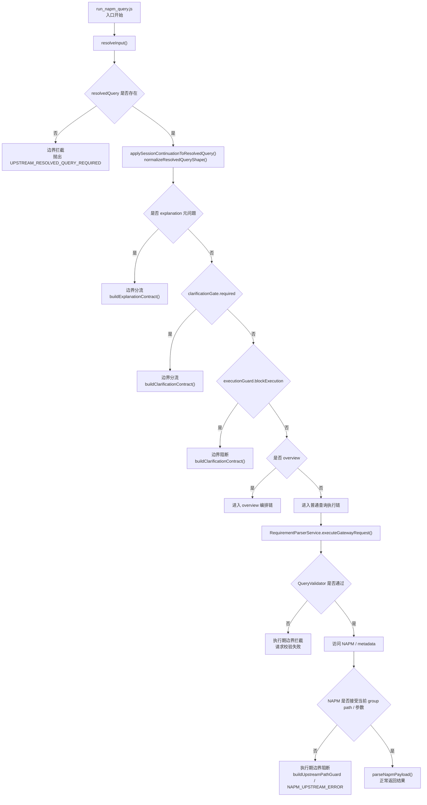

## 3.4.3 边界判断文件级责任图

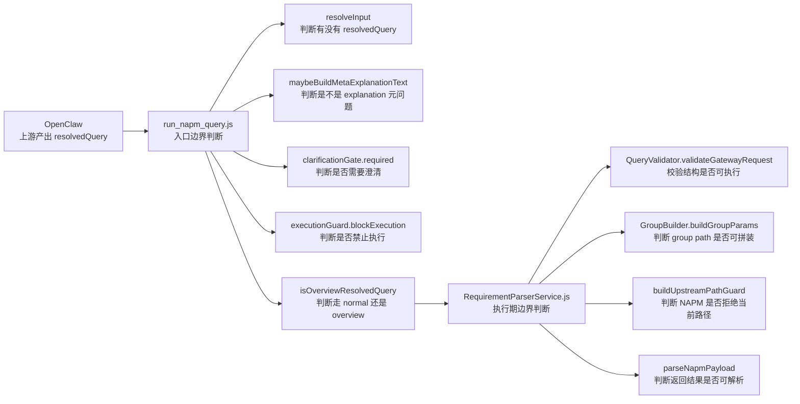

## 3.5 阶段 4：执行阶段

真正执行阶段分成两条主链：

1. 普通查询执行链
2. `overview` 概览执行链

入口判断函数：

- `isOverviewResolvedQuery()`

执行函数：

- `executeResolvedQuery(prompt, resolvedQuery, payload, intentResult)`

执行分流如下：

```text
executeResolvedQuery()
  -> isOverviewResolvedQuery()
      -> 是：executeOverviewModule()
      -> 否：RequirementParserService.executeGatewayRequest()
```

## 3.5.1 执行分流图

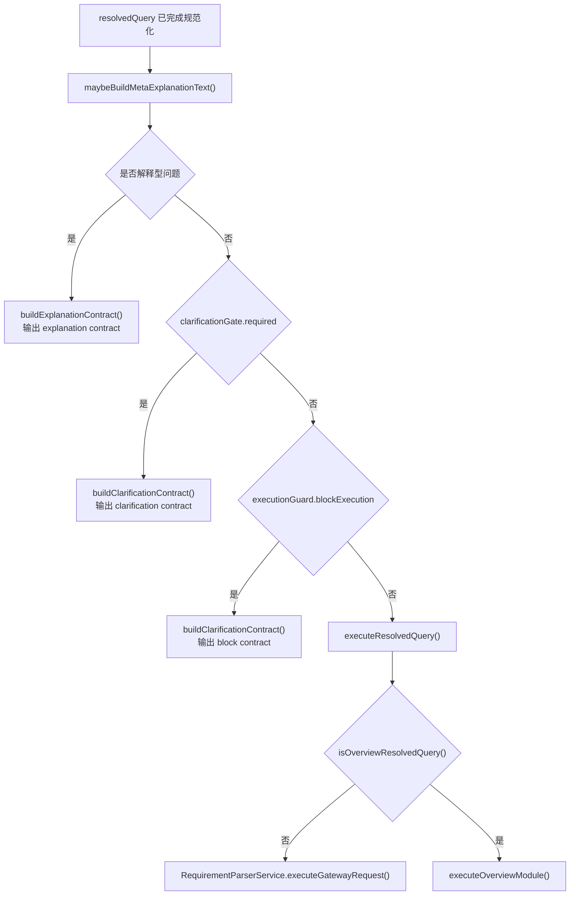

---

## 4. 普通查询执行链

## 4.1 普通查询执行主链

当不是 `overview` 查询时，走下面这条链：

```text
run_napm_query.js
  -> RequirementParserService.executeGatewayRequest()
      -> QueryValidator.validateGatewayRequest()
      -> GroupBuilder.buildGroupParams()
      -> NapmMetadataService / NapmClient
      -> RequirementParserService.parseNapmPayload()
  -> buildOpenClawReplyContract()
```

如果按照你前面那种“逐层收敛”的写法，普通查询链可以写成下面这样：

```text
普通查询进入执行链
  ↓
run_napm_query.js 普通查询分流
  → 已确认不是 explanation / clarification / block / overview
  → 调用 RequirementParserService.executeGatewayRequest()
  ↓
RequirementParserService 执行收口层
  → 复制 passthroughGatewayRequest
  → 构造 queryRequest
  → 提取 service / start / end / metric / metrics / groups / topCount / granularity
  ↓
group path 标准化层
  → GroupBuilder.parseGroupType()
  → 将 group alias / groupType 规范到可执行对象类型
  ↓
service 分流层
  → 如果 service=metrics：
     - 进入 metricsForGroup 元数据查询链
  → 如果 service=groups：
     - 进入 objects / groupArguments 元数据查询链
  → 如果 service=topValues / averageValues / timeValues：
     - 进入真实数据查询链
  ↓
元数据查询链
  → NapmMetadataService.getMetricsForGroupPath()
  → NapmMetadataService.getApplications()
  → NapmMetadataService.getBusinessGroups()
  → NapmMetadataService.getGroupArguments()
  → 返回 metadata 列表结果
  ↓
真实数据查询链
  → QueryValidator.validateGatewayRequest()
  → 校验 service / start / end / metrics / granularity
  → GroupBuilder.buildGroupParams()
  → 构造 groupType1 / groupArgument1 / numGroups
  ↓
构造 NetInside / NAPM API
  → type=topValues / averageValues / timeValues
  → metrics=...
  → topMetric=...
  → topCount=...
  → granularity=...
  → groupType1 / groupArgument1 / numGroups
  ↓
HTTP 调用 NAPM
  → NapmClient.get()
  ↓
接收原始结果
  → JSON 或 CSV
  ↓
结果事实归一
  → RequirementParserService.parseNapmPayload()
  → 归一成 rows / data
  → buildGatewayRequestSummary()
  → buildExecutionDataSummary()
  → 若失败则进入 buildUpstreamPathGuard / NAPM_UPSTREAM_ERROR
  ↓
OpenClawNarrationContractService 表达层收口
  → buildOpenClawReplyContract()
  → 输出 summary / narrationInput / narrationStructure / requestUrl / followUp
  ↓
OpenClaw 输出最终回答
```

## 4.1.1 普通查询完整流程图

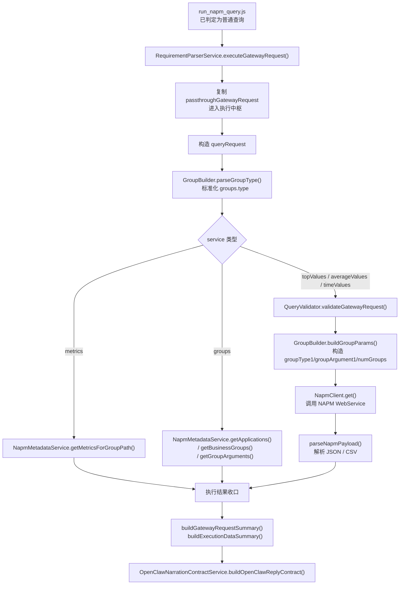

## 4.1.2 普通查询逐层流程图

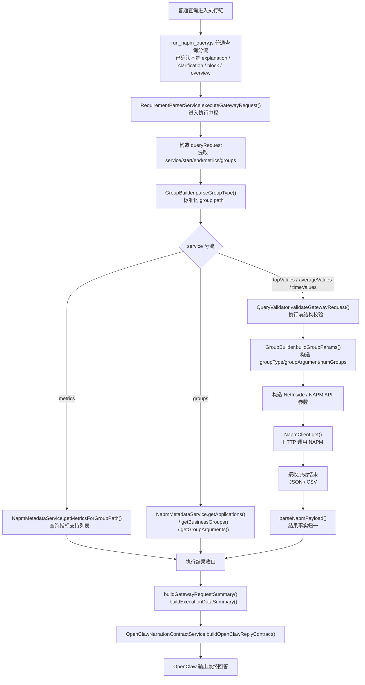

## 4.2 普通查询分为哪几类

`RequirementParserService.executeGatewayRequest()` 内部会继续按 `service` 分流：

1. `metrics`
2. `groups`
3. `topValues / averageValues / timeValues`

### A. `metrics` 查询

作用：

- 查询某个 group path 下支持哪些指标。

执行方式：

- 通过 `NapmMetadataService.getMetricsForGroupPath()` 访问元数据接口；
- 不走真实数据值查询；
- 返回指标列表。

### B. `groups` 查询

作用：

- 查询某类对象清单；
- 或查询某类对象的可选参数值列表。

执行方式：

- `Application / DefinedApp` 走 `getApplications()`；
- `WebApplication` 走 `getGroupArguments('WebApplication')`；
- `BusinessGroup` 走 `getBusinessGroups()`；
- 本质上也是元数据查询，不是实时数值查询。

### C. `topValues / averageValues / timeValues`

作用：

- 查询真实业务数据。

执行方式：

- 先做请求合法性校验；
- 再构造 NAPM URL 参数；
- 再由 `NapmClient.get()` 发起请求；
- 再由 `parseNapmPayload()` 把返回的 JSON / CSV 解析为统一结构。

## 4.3 普通查询文件级调用链图

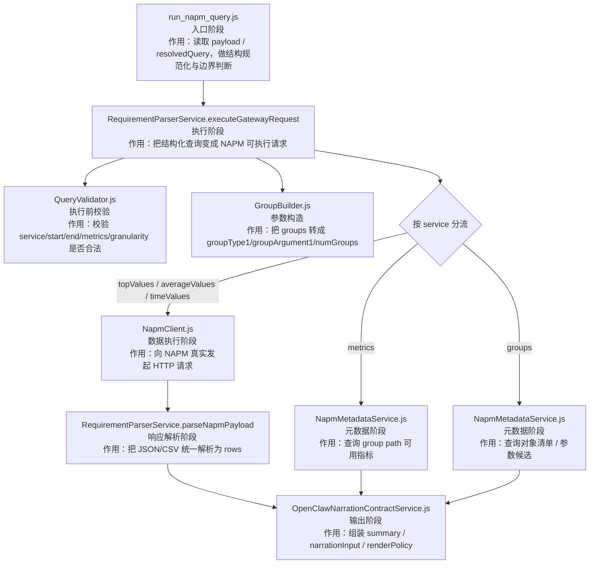

## 4.3.1 普通查询文件级注释版流程

下面这段专门按“文件 -> 输入 -> 输出 -> 作用”来写普通查询主链。

```text
run_napm_query.js
  输入：
    - payload
    - resolvedQuery
    - decision / intent / session
  输出：
    - 已规范化的 resolvedQuery
    - intentResult
    - semanticResolutionResult
  作用：
    - 完成入口收口
    - 完成边界判断
    - 确认本次请求进入普通查询执行链
  ↓
RequirementParserService.js -> executeGatewayRequest(gatewayRequest)
  输入：
    - resolvedQuery / gatewayRequest
  输出：
    - executionResult
    - data / requestUrl / error / requestParamsMasked
  作用：
    - 作为普通查询执行中枢
    - 判断当前是 metrics / groups / topValues / averageValues / timeValues 哪一类执行
  ↓
GroupBuilder.js -> parseGroupType()
  输入：
    - queryRequest.groups[].type
  输出：
    - 标准化后的 groupType
  作用：
    - 统一对象类型写法，避免 group type 因 alias 导致执行失败
  ↓
RequirementParserService.js -> service 分流
  输入：
    - queryRequest.service
  输出：
    - metadata 查询路径 或 数据查询路径
  作用：
    - 决定本次请求到底走 metadata 还是真实数据
  ↓
NapmMetadataService.js -> getMetricsForGroupPath()
  输入：
    - metadataGroups
  输出：
    - metrics 列表
  作用：
    - 当 service=metrics 时，返回某个 group path 下支持哪些指标

NapmMetadataService.js -> getApplications() / getBusinessGroups() / getGroupArguments()
  输入：
    - group type
    - optional keyword / argument
  输出：
    - 对象清单 / group argument 候选列表
  作用：
    - 当 service=groups 时，返回对象列表或候选参数列表
  ↓
QueryValidator.js -> validateGatewayRequest()
  输入：
    - passthroughGatewayRequest
  输出：
    - 通过校验的 gatewayRequest
    - 或抛出校验错误
  作用：
    - 当进入真实数据查询时，校验 service/start/end/metrics/granularity 是否满足执行要求
  ↓
GroupBuilder.js -> buildGroupParams()
  输入：
    - queryRequest.groups
  输出：
    - groupType1 / groupArgument1 / numGroups
  作用：
    - 把结构化 groups 转成 NAPM API 所需参数
  ↓
RequirementParserService.js
  输入：
    - queryRequest
    - group params
  输出：
    - params
    - requestUrl
  作用：
    - 构造最终 NAPM API 参数
    - 写入审计信息
  ↓
NapmClient.js -> get()
  输入：
    - params
  输出：
    - rawPayload
  作用：
    - 向 NAPM 发起真实 HTTP 请求
  ↓
RequirementParserService.js -> parseNapmPayload()
  输入：
    - rawPayload(JSON / CSV)
  输出：
    - rows / data
  作用：
    - 把原始结果统一归一成数组行数据
  ↓
RequirementParserService.js -> buildGatewayRequestSummary()
  输入：
    - queryRequest
  输出：
    - gatewayRequest summary
  作用：
    - 给审计层和表达层提供请求摘要

RequirementParserService.js -> buildExecutionDataSummary()
  输入：
    - rows / data
  输出：
    - execution summary
  作用：
    - 提供执行结果摘要
  ↓
OpenClawNarrationContractService.js -> buildOpenClawReplyContract()
  输入：
    - service
    - rows / data
    - summary
    - resolvedQuery
    - requestUrl
  输出：
    - narration contract
  作用：
    - 构造 summary / narrationInput / narrationStructure / followUp / renderPolicy
  ↓
OpenClaw
  输入：
    - narration contract
  输出：
    - 最终中文回答
  作用：
    - 面向用户做最终表达
```

## 4.3.2 `run_napm_query.js` 函数级调用链

下面这段把入口脚本继续下钻到函数级。

```text
main()
  输入：
    - process.argv
  输出：
    - 最终 reply contract JSON
  作用：
    - 驱动整个入口执行流程
  ↓
parseArgs(argv)
  输入：
    - 命令行参数
  输出：
    - args
  作用：
    - 解析 --payload / --resolvedQuery / --query / --decision / --intent / --session
  ↓
parseJsonArg('--payload', args.payload)
  输入：
    - payload JSON 字符串
  输出：
    - payload 对象
  作用：
    - 解析上游传入的 payload
  ↓
resolveInput(args, payload)
  输入：
    - args
    - payload
  输出：
    - prompt
    - resolvedQuery
    - intentResult
    - semanticResolutionResult
    - requestContext
  作用：
    - 统一完成输入收口
  ↓
coerceJsonObject(args.query)
  输入：
    - args.query
  输出：
    - query object 或 null
  作用：
    - 兼容直接传入 JSON object 字符串

parseJsonArg('--resolvedQuery', args.resolvedQuery)
  输入：
    - resolvedQuery JSON 字符串
  输出：
    - resolvedQuery 对象 或 null
  作用：
    - 解析显式传入的 resolvedQuery
  ↓
applySessionContinuationToResolvedQuery(explicitResolvedQuery, prompt, requestContext.session)
  输入：
    - explicitResolvedQuery
    - prompt
    - session
  输出：
    - 带续接信息的 resolvedQuery
  作用：
    - 结合 session 做 follow-up drilldown 和上下文继承
  ↓
normalizeResolvedQueryShape(resolvedQuery, prompt)
  输入：
    - resolvedQuery
    - prompt
  输出：
    - 执行期规范化后的 resolvedQuery
  作用：
    - 补齐 metrics / topMetric / topCount / granularity / format
  ↓
RequirementParserService.buildIntentResult(resolvedQuery, prompt)
  输入：
    - resolvedQuery
    - userRequirement
  输出：
    - intentResult
  作用：
    - 构造上游可消费的意图摘要
  ↓
RequirementParserService.buildSemanticResolutionResult(resolvedQuery)
  输入：
    - resolvedQuery
  输出：
    - semanticResolutionResult
  作用：
    - 构造上游可消费的语义收敛摘要
  ↓
maybeBuildMetaExplanationText(prompt, resolvedQuery)
  输入：
    - prompt
    - resolvedQuery
  输出：
    - explanation text 或 null
  作用：
    - 判断是否为 explanation 元问题
  ↓
buildExplanationContract(...)
  输入：
    - explanation text
    - resolvedQuery
  输出：
    - explanation contract
  作用：
    - explanation 分支直接返回

buildClarificationContract(...)
  输入：
    - clarificationGate 或 executionGuard
  输出：
    - clarification / block contract
  作用：
    - 澄清或阻断分支直接返回
  ↓
executeResolvedQuery(prompt, resolvedQuery, payload, intentResult)
  输入：
    - prompt
    - resolvedQuery
    - payload
    - intentResult
  输出：
    - executionResult
  作用：
    - 把请求送入普通链或 overview 链
  ↓
isOverviewResolvedQuery(resolvedQuery)
  输入：
    - resolvedQuery
  输出：
    - boolean
  作用：
    - 判断走 normal 还是 overview
  ↓
RequirementParserService.executeGatewayRequest(...)
  或
executeOverviewModule(...)
  输出：
    - executionResult
  ↓
buildOpenClawReplyContract(...)
  输入：
    - executionResult
    - rows / summary / resolvedQuery / requestUrl
  输出：
    - 最终 narration contract
  作用：
    - 作为入口脚本最后的统一输出封装
```

## 4.4 普通查询阶段中各文件的角色

### `skills/openclaw-napm-query/services/RequirementParserService.js`

当前是普通查询主执行中枢。

它负责：

- 接收已经结构化好的查询；
- 根据 `service` 判断该查 metadata 还是查真实数据；
- 调用 `QueryValidator` 做校验；
- 调用 `GroupBuilder` 生成 NAPM 所需 group 参数；
- 调用 `NapmMetadataService` 或 `NapmClient`；
- 解析返回结果；
- 在失败时组装上游错误信息；
- 生成 `intentResult` 和 `semanticResolutionResult`。

当前重要方法：

- `executeGatewayRequest()`
- `parseNapmPayload()`
- `buildIntentResult()`
- `buildSemanticResolutionResult()`
- `buildGatewayRequestSummary()`
- `buildExecutionDataSummary()`

### `skills/openclaw-napm-query/services/QueryValidator.js`

处于**执行前校验阶段**。

它负责：

- 校验 `service` 是否合法；
- 校验 `start/end` 是否存在；
- 校验 `topValues` 是否有 `metric`；
- 校验 `averageValues / timeValues` 是否有 `metrics`；
- 校验 `timeValues` 是否有 `granularity`。

它不负责语义理解，只负责执行前结构校验。

### `skills/openclaw-napm-query/services/GroupBuilder.js`

处于**NAPM 参数组装阶段**。

它负责：

- 把 `groups` 数组转成 `groupType1/groupArgument1/.../numGroups`；
- 把 alias 解析成标准 group type；
- 为 NAPM API 拼出 group path 参数。

### `skills/openclaw-napm-query/services/NapmMetadataService.js`

处于**元数据执行阶段**。

它负责：

- 查询应用列表、业务组列表、对象列表；
- 查询 group definition；
- 查询 groupArguments；
- 查询 group path 支持哪些指标；
- 对 query 做 metadata review；
- 维护 metadata cache。

它是“查系统支持什么”的服务，不是“查业务数值”的服务。

### `skills/openclaw-napm-query/services/NapmClient.js`

处于**真实数据请求阶段**。

它负责：

- 向 NAPM WebService 发 GET / JSON 请求；
- 承载最终真实数据访问动作。

### `src/utils/CsvParser.js`

处于**响应解析阶段**。

它负责：

- 当 NAPM 返回 CSV 字符串时，把它解析成结构化行数据。

### `skills/openclaw-napm-query/services/OpenClawNarrationContractService.js`

处于**结果契约输出阶段**。

它负责：

- 统一生成 `buildOpenClawReplyContract()`；
- 生成 `summary`；
- 生成 `narrationInput`；
- 生成 `narrationStructure`；
- 生成 `followUp`；
- 生成 `renderPolicy`；
- 给上游提供稳定消费格式。

---

## 5. Overview 概览执行链

## 5.1 Overview 的定位

`overview` 不是一条单独的 NAPM API，而是一个**编排型查询模式**。

也就是说：

- 上游给出的是一个 `overview` 意图；
- 本仓库把这个意图拆成多条真实可执行子查询；
- 再把多条子查询结果重新聚合。

## 5.2 Overview 主执行流程

执行文件：

- `skills/openclaw-napm-query/scripts/overview-module.js`

核心流程如下：

```text
executeOverviewModule()
  -> resolveOverviewScene()
  -> buildOverviewQueries(scene, start, end)
  -> 遍历每个 planned query
      -> buildBaseQueryFromTemplate()
      -> executeGatewayRequest(parentQuery)
      -> 如果存在 child queries：
         - 从 parent result 提取 top group values
         - 构造 childQuery
         - executeGatewayRequest(childQuery)
  -> 聚合 overviewResult
  -> buildOverviewSummary()
  -> 返回 overview contract 数据
```

如果按照同样的“逐层收敛”写法，overview 链当前真实流程如下：

```text
overview 查询进入执行链
  ↓
run_napm_query.js overview 分流
  → isOverviewResolvedQuery()
  → 调用 executeOverviewModule()
  ↓
overview-module.js 场景识别层
  → resolveOverviewScene()
  → 判断当前属于 security / network / application / business / system 哪个 scene
  ↓
overview 查询规划层
  → buildOverviewQueries(scene, start, end)
  → 规划本次 overview 需要执行哪些父查询、哪些子查询
  ↓
overview 父查询构造层
  → buildBaseQueryFromTemplate()
  → 生成 parentQuery
  ↓
overview 父查询执行层
  → executeGatewayRequest(parentQuery)
  → 实际仍由 RequirementParserService 执行真实查询
  ↓
overview 父结果分析层
  → buildOverviewModuleInsight()
  → 提取模块摘要、preview、top findings
  ↓
overview 子查询派生层
  → 如果该模板定义了 children：
     - extractTopGroupValues()
     - 从父查询结果提取 groupValue
     - 构造 childQuery
     - executeGatewayRequest(childQuery)
  ↓
overview 聚合层
  → 写入 overviewResult.queries
  → 写入 overviewResult.modules
  → 写入 overviewResult.topFindings
  ↓
overview Summary 构造层
  → buildOverviewSummary()
  → 生成本次概览结果摘要
  ↓
OpenClawNarrationContractService 表达层收口
  → buildOpenClawReplyContract()
  → 输出 overview narration contract
  ↓
OpenClaw 输出最终回答
```

## 5.2.1 Overview 完整流程图

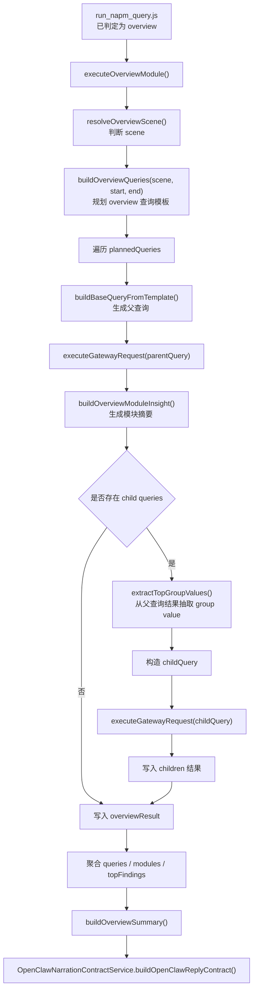

## 5.2.2 Overview 逐层流程图

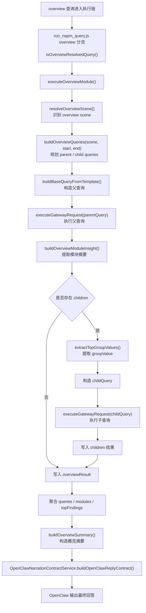

## 5.3 Overview 中的关键概念

### `scene`

`overview` 会先判断场景，例如：

- `security`
- `network`
- `application`
- `business`
- `system`

不同 `scene` 对应不同的概览编排模板。

### `plannedQueries`

概览不会直接查一条 API，而是先根据 scene 规划多条父查询 / 子查询。

### `parent query`

父查询负责先拉出某个模块的总体结果，或排名入口。

### `child query`

子查询从父查询结果中抽取 group value，再继续对某个对象做深入查询。

## 5.4 Overview 文件级调用链图

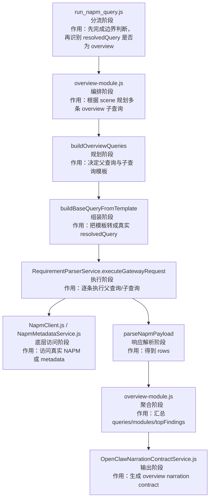

## 5.4.1 Overview 文件级注释版流程

下面这段按“文件 -> 输入 -> 输出 -> 作用”来写 overview 主链。

```text
run_napm_query.js
  输入：
    - payload
    - resolvedQuery
    - intentResult
  输出：
    - overview 执行请求
  作用：
    - 完成入口收口
    - 完成边界判断
    - 通过 isOverviewResolvedQuery() 确认进入 overview 链
  ↓
overview-module.js -> executeOverviewModule(options)
  输入：
    - prompt
    - payload
    - intent
    - resolvedQuery
    - executeGatewayRequest
  输出：
    - overviewResult
    - summary
    - warnings
  作用：
    - 作为 overview 执行总编排器
  ↓
overview-module.js -> resolveOverviewScene()
  输入：
    - prompt / payload / intent / resolvedQuery
  输出：
    - overview scene
  作用：
    - 判断是 security / network / application / business / system 哪一种概览场景
  ↓
overview-module.js -> buildOverviewQueries(scene, start, end)
  输入：
    - scene
    - start / end
  输出：
    - plannedQueries
  作用：
    - 规划 overview 要执行哪些父查询、哪些子查询
  ↓
overview-module.js -> buildBaseQueryFromTemplate()
  输入：
    - template
    - range
    - seedGroups
  输出：
    - parentQuery / childQuerySeed
  作用：
    - 把 overview 模板变成真正可执行的 resolvedQuery
  ↓
RequirementParserService.js -> executeGatewayRequest(parentQuery)
  输入：
    - parentQuery
  输出：
    - parentResult
  作用：
    - 执行 overview 父查询
  ↓
overview-module.js -> buildOverviewModuleInsight()
  输入：
    - template
    - parentResult.data
  输出：
    - module label / summary / preview
  作用：
    - 从父查询结果提炼当前模块摘要
  ↓
overview-module.js -> extractTopGroupValues()
  输入：
    - parentResult.data
    - targetGroupType
    - metricHints
  输出：
    - groupValues
  作用：
    - 如果存在 children，从父查询结果里抽取下一层子查询需要的对象值
  ↓
overview-module.js
  输入：
    - childQuerySeed
    - groupValue
  输出：
    - childQuery
  作用：
    - 把父查询结果派生为真正的子查询
  ↓
RequirementParserService.js -> executeGatewayRequest(childQuery)
  输入：
    - childQuery
  输出：
    - childResult
  作用：
    - 执行 overview 子查询
  ↓
overview-module.js
  输入：
    - parentResult
    - childResults
  输出：
    - overviewResult.queries
    - overviewResult.modules
    - overviewResult.topFindings
  作用：
    - 汇总整个 overview 的父子查询结果
  ↓
overview-module.js -> buildOverviewSummary()
  输入：
    - overviewResult
    - stats
  输出：
    - overview summary
  作用：
    - 生成本次概览的摘要说明
  ↓
OpenClawNarrationContractService.js -> buildOpenClawReplyContract()
  输入：
    - overviewResult
    - summary
    - warnings
    - service=overview
  输出：
    - overview narration contract
  作用：
    - 构造 overview 的统一叙述契约
  ↓
OpenClaw
  输入：
    - overview narration contract
  输出：
    - 最终中文回答
  作用：
    - 面向用户输出 overview 总结结果
```

## 5.4.2 `RequirementParserService.js` 函数级调用链

下面这段把普通执行中枢继续下钻到函数级。

```text
executeGatewayRequest(gatewayRequest, requestContext)
  输入：
    - gatewayRequest
    - requestContext
  输出：
    - response { ok, service, data, error, requestUrl, requestParamsMasked }
  作用：
    - 作为普通执行链核心函数
  ↓
buildGatewayRequestSummary(gatewayRequest)
  输入：
    - gatewayRequest
  输出：
    - gatewayRequest summary
  作用：
    - 给审计与表达层提供结构化请求摘要

buildExecutionDataSummary(data)
  输入：
    - data
  输出：
    - rowCount / sampleRows
  作用：
    - 给审计与表达层提供执行结果摘要
  ↓
构造 queryRequest
  输入：
    - passthroughGatewayRequest
  输出：
    - queryRequest
  作用：
    - 从结构化请求中提取 service / metric / metrics / groups / topCount / granularity
  ↓
metadataGroups = groups.map(...)
  内部调用：
    - GroupBuilder.parseGroupType()
  输入：
    - queryRequest.groups
  输出：
    - metadataGroups
  作用：
    - 做 group type 标准化
  ↓
service 分流
  输入：
    - queryRequest.service
  输出：
    - metadata 查询路径 或 数据查询路径
  作用：
    - 决定执行分支
  ↓
NapmMetadataService.getMetricsForGroupPath(metadataGroups)
  输入：
    - metadataGroups
  输出：
    - metrics 列表
  作用：
    - 处理 service=metrics

NapmMetadataService.getApplications(firstArgument)
NapmMetadataService.getBusinessGroups(firstArgument)
NapmMetadataService.getGroupArguments('WebApplication', firstArgument)
  输入：
    - firstGroup.type / firstArgument
  输出：
    - namedList
  作用：
    - 处理 service=groups
  ↓
QueryValidator.validateGatewayRequest(passthroughGatewayRequest)
  输入：
    - passthroughGatewayRequest
  输出：
    - 校验通过 或抛错
  作用：
    - 处理真实数据查询前的结构校验
  ↓
GroupBuilder.buildGroupParams(queryRequest.groups)
  输入：
    - groups
  输出：
    - groupType1 / groupArgument1 / numGroups
  作用：
    - 生成 NAPM API group 参数
  ↓
构造 params / fullParams / requestUrl
  输入：
    - queryRequest
    - group params
  输出：
    - params
    - requestUrl
    - requestParamsMasked
  作用：
    - 生成最终 HTTP 请求参数
  ↓
NapmClient.get(params)
  输入：
    - params
  输出：
    - rawPayload
  作用：
    - 发起真实 NAPM 请求
  ↓
parseNapmPayload(rawPayload)
  输入：
    - rawPayload
  输出：
    - rows / data
  作用：
    - 统一解析 JSON / CSV / object / array
  ↓
buildUpstreamPathGuard(gatewayRequest, error)
  输入：
    - gatewayRequest
    - error
  输出：
    - upstream path guard error 或 null
  作用：
    - 当 NAPM 拒绝 group path 时，构造可解释的阻断信息

formatGroupPathWithArguments(groups)
  输入：
    - groups
  输出：
    - pathText
  作用：
    - 生成可读的 group path 文本

collectMetadataPathCandidates(gatewayRequest, currentPath)
  输入：
    - gatewayRequest
    - currentPath
  输出：
    - candidatePaths
  作用：
    - 收集元数据中的可能路径候选
  ↓
parseNapmPayload(rawPayload)
  输入：
    - rawPayload
  输出：
    - 归一 rows
  作用：
    - 把 array/object/json/csv 统一解析为数组
  ↓
buildIntentResult(partialQuery, userRequirement)
  输入：
    - partialQuery
    - userRequirement
  输出：
    - intentResult
  作用：
    - 生成意图摘要

buildSemanticResolutionResult(partialQuery)
  输入：
    - partialQuery
  输出：
    - semanticResolutionResult
  作用：
    - 生成语义收敛摘要

normalizeTopLevelGroupType(groupType)
normalizeTopLevelGroupPath(pathTypes)
  输入：
    - groupType / pathTypes
  输出：
    - 标准化后的顶层对象类型 / group path
  作用：
    - 统一对象类型与路径表示
```

## 5.5 Overview 阶段中各文件的角色

### `skills/openclaw-napm-query/scripts/overview-module.js`

它是 `overview` 模式的总编排器。

负责：

- 判断 overview scene；
- 选择 template；
- 规划父查询和子查询；
- 调 `executeGatewayRequest()` 执行真实子查询；
- 聚合 `overviewResult`；
- 生成 `summary` 和 warnings。

### `skills/openclaw-napm-query/services/RequirementParserService.js`

在 overview 中不负责“编排”，而负责：

- 执行 overview 拆出来的每一条真实子查询。

也就是说：

- `overview-module.js` 决定“查什么”；
- `RequirementParserService.js` 决定“怎么执行这条查询”。

---

## 6. 输出阶段与 OpenClaw 契约

## 6.1 输出阶段由谁执行

输出契约收口主要由：

- `skills/openclaw-napm-query/services/OpenClawNarrationContractService.js`

执行。

入口脚本和 overview 模块都会把结果整理后交给它来统一包装。

## 6.2 输出阶段做什么

它负责把底层执行结果整理为 `OpenClaw` 可以稳定消费的格式：

- `summary`
- `requestUrl`
- `displayText`
- `replyText`
- `responseMode`
- `narrationInput`
- `narrationStructure`
- `followUp`
- `renderPolicy`

## 6.2.1 输出契约流程图

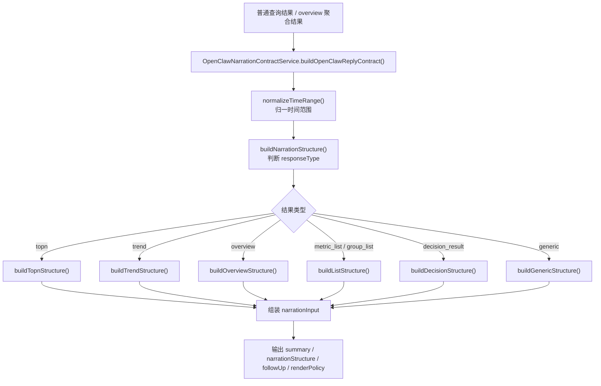

## 6.3 输出阶段的真实意义

这一层并不是简单“返回 rows”。

它真正做的是：

- 判断当前结果属于 `topn`、`trend`、`overview`、`group_list`、`metric_list`、`decision_result` 还是 generic；
- 生成适合 OpenClaw 最终表达的叙述结构；
- 给 OpenClaw 一个稳定 contract，而不是让上游自己读底层 rows。

因此这层是整个系统的**表达层中枢**。

---

## 7. 当前各文件在系统中的作用清单

## 7.0 阶段-文件对应图

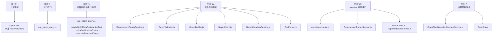

## 7.1 主链核心文件

### `skills/openclaw-napm-query/scripts/run_napm_query.js`

阶段：

- Skill 入口阶段
- 执行分流阶段

作用：

- 统一读取输入；
- 强制要求 `resolvedQuery`；
- 做 session continuation；
- 做结构规范化；
- 判断 explanation / clarification / block / overview / normal；
- 调用执行链；
- 输出最终 contract。

### `skills/openclaw-napm-query/services/RequirementParserService.js`

阶段：

- 普通查询主执行阶段
- overview 子查询执行阶段

作用：

- 执行结构化查询；
- 按 service 分流；
- 做参数校验；
- 组装 NAPM 请求；
- 请求真实数据或 metadata；
- 解析响应；
- 组装执行结果摘要。

### `skills/openclaw-napm-query/scripts/overview-module.js`

阶段：

- overview 编排阶段

作用：

- 决定 overview scene；
- 决定查哪些父查询和子查询；
- 汇总 overview 聚合结果。

### `skills/openclaw-napm-query/services/OpenClawNarrationContractService.js`

阶段：

- 输出契约阶段

作用：

- 构造标准 narration contract；
- 把结果格式变成上游稳定可消费结构。

## 7.2 执行辅助文件

### `skills/openclaw-napm-query/services/NapmClient.js`

阶段：

- 底层 HTTP 执行阶段

作用：

- 向 NAPM WebService 发请求。

### `skills/openclaw-napm-query/services/NapmMetadataService.js`

阶段：

- metadata 查询阶段

作用：

- 查询对象、group definition、group arguments、metricsForGroup、reviewQuery。

### `skills/openclaw-napm-query/services/GroupBuilder.js`

阶段：

- 请求参数构造阶段

作用：

- 把 groups 数组转成 NAPM 需要的 group 参数。

### `skills/openclaw-napm-query/services/QueryValidator.js`

阶段：

- 执行前校验阶段

作用：

- 校验请求结构合法性。

## 7.3 基础支撑文件

### `src/utils/CsvParser.js`

作用：

- 解析 CSV 响应。

### `src/utils/TimeUtils.js`

作用：

- 提供时间范围和时间格式辅助能力。

### `src/utils/logger.js`

作用：

- 统一日志输出。

### `src/utils/auditLogger.js`

作用：

- 记录审计日志；
- 脱敏参数；
- 生成安全 request URL。

### `src/constants/objectDimensions.js`

作用：

- 维护对象维度标准字典；
- 被 `GroupBuilder`、`DimensionMappingService` 等组件使用。

### `skills/openclaw-napm-query/services/MetricMappingService.js`

作用：

- 提供指标配置加载与指标编码字典；
- 在入口与表达层等环节提供指标支撑能力。

---

## 8. 当前不是主执行链的组件

下面这些文件现在不是当前正式主链的必经节点，文档里需要和主链分开看。

### `ClarificationGateService.js`

当前主要作为辅助/测试支撑组件存在，不是现在入口主链的必经执行节点。

### `QueryMetadataConstraintService.js`

当前不在正式主执行链中，不应再理解为当前主流程核心节点。

### `DimensionMappingService.js`

当前主要作为 metadata / mapping 的底层支撑组件，不是入口主链直接调度的第一层服务。

---

## 9. 当前项目最准确的一句话总结

截至当前代码状态，本项目已经明确收口为：

```text
OpenClaw 负责自然语言理解
  -> 输出 resolvedQuery
  -> run_napm_query.js 收口并分流
  -> RequirementParserService / overview-module 执行
  -> NapmClient / NapmMetadataService 访问 NAPM
  -> OpenClawNarrationContractService 生成 narration contract
  -> OpenClaw 最终回答用户
```

所以现在项目的核心不是“怎么把 prompt 解析成查询”，而是：

- 怎么稳定消费上游 `resolvedQuery`；
- 怎么稳定执行 NAPM 查询；
- 怎么稳定返回 narration contract；
- 怎么让文档、代码、测试三者口径保持一致。
## 9.1 Skill 在整条链中的作用与阶段定位

这里的 `skill`，不是指某一个单独函数，也不是只指 `run_napm_query.js` 这一个文件。

当前文档里说的 `skill`，指的是整个：

- `skills/openclaw-napm-query/`

这一套运行时执行能力。

更准确地说：

```text
OpenClaw 负责“理解用户在问什么”
Skill 负责“拿着结构化 resolvedQuery 去真正执行，并把结果整理好再交回去”
```

所以 `skill` 在整条链里的核心作用，是这 4 件事：

1. 接住上游给出的 `resolvedQuery`
2. 判断这次请求应该走 explanation / clarification / block / normal / overview 哪条分支
3. 真正调用 NAPM / metadata 完成执行
4. 把执行结果整理成 narration contract 交回 OpenClaw

它起作用的阶段，不是在最前面的“自然语言理解阶段”，而是在 **OpenClaw 已经完成自然语言理解之后**。

可以用下面这条链来理解：

```text
用户提问
  -> OpenClaw 理解自然语言
  -> OpenClaw 输出 resolvedQuery
  -> Skill 开始接管
      -> run_napm_query.js 入口收口与分流
      -> RequirementParserService / overview-module 执行
      -> NapmClient / NapmMetadataService 访问 NAPM
      -> OpenClawNarrationContractService 生成 contract
  -> OpenClaw 消费 contract
  -> OpenClaw 输出最终回答
```

如果继续细分，`skill` 在不同阶段对应的文件如下：

- `run_napm_query.js`
  作用：Skill 入口层。
  阶段：输入收口阶段、边界判断阶段、执行分流阶段。

- `RequirementParserService.js`
  作用：Skill 的普通查询执行中枢。
  阶段：普通查询执行阶段。

- `overview-module.js`
  作用：Skill 的概览编排执行中枢。
  阶段：overview 编排与聚合阶段。

- `NapmClient.js` / `NapmMetadataService.js`
  作用：Skill 访问底层 NAPM 和 metadata 的执行层。
  阶段：真实数据执行阶段、元数据复核阶段。

- `OpenClawNarrationContractService.js`
  作用：Skill 的表达收口层。
  阶段：结果契约输出阶段。

所以最准确的一句话可以写成：

> `OpenClaw` 负责“想明白用户要什么”，`skill` 负责“把这件事真正执行出来，并整理成可返回的结果”。
