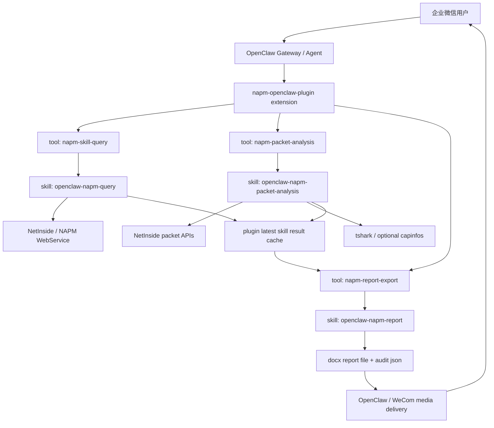
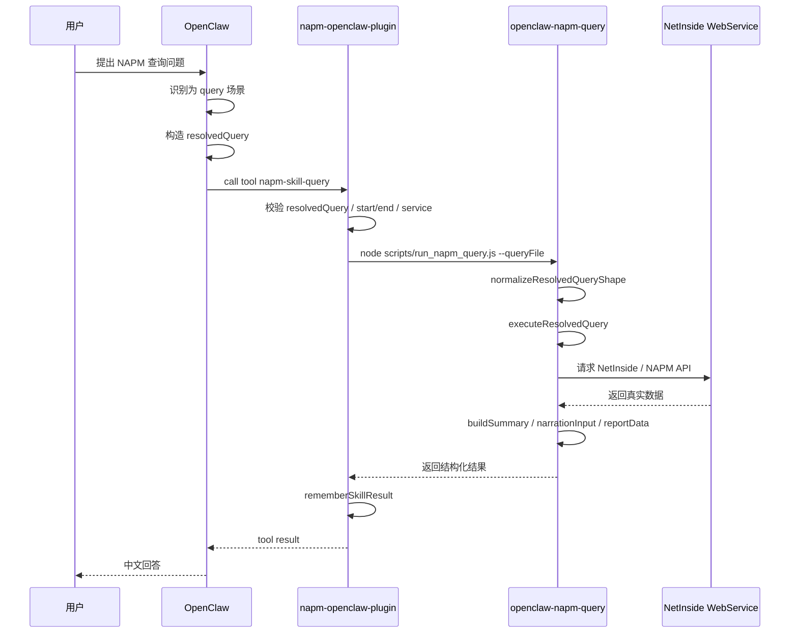
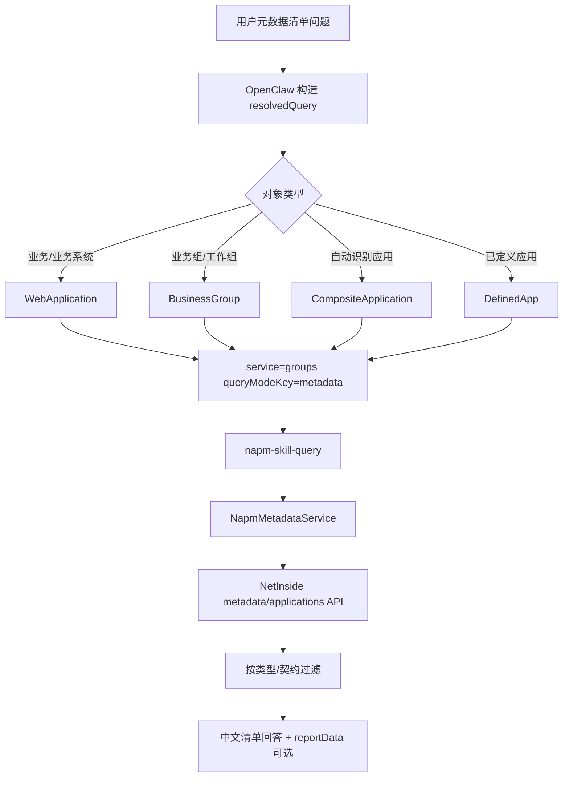
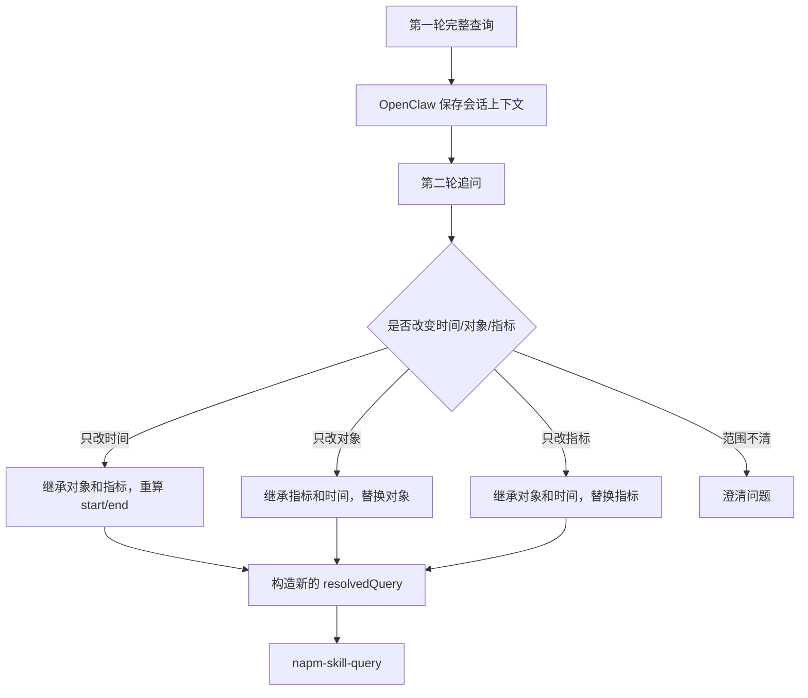
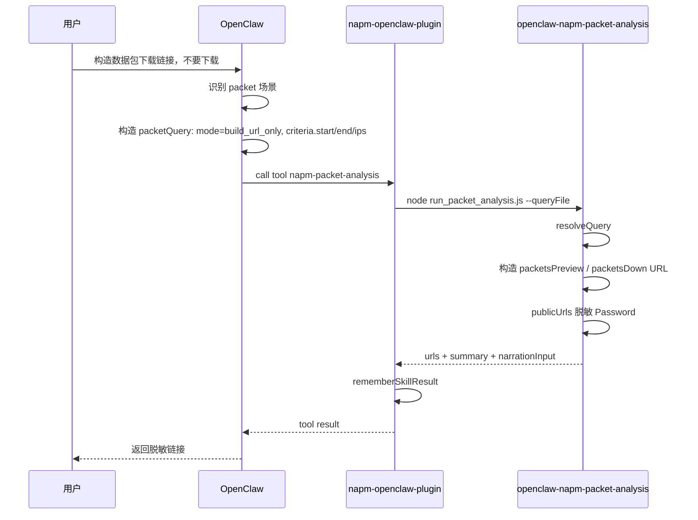
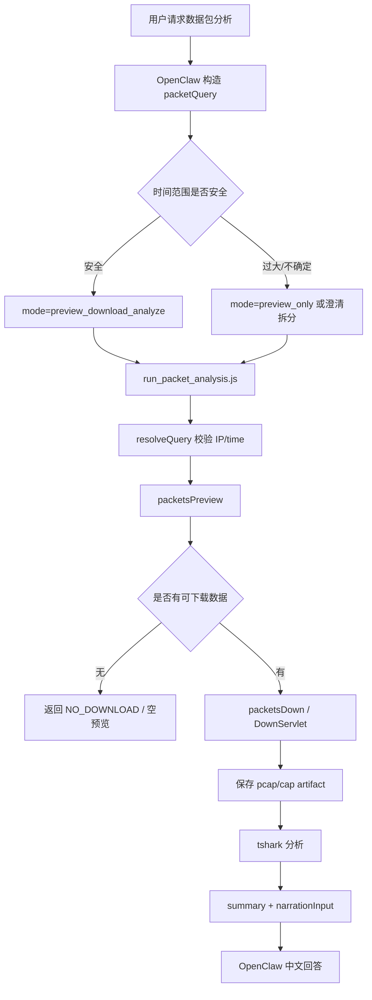
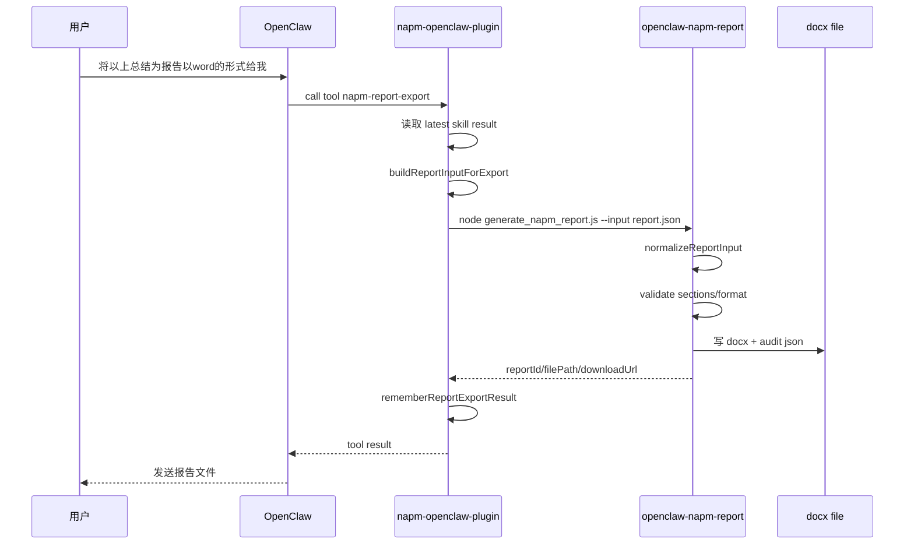
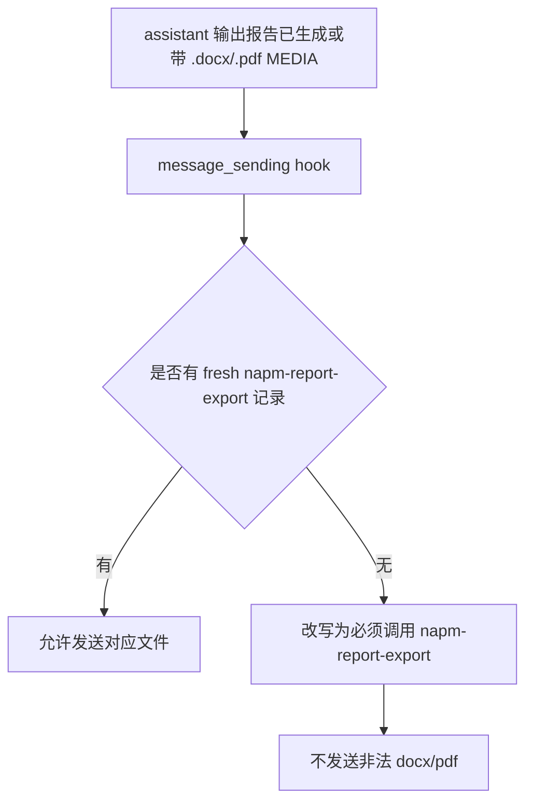

# 当前 OpenClaw NAPM 项目全链路与文件职责说明

更新时间：2026-06-10  
本地实际项目目录：`G:\my_file\项目测试\观枢·智维平台-GAIOP\project_3\NAPM_skill`  
历史目录：`G:\my_file\项目测试\观枢·智维平台-GAIOP\project_3\NAPM_Semantic_Gateway`

## 1. 当前结论

当前项目已经不是传统意义上的 `NAPM_Semantic_Gateway` HTTP 语义网关项目，而是：

```text
OpenClaw 插件
  + workspace skills
  + NAPM query skill
  + NAPM packet skill
  + NAPM report skill
  + NetInside / NAPM WebService
```

生产运行时仍然需要 `napm-openclaw-plugin`。它不是旧语义网关，而是 OpenClaw extension，用来注册工具、挂载 hook、记录最近结果、做安全边界和媒体发送边界。

当前三个业务能力已经拆成独立 skill：

- `openclaw-napm-query`：NAPM 指标、元数据、业务清单、下钻、综合分析查询。
- `openclaw-napm-packet-analysis`：数据包链接构造、预览、下载、pcap/cap 分析。
- `openclaw-napm-report`：把已有结构化查询/分析结果生成 docx 报告。

远端当前状态：

```text
openclaw-gateway.service: active

openclaw skills list:
  ready openclaw-napm-query
  ready openclaw-napm-packet-analysis
  ready openclaw-napm-report
```

## 2. 总体架构图



说明：

- OpenClaw 负责自然语言理解、追问继承、决定调用哪个 tool/skill。
- 插件负责把 OpenClaw tool 调用转成对应 Node.js skill 脚本执行。
- query/packet/report skill 各自负责自己的确定性执行，不应该互相抢职责。
- report 导出必须基于已有结构化结果，不能由模型直接写 Word 或直接发 MEDIA 文件。

## 3. 本地与远端路径映射

| 类型 | 本地路径 | 远端路径 | 说明 |
| --- | --- | --- | --- |
| 项目根目录 | `...\project_3\NAPM_skill` | 无完全等价根目录 | 本地开发与测试目录 |
| OpenClaw 插件实现 | `napm-openclaw-plugin.remote.js` | `/home/netinside/.openclaw/extensions/napm-openclaw-plugin/index.js` | 当前生产插件入口 |
| 插件 manifest | `openclaw.plugin.json` | 插件安装/加载时使用 | 声明工具契约 |
| Query skill | `skills/openclaw-napm-query` | `/home/netinside/.openclaw/workspace/skills/openclaw-napm-query` | NAPM 查询能力 |
| Packet skill | `skills/openclaw-napm-packet-analysis` | `/home/netinside/.openclaw/workspace/skills/openclaw-napm-packet-analysis` | 数据包能力 |
| Report skill | `skills/openclaw-napm-report` | `/home/netinside/.openclaw/workspace/skills/openclaw-napm-report` | 报告导出能力 |
| OpenClaw workspace skills | 无 | `/home/netinside/.openclaw/workspace/skills` | 当前 `openclaw skills list` 的 NAPM skill 来源 |
| OpenClaw root skills | 无 | `/home/netinside/.openclaw/skills` | 当前 NAPM skills 不从这里展示 |
| 报告输出目录 | 本地测试可配置 | 默认 `/home/netinside/.openclaw/reports` 或调用时指定 | docx 与审计 JSON |
| 日志 | `logs/` 和测试输出 | `/tmp/openclaw/*.log`、`journalctl --user -u openclaw-gateway.service` | 运行排查入口 |

注意：

- 当前 `NAPM_Semantic_Gateway` 是历史命名目录，实际开发和部署以 `NAPM_skill` 为准。
- 远端插件和 skill 不是同一个目录。插件在 `extensions`，skill 在 `workspace/skills`。
- `openclaw-napm-report` 必须有 `SKILL.md` frontmatter，否则 `openclaw skills list` 不会识别。

## 4. 运行时组件职责

### 4.1 OpenClaw Gateway / Agent

职责：

- 接收企业微信消息。
- 理解用户意图。
- 选择调用 `napm-skill-query`、`napm-packet-analysis` 或 `napm-report-export`。
- 对追问进行上下文继承，例如“最近一天呢”“将以上导出 Word”。
- 将 tool/skill 结果组织成最终中文回复。
- 负责媒体文件发送。

不应该做：

- 手动 curl NetInside。
- 自己写 Python 过滤 API 返回。
- 自己创建 Word 并通过 MEDIA 发送。
- 在没有 skill 结果时编造查询链路或报告。

### 4.2 `napm-openclaw-plugin`

本地文件：

```text
napm-openclaw-plugin.remote.js
openclaw.plugin.json
```

远端文件：

```text
/home/netinside/.openclaw/extensions/napm-openclaw-plugin/index.js
```

职责：

- 注册生产工具：
  - `napm-skill-query`
  - `napm-packet-analysis`
  - `napm-report-export`
- 调用对应 skill 脚本：
  - query -> `openclaw-napm-query/scripts/run_napm_query.js`
  - packet -> `openclaw-napm-packet-analysis/scripts/run_packet_analysis.js`
  - report -> `openclaw-napm-report/scripts/generate_napm_report.js`
- 缓存最近一次 query/packet 结构化结果，支持“将以上导出 Word”。
- 记录最近一次合法 report export 结果，防止模型直接发送未审计 docx/pdf。
- hook 守卫：
  - 阻断 packet 请求误走 query tool。
  - 阻断 NAPM 请求调用 shell/exec 等旁路工具。
  - 阻断报告导出请求直接发送 `.docx/.pdf`。
  - 阻断“报告已生成”但没有 `napm-report-export` 记录的文本。
- 媒体去重，避免同一文件重复发送。

不应该做：

- 继续承载业务语义解析细节。
- 继续内置大量 query 语义规则。
- 继续在插件内展开 packet 报告章节。
- 直接生成 Word/PDF。

插件关键函数：

| 函数 | 作用 |
| --- | --- |
| `createSkillToolDefinition()` | 注册 `napm-skill-query` tool |
| `createPacketAnalysisToolDefinition()` | 注册 `napm-packet-analysis` tool |
| `createReportExportToolDefinition()` | 注册 `napm-report-export` tool |
| `runSkillExecutor()` | 执行 query skill 脚本 |
| `runPacketExecutor()` | 执行 packet skill 脚本 |
| `runReportExecutor()` | 执行 report skill 脚本 |
| `buildReportInputForExport()` | 把最近 query/packet 结果作为 `sourceResult` 或 `reportData` 交给 report skill |
| `rememberSkillResult()` | 缓存最近 query/packet 结构化结果 |
| `rememberReportExportResult()` | 缓存最近合法报告导出结果 |
| `message_sending` hook | 拦截旁路回复、MEDIA 重复、非法报告文件发送 |
| `before_message_write` hook | 写入前再次改写不合规 assistant 消息 |

### 4.3 `openclaw-napm-query`

本地目录：

```text
skills/openclaw-napm-query
```

远端目录：

```text
/home/netinside/.openclaw/workspace/skills/openclaw-napm-query
```

职责：

- 执行 NAPM 指标查询。
- 执行 NAPM 元数据/对象清单查询。
- 执行指标归属、业务清单、自动识别应用、下钻目录查询。
- 执行 TopN、均值、趋势、概览、综合分析。
- 生成中文叙述结构和可导出的 `reportData`。

核心边界：

- 生产执行要求 OpenClaw 已经构造完整 `resolvedQuery`。
- 时间执行字段必须是根层级 `start/end`。
- `timeRange` 只是声明性元数据，不是执行时间。
- 不能处理数据包下载/分析。
- 不能处理报告文件生成。

主要文件：

| 文件 | 作用 |
| --- | --- |
| `SKILL.md` | query skill 的边界、职责、触发说明 |
| `references/query-workflow-contract.md` | 查询语义、对象映射、追问、时间、下钻等详细契约 |
| `scripts/run_napm_query.js` | query skill 主执行脚本 |
| `services/NapmMetadataService.js` | 元数据对象列表、应用类型筛选、下钻/对象实例相关服务 |
| `services/ResolutionSpecService.js` | 读取和解释 resolution spec |
| `services/ResolvedQueryTimeRangeService.js` | 确定性时间范围计算与分钟对齐 |
| `services/OpenClawNarrationContractService.js` | 生成 OpenClaw 可消费的中文叙述结构 |
| `services/ReportDataContractService.js` | 从 query 结果生成 `reportData` |
| `services/MetricMappingService.js` | 指标语义映射 |
| `services/DimensionMappingService.js` | 维度/对象映射 |
| `services/ObjectOntologyService.js` | NAPM 对象本体与对象类型知识 |
| `services/GroupPathPlannerService.js` | group path / 下钻路径规划 |
| `services/QueryMetadataConstraintService.js` | 查询元数据约束 |
| `services/WorkflowClassifierService.js` | 查询工作流分类 |
| `services/ClarificationGateService.js` | 判断是否需要澄清 |
| `services/PromptRoutingService.js` | 历史/辅助路由逻辑，后续应继续瘦身 |
| `services/NapmResolvedQueryResolverService.js` | 诊断/兼容用 resolver，不应成为生产主解析入口 |

### 4.4 `openclaw-napm-packet-analysis`

本地目录：

```text
skills/openclaw-napm-packet-analysis
```

远端目录：

```text
/home/netinside/.openclaw/workspace/skills/openclaw-napm-packet-analysis
```

职责：

- 构造数据包预览链接。
- 构造数据包下载链接。
- 调用 `packetsPreview` 做预览。
- 调用 `packetsDown` 或 `DownServlet` 下载数据包。
- 调用 `tshark` 分析 pcap/cap。
- 可选使用 `capinfos` 获取文件元信息。
- 返回结构化 JSON，供 OpenClaw 叙述或 report skill 转报告。

核心边界：

- 数据包请求必须走该 skill，不能改走 `topValues`、`overview` 等 NAPM 指标查询。
- 链接中需要保留 `UserName`，但 `Password` 必须脱敏为 `***`。
- 大时间范围应先预览或拆分，不能静默下载超大文件。
- packet skill 不生成 Word 报告；报告由 report skill 完成。

主要文件：

| 文件 | 作用 |
| --- | --- |
| `SKILL.md` | packet skill 的边界、模式、触发说明 |
| `references/packet-workflow-contract.md` | packet 工作流、模式选择、失败处理、跨 skill 规则 |
| `references/packet-download-api.md` | packetsPreview / packetsDown / DownServlet 接口说明 |
| `references/packet-analysis-runtime.md` | tshark/capinfos 分析策略 |
| `scripts/run_packet_analysis.js` | packet skill 主执行脚本 |
| `.env.example` | 数据包接口所需环境变量示例 |
| `package.json` | packet skill 单独运行依赖/脚本声明 |

`run_packet_analysis.js` 关键流程：

| 函数 | 作用 |
| --- | --- |
| `resolveQuery()` | 校验和归一 packetQuery |
| `publicUrls()` | 构造面向用户的脱敏 URL |
| `requestPreview()` | 调用 `packetsPreview` |
| `downloadPacket()` | 下载 pcap/cap 文件 |
| `analyzePacketFile()` | 调用 tshark/capinfos 分析 |
| `buildSummary()` | 生成摘要 |
| `buildNarrationInput()` | 输出稳定结构化结果 |

### 4.5 `openclaw-napm-report`

本地目录：

```text
skills/openclaw-napm-report
```

远端目录：

```text
/home/netinside/.openclaw/workspace/skills/openclaw-napm-report
```

职责：

- 消费已有结构化查询/分析结果。
- 归一输入为 `reportData`。
- 校验 report sections。
- 生成 `.docx`。
- 保存审计 JSON。
- 返回 `reportId/filePath/auditPath/downloadUrl/generatedAt`。

核心边界：

- 不查询 NAPM。
- 不下载数据包。
- 不理解新的自然语言查询意图。
- 不在 PDF 不可用时静默降级到 Word。
- 不生成没有 `sections` 的空报告。
- 不解决媒体重复发送问题；媒体去重属于插件/OpenClaw 运行层。

主要文件：

| 文件 | 作用 |
| --- | --- |
| `SKILL.md` | report skill 的边界、触发说明；必须有 frontmatter 才能被 OpenClaw 扫描 |
| `references/report-workflow-contract.md` | 报告输入、格式、跨 skill 编排、反模式契约 |
| `scripts/generate_napm_report.js` | report skill 主执行脚本 |
| `services/ReportInputContractService.js` | 输入归一层：接收 `reportData/sourceResult/queryResult/packetResult` 并转换成报告输入 |
| `services/ReportGenerationService.js` | 报告校验和生成主服务 |
| `services/ReportTemplateService.js` | 使用 `docx` 库渲染 Word 文档 |
| `services/ReportStorageService.js` | 生成 reportId、落盘 docx 与 audit JSON |
| `services/PdfExportService.js` | PDF 暂未启用，返回明确错误 |
| `output/.gitkeep` | 本地输出目录占位 |

`ReportInputContractService.js` 支持三类输入：

```json
{ "reportData": { "...": "..." } }
```

```json
{ "sourceResult": { "reportData": { "...": "..." } } }
```

```json
{
  "sourceResult": {
    "narrationInput": {
      "schema": "openclaw_napm_packet_analysis.v1"
    }
  }
}
```

## 5. 查询链路详细流程

### 5.1 普通 NAPM 查询

示例：

```text
系统中有哪些业务？
最近一小时丢包严重的前10个IP
业务有哪些下钻路径？
```

流程：



关键点：

- query skill 不应该从 raw prompt 自己发散查询。
- OpenClaw upstream 是 `resolvedQuery` 的构造者。
- query skill 是执行者和结果结构化者。
- 结果中如果含 `requestUrl`，最终回答应带 `Debug API`。
- query 结果可以带 `reportData`，供后续 report skill 使用。

### 5.2 元数据清单查询

示例：

```text
系统中有哪些业务？
系统中有哪些自动识别的应用？
系统都有哪些工作组？
```

流程：



对象语义契约：

| 用户说法 | 规范对象 | 说明 |
| --- | --- | --- |
| `业务` / `业务系统` / `Web应用` | `WebApplication` | 对应 Web 业务应用，通常筛 Type=3 |
| `业务组` / `工作组` | `BusinessGroup` | 业务组/工作组对象 |
| `自动识别的应用` | `CompositeApplication` | 复合/自动识别应用 |
| `已定义应用` | `DefinedApp` | 自定义/已定义应用，通常 Type=2 |

历史踩坑：

- `argument:"all"` 不能被当作名称关键词过滤。
- `业务` 不能混合 Type=2 和 Type=3 回答。
- 不能用 curl/python 手动过滤代替主链路。

### 5.3 追问查询

示例：

```text
最近一小时流量较大的前10个IP
最近一天的呢？
```

流程：



关键点：

- 追问应由 OpenClaw 继承上下文并构造新的 `resolvedQuery`。
- 不应该因为用户只说“最近一天呢”就要求重新完整描述。
- 时间戳应由确定性时间规则生成，而不是使用旧日志里的示例时间。

## 6. 数据包链路详细流程

### 6.1 构造数据包下载链接

示例：

```text
帮我构造 101.254.114.238 最近一小时的数据包下载链接，不要下载
```

流程：



关键点：

- 用户说“不要下载”时只能构造链接，不能请求下载。
- URL 应包含 `UserName=GAIOP&Password=***` 这种脱敏形式。
- 不能回答“无权限”除非 packet skill 或真实接口返回该结果。
- 不能改用 NAPM 指标 overview/topValues 来回答。

### 6.2 预览、下载、分析数据包

示例：

```text
分析 101.254.114.238 最近一天的数据包 数据情况
```

流程：



失败边界：

- 预览为空：不下载。
- 权限不足：返回 packet 接口错误，不改用 query skill 猜测。
- `tshark` 不可用：返回分析工具不可用，不伪造 packet 分析。
- 时间范围太大：要求拆分或先预览，不静默下载。

## 7. 报告导出链路详细流程

### 7.1 上一轮已有结果，追问导出 Word

示例：

```text
将以上总结为报告以word的形式给我
```

流程：



关键点：

- 模型可以总结已有结构化结果。
- 模型不能自己创建 Word。
- 文件必须来自 `napm-report-export` / `openclaw-napm-report`。
- 如果没有 fresh query/packet 结果，则返回 `REPORT_DATA_NOT_FOUND`。

### 7.2 Query 结果导出报告


### 7.3 Packet 分析结果导出报告


### 7.4 非法直接 Word/MEDIA 旁路

历史问题：

```text
模型：我直接构建一份 word 文档。
模型：通过 MEDIA 发送 /home/netinside/.openclaw/media/outbound/xxx.docx
```

当前守卫：



写入前还有第二道：

```text
before_message_write hook
  -> 发现 report prompt + 生成报告 claim + 无 report export
  -> 改写 assistant message
```

## 8. 当前文件作用总表

### 8.1 根目录关键文件

| 文件 | 作用 | 当前状态 |
| --- | --- | --- |
| `napm-openclaw-plugin.remote.js` | 生产 OpenClaw 插件源码，本地修改后部署为远端 `index.js` | 仍在生产生效 |
| `napm-openclaw-plugin.index.mjs` | 插件入口/兼容包装历史文件 | 非主要生产部署文件 |
| `napm-openclaw-plugin.package.json` | 插件包描述 | 插件安装/打包参考 |
| `openclaw.plugin.json` | 插件 manifest，声明 tool/hook 能力和工具契约 | 当前工具包括 query/report/packet |
| `package.json` | 本地 Node 项目依赖和测试命令 | `npm test` / query 脚本入口 |
| `.env` | 本地运行环境变量 | 不应提交敏感信息 |
| `.env.example` | 环境变量示例 | 可用于部署参考 |
| `.codex-temp/` | 测试中复制插件文件的临时目录 | Jest 测试使用 |
| `docs/` | 设计、复盘、部署说明文档 | 当前新增本文档 |
| `test/` | 回归测试 | 覆盖 query/report/plugin 守卫等 |

### 8.2 Query skill 文件

| 文件 | 作用 |
| --- | --- |
| `skills/openclaw-napm-query/SKILL.md` | OpenClaw 扫描和理解 query skill 的入口说明 |
| `skills/openclaw-napm-query/references/query-workflow-contract.md` | query 语义和工作流详细契约 |
| `skills/openclaw-napm-query/scripts/run_napm_query.js` | query 执行主脚本 |
| `skills/openclaw-napm-query/services/ReportDataContractService.js` | query 结果转 reportData |
| `skills/openclaw-napm-query/services/OpenClawNarrationContractService.js` | query 结果转中文叙述契约 |
| `skills/openclaw-napm-query/services/NapmMetadataService.js` | 对象实例、元数据、应用类型过滤 |
| `skills/openclaw-napm-query/services/ResolvedQueryTimeRangeService.js` | 时间范围确定性计算 |
| `skills/openclaw-napm-query/services/ResolutionSpecService.js` | resolution spec 读取 |
| `skills/openclaw-napm-query/services/NapmResolvedQueryResolverService.js` | 诊断/兼容 resolver |
| `skills/openclaw-napm-query/services/PromptRoutingService.js` | 历史路由逻辑，后续继续收口 |
| `skills/openclaw-napm-query/services/RequirementParserService.js` | 历史需求解析/兼容逻辑 |
| `skills/openclaw-napm-query/services/WorkflowClassifierService.js` | 工作流分类 |
| `skills/openclaw-napm-query/services/ClarificationGateService.js` | 澄清判断 |

### 8.3 Packet skill 文件

| 文件 | 作用 |
| --- | --- |
| `skills/openclaw-napm-packet-analysis/SKILL.md` | packet skill 入口说明 |
| `skills/openclaw-napm-packet-analysis/references/packet-workflow-contract.md` | packet 工作流契约 |
| `skills/openclaw-napm-packet-analysis/references/packet-download-api.md` | 数据包下载接口文档 |
| `skills/openclaw-napm-packet-analysis/references/packet-analysis-runtime.md` | tshark/capinfos 分析说明 |
| `skills/openclaw-napm-packet-analysis/scripts/run_packet_analysis.js` | packet 主执行脚本 |
| `skills/openclaw-napm-packet-analysis/package.json` | packet skill 独立包描述 |
| `skills/openclaw-napm-packet-analysis/.env.example` | packet 运行环境变量示例 |

### 8.4 Report skill 文件

| 文件 | 作用 |
| --- | --- |
| `skills/openclaw-napm-report/SKILL.md` | report skill 入口说明；必须含 frontmatter |
| `skills/openclaw-napm-report/references/report-workflow-contract.md` | 报告工作流契约 |
| `skills/openclaw-napm-report/scripts/generate_napm_report.js` | report 主执行脚本 |
| `skills/openclaw-napm-report/services/ReportInputContractService.js` | 输入归一：`reportData/sourceResult/queryResult/packetResult` -> reportData |
| `skills/openclaw-napm-report/services/ReportGenerationService.js` | 校验并生成报告 |
| `skills/openclaw-napm-report/services/ReportTemplateService.js` | docx 模板渲染 |
| `skills/openclaw-napm-report/services/ReportStorageService.js` | 文件和 audit JSON 存储 |
| `skills/openclaw-napm-report/services/PdfExportService.js` | PDF 不可用时返回明确错误 |
| `skills/openclaw-napm-report/output/.gitkeep` | 输出目录占位 |

## 9. 部署流程

### 9.1 本地验证

常用命令：

```bash
node --check napm-openclaw-plugin.remote.js
node --check skills/openclaw-napm-report/services/ReportInputContractService.js
node --check skills/openclaw-napm-report/scripts/generate_napm_report.js
npm test -- --runInBand test/napm-report-input-contract.test.js test/napm-openclaw-plugin-report-export.test.js test/napm-report-generation-service.test.js
```

### 9.2 远端部署

远端连接：

```text
host: 101.254.114.237
user: netinside
```

部署目标：

```text
napm-openclaw-plugin.remote.js
  -> /home/netinside/.openclaw/extensions/napm-openclaw-plugin/index.js

skills/openclaw-napm-query
  -> /home/netinside/.openclaw/workspace/skills/openclaw-napm-query

skills/openclaw-napm-packet-analysis
  -> /home/netinside/.openclaw/workspace/skills/openclaw-napm-packet-analysis

skills/openclaw-napm-report
  -> /home/netinside/.openclaw/workspace/skills/openclaw-napm-report
```

重启：

```bash
systemctl --user restart openclaw-gateway.service
systemctl --user is-active openclaw-gateway.service
```

检查：

```bash
/home/netinside/.npm-global/bin/openclaw skills list | grep openclaw-napm
journalctl --user -u openclaw-gateway.service -n 80 --no-pager
```

### 9.3 远端当前部署状态

截至 2026-06-10 文档整理时，远端确认：

```text
openclaw-gateway.service: active

ready openclaw-napm-query
ready openclaw-napm-packet-analysis
ready openclaw-napm-report
```

报告 smoke test 已验证：

```text
sourceResult(packet analysis shape)
  -> generate_napm_report.js
  -> ReportInputContractService
  -> ReportGenerationService
  -> docx + audit json
```

## 10. 企业微信测试建议

### 10.1 Query 测试

```text
系统中有哪些业务？
系统中有哪些自动识别的应用？
最近一小时丢包严重的前10个IP都有谁？
业务有哪些下钻路径？
```

期望：

- 调用 `napm-skill-query`。
- 不出现 curl/python 手动过滤。
- 不出现“直接调用后端 API”作为主链路。
- 查询链路说明应基于真实 tool/audit 记录。

### 10.2 Packet 测试

```text
帮我构造 101.254.114.238 最近一小时的数据包下载链接，不要下载
```

期望：

- 调用 `napm-packet-analysis`。
- mode 应为 `build_url_only`。
- 返回 `packetsPreview` 和 `packetsDown` 链接。
- 链接包含 `UserName`，`Password` 脱敏。
- 不判断“无权限”，除非真实 packet skill 结果证明。

```text
分析 101.254.114.238 最近一小时的数据包 数据情况
```

期望：

- 调用 `napm-packet-analysis`。
- 不改走 `napm-skill-query` 的 overview/topValues。
- 若下载/分析成功，应返回 packet 结构化摘要。

### 10.3 Report 测试

先执行 query 或 packet：

```text
分析 101.254.114.238 最近一小时的数据包 数据情况
```

再追问：

```text
将以上总结为报告以word的形式给我
```

期望：

- 调用 `napm-report-export`。
- 日志出现 `napm_report_export_invoked`。
- 日志出现 `napm_report_export_completed`。
- 文件来自 report skill 输出目录。
- 不出现“我直接构建一份 word 文档”。
- 不出现未经过 report export 的 MEDIA docx。

PDF：

```text
将以上导出 PDF
```

期望：

```text
REPORT_PDF_EXPORT_UNAVAILABLE
```

不能静默生成 Word。

## 11. 常见问题与判断

### 11.1 为什么还有插件？

因为当前 OpenClaw 需要插件注册工具和 hook。

当前设计不是“无插件纯 skill”，而是：

```text
插件作为薄适配层
skill 作为能力主体
```

插件仍负责运行时边界：

- 工具注册。
- 调用脚本。
- 最新结果缓存。
- 媒体去重。
- 禁止直接 Word/PDF 旁路。

业务执行逻辑应继续下沉到 skill。

### 11.2 workspace 下的 MD 文档有没有帮助？

有，但作用不同：

- `SKILL.md` 和 `references/*.md` 会帮助 OpenClaw/agent 理解 skill 边界和调用方式。
- 普通 `docs/*.md` 主要用于人类维护、复盘和交接。
- 仅把规则写进普通 docs，不等于生产主链路一定会遵守。
- 真正硬边界要在 plugin hook、tool schema、skill 输入校验里实现。

### 11.3 为什么 report skill 之前 `skills list` 看不到？

原因是 `openclaw-napm-report/SKILL.md` 缺少 frontmatter：

```yaml
---
name: openclaw-napm-report
description: ...
---
```

补上后，远端 `openclaw skills list` 已显示 ready。

### 11.4 什么时候会走 query，什么时候走 packet？

| 用户问题 | 应走 skill | 不应走 |
| --- | --- | --- |
| `最近一小时丢包严重的前10个IP` | query | packet |
| `系统中有哪些业务` | query | packet/report |
| `帮我构造数据包下载链接` | packet | query |
| `分析某 IP 的数据包情况` | packet | query overview/topValues |
| `将以上导出 Word` | report | query/packet 重新查 |
| `查最近一天丢包并导出报告` | query -> report | 直接 report |
| `分析 IP 数据包并导出报告` | packet -> report | query -> report |

## 12. 后续优化方向

优先级建议：

1. 继续瘦 `napm-openclaw-plugin.remote.js`，只保留工具注册、执行转发、缓存和硬边界。
2. 把 query 语义规则继续沉到 `openclaw-napm-query/references/query-workflow-contract.md` 和 query skill 内。
3. 清理 query skill 中遗留的乱码中文和旧“语义网关”描述。
4. 给 packet skill 增加更多真实接口回归测试，覆盖 `UserName/Password` URL 参数。
5. 给 report skill 增加 PDF 明确失败和 docx 视觉质量验证。
6. 建立远端部署脚本，避免手动 pscp 漏传 `SKILL.md`、references 或 services。
7. 建立企业微信冒烟测试清单，固定验证 query、packet、report 三条链路。

## 13. 一句话版心智模型

```text
OpenClaw 负责理解和编排；
plugin 负责注册工具、转发执行和守边界；
query skill 负责查 NAPM；
packet skill 负责处理数据包；
report skill 负责把已有结构化结果生成 docx；
任何 curl/python/直接 Word/MEDIA 旁路都不是生产主链路。
```
