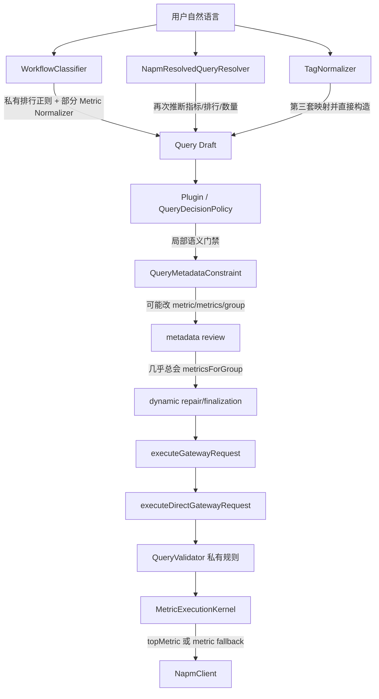
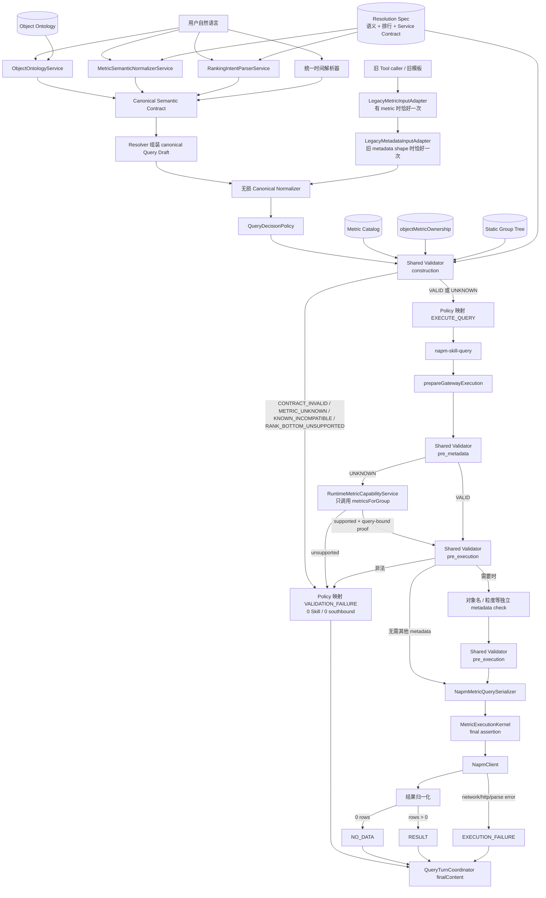
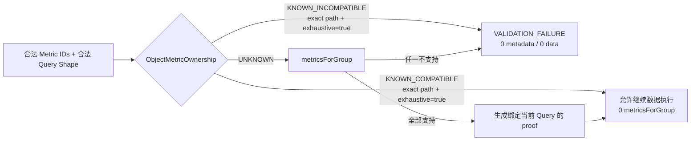

# NAPM 对象指标语义与查询执行契约最终实施方案

> 状态：最终设计已完成最后一次边界对齐，可冻结后实施
> 设计基线：`codex/napm-turn-decision-phase1` / `c07a652aa80dd593ecf3546fe41f8f621175491a`
> 本轮范围：只形成设计文档，不修改运行时代码、不连接远端 NAPM、不提交、不部署
> 主问题代号：BUG-A（Object × Metric × Service × Query Contract）
> 独立问题代号：BUG-B（PageFamily 排行后的 `pageViews` 短追问）

## 0. 结论

本方案接受上一轮对齐要求中的 15 项原则，并完成最后 7 个边界问题的核验。实施时必须遵守以下补充约束，避免把正确方向再次做成新的重复规则：

1. `metrics[]` 是 GAIOP 内部数组；NAPM HTTP 线上的正式参数名仍是逗号分隔的 `metrics`。
2. Resolution Spec 只拥有指标语义和服务契约，不再人工保存 Object × Metric 执行 ownership；当前已有的 `compatibleObjectTypes`、`ownershipClass`、`ownershipRules`、`ownershipMatrix` 必须退出人工维护的执行真相源。
3. `UNKNOWN` 不是“指标不存在”，也不是“可以直接执行”。它只允许进入一次受控的 `metricsForGroup` 能力确认；确认前数据查询门保持关闭。
4. 当前接口材料、项目请求构造和历史审计日志均没有 BottomN/升序 Top 参数；`rank_bottom` 只能被识别，不能被执行，必须在 Skill 和南向调用前返回 `RANK_BOTTOM_UNSUPPORTED`。
5. Metadata 的 GAIOP 语义必须拆成 `metricCatalog`、`metricCapability`、`groupCatalog`、`objectInventory` 和 `drilldownCatalog`；不得再用 `service="metrics" + groups 是否存在` 或 `service="groups" + groups 是否存在` 暗中切换原生接口。
6. `primaryMetric` 始终可选；排行唯一必需的是 `rankingMetric`，由 Resolver 映射为 `topMetric`。
7. Validator 只输出事实性校验状态和运行时检查要求；是否调用 Skill、metadata 或数据接口由 Policy/Orchestrator 决定。
8. legacy `metric` 永远无权覆盖 canonical 字段；完整 canonical 与不相干的 legacy `metric` 同时出现时直接拒绝，不采用“先告警后放行”。
9. `KNOWN_COMPATIBLE` 只适用于明确声明 `exhaustive=true` 的静态路径覆盖；非穷举对象或路径必须是 `UNKNOWN`。

本方案不是给某一个指标增加特例。它把“谁理解语义、谁决定对象、谁校验指标、谁可以否决执行、谁允许访问南向接口”一次性分开。

---

## 1. 已确认事实与当前问题

### 1.1 NAPM 接口事实

根据《API构造规则手册-0725》的核心参数说明和 `topValues` 示例，以及《NetInside NAPM Web Services接口描述20201218》的服务参数表：

- NAPM 的正式指标列表参数是 `metrics`，HTTP 中使用逗号分隔的指标 ID。
- `topMetric` 只承担 `topValues` 排序依据的角色。
- `metrics=TPI,TPO&topMetric=TPIO` 是合法形态，说明 `topMetric` 不必出现在 `metrics` 中。
- 两份材料都没有把单数 `metric` 定义成正式 Web Services 参数。
- `topCount` 的接口允许范围是 1 到 1000；GAIOP 仍需在语义层决定未明确数量时的产品默认值。
- 两份材料列出的 `topValues` 参数都只有 `start/end`、`metrics`、`topMetric`、`topCount` 和分组参数，没有 `direction`、`order`、`ascending` 或 `bottom` 参数；现有仓库与审计请求同样没有可验证的升序请求样本。
- 原生 `type=metrics` 是不带 group path 的全局指标目录，`type=metricsForGroup` 才是带 group path 的路径能力查询；原生 `type=groups` 返回完整分组树，本身不要求输入 groups。

因此，以下等式全部禁止成为规则：

```text
topMetric ∈ metrics[]
metric = metrics[0]
metric = topMetric
metric = metrics[0] = topMetric
```

它们在某些单指标查询中可能恰好相等，但不能成为契约。

### 1.2 当前代码已经证实的结构性问题

| 问题 | 当前证据 | 影响 |
|---|---|---|
| Plugin 强制 `topMetric` 必须在 `metrics[]` | `napm-openclaw-plugin.remote.js` 的 `top_metric_not_in_metrics` | 拒绝 NAPM 文档明确允许的 `TPI,TPO` 按 `TPIO` 排序 |
| `QueryValidator` 对 `topValues` 要求单数 `metric` | `services/QueryValidator.js` | 执行契约与正式接口错位 |
| 执行形态归一化把 `metric`、`topMetric` 都混入 `metrics[]` | `RequirementParserService.normalizeExecutableQueryShape()` | 返回列和排序列被错误合并 |
| `metric` 缺失时自动取 `metrics[0]` | `RequirementParserService`、`QueryMetadataConstraintService` | 把数组顺序误当成用户主语义 |
| 内核使用 `topMetric || metric` | `MetricExecutionKernel.js` | 掩盖上游缺字段，执行层继续猜语义 |
| 静态约束只检查一个 `metric` | `QueryMetadataConstraintService.buildCompatibility()` | 不能完整校验多个 `metrics[]` 和独立 `topMetric` |
| 动态元数据只检查一个 `query.metric` | `NapmMetadataService.reviewQuery()` | 其余返回指标和排序指标可能未经确认 |
| `reviewQuery()` 对有 group 的查询一律调用 `metricsForGroup` | `NapmMetadataService.reviewQuery()` | 静态明确非法组合仍产生不必要的南向元数据调用 |
| Resolver 独立解析指标和排行 | `NapmResolvedQueryResolverService.inferMetric()`、`isRankingPrompt()`、`inferTopCount()` | 与统一分类器形成多套解释 |
| WorkflowClassifier 自带排行正则 | `WorkflowClassifierService.hasRankingIntent()` | 排行语义无法保持唯一来源 |
| `MetricSemanticNormalizerService` 仍内置独立指标正则 | `METRIC_PATTERNS` | Resolution Spec 尚未真正成为机器语义真相源 |
| `TagNormalizer` 同时维护指标、对象、形态和指标编码 | `services/TagNormalizer.js` | 可直接构造另一套 ResolvedQuery |
| Resolution Spec 内含 execution ownership | `metrics.catalog.*.compatibleObjectTypes`、`ownershipClass`、`ownershipRules`、`ownershipMatrix` | 与 `objectMetricOwnership.js` 形成两套执行真相 |
| 根目录和 Skill 内 Resolution Spec 已漂移 | 两份 JSON 的 SHA-256 不同；Skill 内还包含 `pageViews` 和 `queryArgumentPolicies` | 开发、测试和部署可能读取不同规则 |
| `objectMetricOwnership.js` 有根目录与 Skill 内两个实体副本 | 当前内容相同但路径不同 | 后续维护仍可能再次漂移 |
| `MetricMappingService` 配置失败时回退到内置指标表 | `loadDefaultMetrics()` | “合法指标目录”存在第二套兜底真相，可能放过过期或不完整定义 |
| 查询失败分类可通过错误文本中的 `empty/no data` 判断空数据 | `ExecutionFailureClassifier.js` | 参数错误或上游错误可能被错误叙述成“未查到数据” |
| 本地归一化器把已返回的 TopN 按 `asc` 重排 | `TopValuesResultNormalizerService.js` | 将“最大 N 条中的最小值”误报成“全体最小 N 条”，属于错误结果 |
| Metadata `metrics/groups` 根据是否携带 `groups[]` 切换含义 | `MetadataExecutionKernel.js` | GAIOP abstraction 与 NAPM 原生 service 重载，required fields 无法稳定 |

### 1.3 当前可复现的主故障

用户问题：

```text
最近业务访问较慢的前5个业务都有谁？
```

产品语义应当是：

```json
{
  "operation": "rank_top",
  "direction": "desc",
  "targetObjectType": "WebApplication",
  "primaryMetric": "PGTME",
  "requestedMetrics": ["PGTME"],
  "rankingMetric": "PGTME",
  "topCount": 5
}
```

最终执行查询应当是：

```json
{
  "service": "topValues",
  "queryModeKey": "topn",
  "groups": [{ "type": "WebApplication" }],
  "metrics": ["PGTME"],
  "topMetric": "PGTME",
  "topCount": 5,
  "start": 0,
  "end": 0
}
```

示例中的 `start/end=0` 只表示由时间解析阶段填入分钟对齐的真实时间，不是可执行值。问题不应被解析为 `WebApplication + TRTI`，也不能在发现不兼容后自动把 `TRTI` 偷换成 `PGTME`。

---

## 2. 最终架构原则

### 2.1 责任分配

| 问题 | 唯一负责组件 | 不再负责的组件 |
|---|---|---|
| “慢业务”对应什么指标 | Resolution Spec 中的 machine semantic rule，由 `MetricSemanticNormalizerService` 读取 | Resolver、Policy、Runner、TagNormalizer |
| 问句是否为排行、方向和数量 | Resolution Spec 中的 ranking grammar，由新增 `RankingIntentParserService` 读取 | WorkflowClassifier 私有正则、Resolver 私有正则 |
| “业务”是什么对象 | `object-ontology.v1.json` + `ObjectOntologyService` | Resolver 的对象关键字补丁 |
| 指标 ID 是否真实存在 | `metrics-config.yml` + 严格指标目录服务 | 内置 fallback 指标表、模型输出 |
| Object × Metric 是否静态可执行 | `objectMetricOwnership.js` | Resolution Spec ownership、DimensionMapping、Policy 正则 |
| Service 字段是否合法 | Resolution Spec `services` | QueryValidator 私有字段规则、Kernel fallback |
| Group path 是否成立 | 静态 groups tree + `GroupPathPlannerService` 的结构验证 | 模型猜路径、仅凭 `groups.length` 放行 |
| 对象参数是否需要/禁止 | Resolution Spec `queryArgumentPolicies` | 各执行器重复判断 |
| 是否允许调用 Skill/metadata/数据接口 | QueryDecisionPolicy 与 RequirementParser orchestration 映射 Validator 事实和必要的 runtime capability proof | Validator 不输出调用权限；Metadata repair、Kernel 不猜测 |
| 静态未知组合的设备能力确认 | `RuntimeMetricCapabilityService` 调用 `metricsForGroup` | 普通 metadata review 无条件调用 |
| Query 修复 | 独立 `AtomicQueryRepairService` | Validator、Serializer、Metadata reviewer |
| NAPM 参数序列化 | `NapmMetricQuerySerializer` | Resolver、Metadata repair、Kernel 兜底 |
| 通信 | `NapmClient` | 不理解对象、指标或用户语义 |

### 2.2 必须保持的分层

```text
Semantic Layer
  只理解用户表达，产出结构化 Semantic Contract

Resolver
  只把结构化语义和时间/对象结果组装成完整 Query Draft

Normalizer
  只做等价、无损、确定性的形态归一化

Validator
  只判断，不改写，不解析自然语言

Runtime Capability Confirmation
  只处理静态 UNKNOWN

Repair Transaction
  只在存在唯一安全修复时生成完整新对象，并重新完整校验

Serializer / Execution Kernel
  只读取已通过校验的 canonical 字段，不猜、不补、不修

NapmClient
  只负责请求和响应
```

---

## 3. Authoritative Source Matrix

| 知识类别 | 唯一 authoritative source | 运行时入口 | 其他现有数据的最终定位 |
|---|---|---|---|
| Object ontology | `skills/openclaw-napm-query/config/object-ontology.v1.json` | `ObjectOntologyService` | Resolution Spec 对象别名迁移后删除或生成，不再手工维护 |
| Metric ID catalog | `skills/openclaw-napm-query/config/metrics-config.yml` | 严格化后的 `MetricMappingService`，后续可更名 `MetricCatalogService` | 内置默认指标表退出准入主链；描述别名不能凭空创建新 ID |
| Metric semantic | Skill 内 canonical Resolution Spec 的 `metricSemanticRules` | `MetricSemanticNormalizerService` | `chinese-semantic-metric-mapping.md` 仅作说明；`TagNormalizer`、Resolver aliases 退出主链 |
| Object-metric ownership | Skill 内 `src/constants/objectMetricOwnership.js` | 新增 tri-state API | Resolution Spec 内 ownership 字段删除或改成自动生成、不可人工编辑的展示投影 |
| Service contract | Skill 内 canonical Resolution Spec 的 `services`，含五种显式 GAIOP metadata service 及 provider mapping | `ResolutionSpecService` | `QueryValidator` 不再维护第二份字段规则；Metadata Kernel 不按 groups 数量重载 service |
| Group path | 当前静态 groups tree | `GroupPathPlannerService.validateExplicitPath()` | Runtime group metadata 仅补设备事实，不改写静态路径否决 |
| Ranking grammar | Skill 内 canonical Resolution Spec 的 `rankingGrammar` | 新增 `RankingIntentParserService` | WorkflowClassifier/Resolver 的排行正则删除 |
| Argument policy | Skill 内 canonical Resolution Spec 的 `queryArgumentPolicies` | `ResolutionSpecService.evaluateQueryArgumentPolicy()` | 执行器只消费结果 |
| Runtime capability | 当前设备 `metricsForGroup` 响应及短 TTL 缓存 | 新增 `RuntimeMetricCapabilityService` | 只能确认静态 UNKNOWN，不能覆盖 static deny |
| pageViews detail contract | `skills/shared/NapmPageViewsContract.js` | `validatePageViewsQuery()` / `buildPageViewsParams()` | Resolution Spec 只登记路由所需字段，不重新实现 detail 校验 |

### 3.1 Resolution Spec 中 ownership/domain 字段的处置

当前 Resolution Spec 中以下字段包含执行 ownership，必须退出人工维护：

```text
metrics.ownershipRules
metrics.ownershipMatrix
metrics.catalog.*.compatibleObjectTypes
metrics.catalog.*.preferredObjectTypes
metrics.catalog.*.ownershipClass
```

迁移规则：

1. 先搜索全部运行时读取者并改为调用 `objectMetricOwnership`。
2. 增加契约测试，禁止 Validator、Policy、Resolver 从 Resolution Spec 读取这些字段做执行准入。
3. 如指标清单展示仍需要兼容对象信息，由构建步骤从 `objectMetricOwnership` 生成只读 projection；生成内容不得回流为准入依据。
4. 无消费方后从 Resolution Spec 删除这些字段。
5. `metrics.catalog.*.domain`、指标标签、单位可作为语义和展示元数据保留，但不能推导执行 compatibility。

这避免出现：

```text
objectMetricOwnership = 一份准入规则
Resolution Spec ownership = 另一份准入规则
```

### 3.2 根目录与 Skill 内配置的收口

运行时 `ResolutionSpecService` 当前固定读取 Skill 内配置，因此最终确定：

```text
canonical authoring source
= skills/openclaw-napm-query/config/napm-resolution-spec.v1.json
```

根目录 `config/napm-resolution-spec.v1.json` 不得继续人工编辑。可选实现按优先级为：

1. 删除根目录副本并修改依赖者使用 Skill 内源；这是首选。
2. 如发布工具必须保留根目录文件，则由脚本从 Skill 内源生成，并在 `verify:runtime-contract` 中做规范化 JSON 等价校验。

同理：

- Skill 内 `objectMetricOwnership.js` 是 canonical runtime source。
- 根目录同名文件改为薄 re-export，或在确认无运行时依赖后删除。
- `metrics-config.yml` 如必须保留根目录副本，也采用生成镜像加等价校验，禁止双向手改。

---

## 4. Canonical Semantic Contract

### 4.1 结构

自然语言解析完成后，WorkflowClassifier 和 Resolver 之间只传递结构化语义：

```json
{
  "schemaVersion": "napm-query-semantic.v1",
  "status": "RESOLVED",
  "operation": "rank_top",
  "direction": "desc",
  "targetObjectType": "WebApplication",
  "primaryMetric": "PGTME",
  "requestedMetrics": ["PGTME"],
  "rankingMetric": "PGTME",
  "topCount": 5,
  "timeIntent": {
    "key": "last24hours"
  },
  "confidence": 0.98,
  "ambiguities": [],
  "unresolvedSlots": [],
  "reasonCode": null,
  "source": {
    "metric": "metric-semantic-normalizer",
    "ranking": "ranking-intent-parser",
    "object": "object-ontology"
  }
}
```

### 4.2 字段要求

| 字段 | 规则 |
|---|---|
| `schemaVersion` | 必填；不接受未识别版本 |
| `status` | 必填；仅允许 `RESOLVED/AMBIGUOUS/UNRESOLVED/UNSUPPORTED` |
| `operation` | 必填；如 `rank_top`、`rank_bottom`、`average`、`timeseries`、`detail_list`、`metadata_list` |
| `targetObjectType` | 普通指标查询必填；来自 Object Ontology |
| `primaryMetric` | 始终可选；表示用户语义上的核心关注指标，不承担排序或返回列的执行职责 |
| `requestedMetrics` | `average`、`timeseries` 必须非空；排行可选，缺省时由 Resolver 明确采用 `[rankingMetric]` 作为展示指标 |
| `rankingMetric` | 仅 `rank_top/rank_bottom` 必填；表示排行依据，独立于 `requestedMetrics[]` |
| `direction` | 排行必填；`asc` 或 `desc` |
| `topCount` | 排行必填；由显式数量或统一 ranking default 产生 |
| `timeIntent` | 可选；由统一时间解析器物化成 `start/end` |
| `ambiguities` | 必填数组；关键槽位存在同等可信候选时保存结构化候选 |
| `unresolvedSlots` | 必填数组；保存当前 operation 所要求但仍缺失的语义槽位 |
| `reasonCode` | 必填但可为 `null`；生命周期失败时给出确定性原因 |
| `source` | 必填；用于证明每个语义槽位来自唯一解析器 |

生命周期由 `WorkflowClassifierService` 在计算 operation 对应的 required semantic slots 后统一判定，顺序固定为：required slot 歧义 → `AMBIGUOUS`；否则 required slot 缺失 → `UNRESOLVED`；否则语义完整但能力明确不支持 → `UNSUPPORTED`；否则 → `RESOLVED`。只有 `RESOLVED` 可以进入 Query Draft assembly。

这里的 `RESOLVED` 只表示“用户语义已经完整、唯一地被理解”，不代表 Query Contract 合法、Object × Metric 兼容、运行时设备支持或允许调用南向接口。这些判断仍分别属于后续 Phase 3/4/5。Resolver 不得通过 implicit default object 补齐非 `RESOLVED` Contract；可信上下文若能确定对象，必须在 Contract 构造阶段写入 `targetObjectType` 和对应 source。

### 4.3 `primaryMetric` 与执行字段的关系

```text
primaryMetric
= 用户语义上主要关注的指标
= Semantic Contract 字段
= 始终 optional
= 不直接发送给 NAPM

requestedMetrics
= 用户明确希望查看的指标集合
= Resolver 生成 metrics[] 的唯一语义输入

rankingMetric
= 排行依据
= 仅 rank_top/rank_bottom required
= Resolver 生成 topMetric 的唯一语义输入

topMetric
= 只在 ResolvedQuery 中出现
= 只由 rankingMetric 生成
```

字段之间不建立隐式等式：`primaryMetric`、`requestedMetrics[]` 和 `rankingMetric` 可以相同，也可以不同。若排行语义没有明确展示指标，Resolver 使用具名规则 `ranking_metric_as_default_display_metric` 生成 `metrics=[rankingMetric]`；这不是通过 `metrics[0]` 反推语义。

如果语义是：

```text
同时查看访问量、页面响应时间和 HTTP 500，并按页面响应时间排行
```

合法结果是：

```json
{
  "operation": "rank_top",
  "requestedMetrics": ["PGNPGE", "PGTME", "PGHTTP500"],
  "rankingMetric": "PGTME"
}
```

Resolver 据此生成 `metrics=[PGNPGE,PGTME,PGHTTP500]`、`topMetric=PGTME`。不得为了“字段一致”压缩成单指标查询。

多指标 `average/timeseries` 不要求 `primaryMetric`：

```json
{
  "operation": "timeseries",
  "targetObjectType": "WebApplication",
  "requestedMetrics": ["PGNPGE", "PGTME", "PGHTTP500"]
}
```

这是完整语义，Resolver 不得制造 `primaryMetric`。

### 4.4 正式产品语义

Resolution Spec 中新增有优先级和适用对象的 machine semantic rules。至少固定：

| 结构化语义 | 对象条件 | 指标 |
|---|---|---|
| 业务慢、业务响应慢、页面响应慢 | `WebApplication` | `PGTME` |
| 慢页面数量 | `WebApplication` / `PageFamily` | `PGNSLPGE` |
| 服务器响应时间 | `DefinedApp` 等非业务应用对象 | `TRTI` |
| 网络时延、RTT | `IPAddress` 等网络对象 | `RTTI` |

匹配顺序必须按“更具体的短语优先、对象约束优先、明确指标 ID 优先”，例如“慢页面数量”必须优先于泛化的“慢”。如果两个候选同等可信，返回 clarification，而不是选择默认指标。

### 4.5 统一排行语义

新增 `rankingGrammar`，由一个 `RankingIntentParserService` 消费，输出：

```json
{
  "operation": "rank_top",
  "direction": "desc",
  "topCount": 5,
  "countSource": "explicit"
}
```

至少覆盖：

```text
前5个、前10个、前 N 个
Top5、Top 10、TopN
最高的5个、最多的5个、最低的5个、最少的5个
都有谁、有哪些、排行、排名
```

`RankingIntentParserService` 可以识别 `rank_bottom/asc`，但“能识别”不等于“可执行”。只有对象、排行指标、数量和方向全部明确时，该语义才为 `UNSUPPORTED/RANK_BOTTOM_UNSUPPORTED`；例如“最低的5个业务”缺少 `rankingMetric`，必须先标记为 `UNRESOLVED`。当前 NAPM 契约没有升序 Top 或完整候选集分页能力，Resolver 不得为两类状态生成 `topValues` ResolvedQuery；完整 BottomN 后续进入 Query Decision 时返回：

```text
outcome=VALIDATION_FAILURE
reasonCode=RANK_BOTTOM_UNSUPPORTED
skill invocation=0
metadata southbound=0
data southbound=0
```

用户提示应说明：当前只能可靠查询最高/最多 TopN，不能保证最低/最少 BottomN 的正确性。后续只有取得真实升序参数，或证明某对象候选全集可被完整枚举并定义分页、完整性和性能边界后，才能另行开启 `rank_bottom`。

默认数量只在 `rankingGrammar.defaults` 中定义：

- 明确单数“哪个/第一”可得到 1。
- 未给数量的复数排行使用统一产品默认值，建议保持当前 Resolver 常见行为为 10。
- `topCount` 最终限制在 1 到 1000。
- Stable Template 如需要特定数量，必须显式声明，不能由 Kernel 再默认成 20。

WorkflowClassifier 只消费该解析结果，不再执行 `hasRankingIntent()`；Resolver 也不再执行 `isRankingPrompt()`、`inferTopCount()` 或 `inferDirection()`。

---

## 5. Canonical ResolvedQuery Contract

### 5.1 公共规则

所有可执行查询都必须满足：

- `service` 必须存在于共享 `ResolvedQueryContract`；`queryModeKey` 必须与该 service 的派生值一致。
- `schemaVersion` 必须是 `napm-resolved-query.v1`；`queryModeKey` 由 `service` 派生并只用于过渡路由一致性校验。
- 数据与详情查询的 `start/end` 是正整数 Unix 秒、`start < end`、并按分钟对齐。
- `groups` 中只保留标准 `type` 和按 argument policy 允许的 `argument`。
- 多 group 普通查询默认拒绝；只有静态 groups tree 验证通过、`pathPlanning` 与实际 groups 完全一致、并满足可信下钻授权的路径可执行。
- canonical ResolvedQuery 不包含单数 `metric`。
- Validator 输入到输出期间不得修改原对象。

### 5.2 `topValues`

| 类别 | 字段 |
|---|---|
| required | `schemaVersion="napm-resolved-query.v1"`、`service="topValues"`、`start`、`end`、非空 `groups[]`、非空 `metrics[]`、`topMetric`、`topCount` |
| optional/derived | `queryModeKey="topn"`、`filters`、声明性 `timeRange`、`format`、`semanticConstraints`、`pathPlanning`、`resolutionHints` |
| forbidden | `metric`、`granularity`、`pageFamilyId`、`maxLimit` |
| derived | 只在 Serializer 中生成逗号分隔的 HTTP `metrics` |
| legacy | 旧 `metric` 只能在 canonical boundary 之前由 Legacy Adapter 消费 |

重要规则：

```text
canonical topValues 当前只允许 semantic operation=rank_top、direction=desc。
rank_bottom/asc 不得到达 Serializer。
topMetric 可以不在 metrics[] 中。
metrics[] 中每个指标与 topMetric 必须分别通过存在性和 Object × Metric 校验。
```

合法示例：

```json
{
  "schemaVersion": "napm-resolved-query.v1",
  "service": "topValues",
  "queryModeKey": "topn",
  "start": 1757311360,
  "end": 1757320000,
  "groups": [{ "type": "IPAddress" }],
  "metrics": ["TPI", "TPO"],
  "topMetric": "TPIO",
  "topCount": 20
}
```

### 5.3 `averageValues`

| 类别 | 字段 |
|---|---|
| required | `schemaVersion="napm-resolved-query.v1"`、`service="averageValues"`、`start`、`end`、非空 `groups[]`、非空 `metrics[]` |
| optional/derived | `queryModeKey="average"`、`filters`、`timeRange`、`format`、`semanticConstraints`、`pathPlanning`、`resolutionHints` |
| forbidden | `metric`、`topMetric`、`topCount`、`granularity`、`pageFamilyId`、`maxLimit` |
| derived | Serializer 生成 HTTP `metrics` |
| legacy | 旧单数 `metric` 可由 Legacy Adapter 转换成单元素 `metrics[]`，但 canonical 对象不保留 |

### 5.4 `timeValues`

| 类别 | 字段 |
|---|---|
| required | `schemaVersion="napm-resolved-query.v1"`、`service="timeValues"`、`start`、`end`、非空 `groups[]`、非空 `metrics[]`、`granularity` |
| optional/derived | `queryModeKey="timeseries"`、`filters`、`timeRange`、`format`、`semanticConstraints`、`pathPlanning`、`resolutionHints` |
| forbidden | `metric`、`topMetric`、`topCount`、`pageFamilyId`、`maxLimit` |
| derived | Serializer 生成 HTTP `metrics` |
| legacy | 与 `averageValues` 相同，只在 canonical boundary 之前转换 |

`granularity` 必须是正整数并通过本地/运行时粒度规则。粒度修正只允许从统一时间策略产生，不得由 Kernel 猜测。

### 5.5 `pageViews`：GAIOP Detail Query Contract

`pageViews` 不与 NAPM 三类指标服务混为同一个“官方指标服务契约”。其依据是当前项目共享实现 `skills/shared/NapmPageViewsContract.js`、已有 HAR/真实链路证据和后续 BUG-B 专项验收。

| 类别 | 字段 |
|---|---|
| required | `schemaVersion="napm-resolved-query.v1"`、`service="pageViews"`、`pageFamilyId`、`start`、`end` |
| optional/derived | `queryModeKey="detail"`、`maxLimit`、可信 `resultReference/sourceReference`、`timeRange`、`format`、`semanticConstraints` |
| forbidden | `groups`、`metrics`、`metric`、`topMetric`、`topCount`、`granularity` |
| derived | 缺省 `maxLimit=20`；本地保护上限 200，不宣称是上游正式上限 |
| legacy | `PageFamilyDetail` 不能转换成 group，必须拒绝 |

### 5.6 Metadata Services

当前 `MetadataExecutionKernel` 把 `service="metrics"` 有 groups 时改调 `metricsForGroup`、无 groups 时调 `metrics`；`service="groups"` 有单 group 时又可能转成 `applications/businessGroups/groupArguments`，无 groups 时才是原生 `groups`。这是需要迁移的 overloaded contract，不能成为最终设计。

最终 canonical GAIOP Metadata Service 固定为五种显式服务：

| GAIOP service | 语义 | required | forbidden | NAPM provider |
|---|---|---|---|---|
| `metricCatalog` | 设备全局指标目录 | `service`、`queryModeKey="metadata"` | `groups`、`targetObjectType`、所有数据指标字段 | `type=metrics` |
| `metricCapability` | 指定 group path 可用指标 | `service`、`queryModeKey="metadata"`、非空 `groups[]` | `targetObjectType`、所有数据指标字段 | `type=metricsForGroup` + group path |
| `groupCatalog` | group 定义/树 | `service`、`queryModeKey="metadata"` | `groups`、`targetObjectType`、所有数据指标字段 | 静态 groups tree 或 `type=groups`，由 truth-source policy 决定 |
| `objectInventory` | 某种命名对象的实例清单 | `service`、`queryModeKey="metadata"`、`targetObjectType` | `groups`、所有数据指标字段 | ObjectMetadataRegistry 选择 `applications`、`businessGroups`、`groupArguments` 等 |
| `drilldownCatalog` | 可达下钻路径目录 | `service`、`queryModeKey="metadata"` | 所有数据指标字段 | 从受信 groups tree 派生；默认不调用数据接口 |

“所有数据指标字段”指 `metric`、`metrics`、`topMetric`、`topCount`、`granularity`。`metricCatalog` 与本地 `metrics-config.yml` 也必须区分：前者是用户主动查询当前设备指标目录的 metadata operation，后者是执行前本地合法 ID 校验的静态真相源。

旧 Metadata shape 只在 legacy boundary 转换一次：

| legacy shape | canonical shape |
|---|---|
| `service=metrics` 且无 groups | `service=metricCatalog` |
| `service=metrics` 且有 groups | `service=metricCapability`，保留 groups |
| `service=groups` 且无 groups | `service=groupCatalog` |
| `service=groups` 且单 group 表示对象清单 | `service=objectInventory`，把可信 group type 投影为 `targetObjectType` |
| 已声明 `drilldownCatalog` | 保持 `drilldownCatalog` |

正常新 Semantic 路径直接生成上述 canonical service，不经过 Metadata Legacy Adapter。Serializer/Metadata Kernel 必须根据明确 service 选择 provider，不再根据 `groups.length` 猜真实服务。

`overview`、`topValues_multi_protocol` 等复合服务继续保持独立 contract；它们内部产生的每个真实子查询都必须分别形成 canonical ResolvedQuery 并通过同一个 Validator。

---

## 6. `metric` Migration Plan

### 6.1 为什么不能立即删除

当前以下路径仍读取或写入 `metric`：

- Plugin Tool schema 和 Query 摘要。
- `QueryValidator`。
- `RequirementParserService.normalizeExecutableQueryShape()`、`buildMetricCsv()`、稳定模板和动态模板。
- `QueryMetadataConstraintService`。
- `NapmMetadataService.reviewQuery()`。
- `MetricExecutionKernel`。
- `NapmResolvedQueryResolverService`。
- `TagNormalizer`。
- `run_napm_query.js` 的 overview/discovery 辅助逻辑。

一次性删除会让大量旧测试、模板和复合查询同时失效，因此采用入口兼容、内部去除、最终删字段的迁移方式。

### 6.2 迁移期唯一兼容入口

新增 `LegacyMetricInputAdapter`。它只在输入对象实际包含单数 `metric` 时、Query Draft 进入 canonical normalization 前运行一次；没有 `metric` 的新 canonical 路径调用次数必须为 0。legacy `metric` 永远无权覆盖已有 canonical 字段。

#### `topValues` 决策表

| 输入情况 | canonical 输出 | warning | reject |
|---|---|---|---|
| 只有 `metric=M` | `metrics=[M]`、`topMetric=M`，删除 `metric` | `LEGACY_METRIC_DEPRECATED(kind=adapted)` | 否 |
| `metrics=[...]` + `metric=M`，缺 `topMetric` | 保留 `metrics`，以 `M` 补 `topMetric`，删除 `metric`；允许 M 不在 metrics 中 | `LEGACY_METRIC_DEPRECATED(kind=adapted)` | 否 |
| `topMetric=T` + `metric=M`，缺 `metrics`，且 `T=M` | 保留 `topMetric=T`，以 `[M]` 补 `metrics`，删除 `metric` | `LEGACY_METRIC_DEPRECATED(kind=adapted)` | 否 |
| `topMetric=T` + `metric=M`，缺 `metrics`，且 `T!=M` | 不猜返回指标集合 | 无 | `LEGACY_METRIC_PARTIAL_CONFLICT` |
| 完整 `metrics + topMetric` + `metric`，且 metric 等于 topMetric 或属于 metrics | 完整 canonical 字段不变，删除 `metric` | `LEGACY_METRIC_DEPRECATED(kind=redundant)` | 否 |
| 完整 `metrics + topMetric` + `metric`，且 metric 与两个 canonical 角色都无关 | 不产出 canonical query | `LEGACY_METRIC_CONFLICT` | **是** |

因此 `{metrics:["PGTME"], topMetric:"PGTME", metric:"TRTI"}` 的唯一结论是直接 `VALIDATION_FAILURE/LEGACY_METRIC_CONFLICT`，零 Skill、零 metadata、零数据南向；不能静默忽略，也没有“先告警后放行”阶段。

#### `averageValues/timeValues` 决策表

| 输入情况 | canonical 输出 | warning | reject |
|---|---|---|---|
| 只有 `metric=M` | `metrics=[M]`，删除 `metric` | `LEGACY_METRIC_DEPRECATED(kind=adapted)` | 否 |
| `metrics=[...]` + `metric=M`，且 M 已在 metrics 中 | 保留 metrics，删除 `metric` | `LEGACY_METRIC_DEPRECATED(kind=redundant)` | 否 |
| `metrics=[...]` + `metric=M`，且 M 不在 metrics 中 | 不产出 canonical query | `LEGACY_METRIC_CONFLICT` | **是** |
| Metadata/pageViews 携带 `metric` | 不转换 | 对应 forbidden-field reason | **是** |

部分 canonical 字段只允许由 legacy `metric` 填充尚未占用的角色；Adapter 不删除、不改写任何已有 canonical 字段。转换后必须删除 `metric` 并重新走完整 Validator。Semantic Contract 的 `primaryMetric` 不触发 Adapter；Resolver 只按 `requestedMetrics/rankingMetric` 生成 canonical 字段。

### 6.3 禁止新增写入

第一阶段即加入静态检查和测试，禁止以下组件继续写 `resolvedQuery.metric`：

```text
WorkflowClassifier
NapmResolvedQueryResolverService
TagNormalizer
QueryMetadataConstraintService
RequirementParserService templates
run_napm_query.js
```

### 6.4 何时允许为空

- `averageValues/timeValues` 有合法 `metrics[]` 时，`metric` 必须不存在。
- 多指标语义没有明确 `primaryMetric` 时，不生成任何兼容 `metric`。
- `topValues` 使用明确 `topMetric`，不需要额外 `metric`。
- 只有旧代码尚未迁移的内部边界可以读取 Adapter 提供的临时兼容视图；该视图不得传到 Serializer。

### 6.5 禁止 `metrics[0]` 成为隐式主指标

数组顺序只用于稳定序列化和展示，不表达主语义。以下查询不能把 `PGNPGE` 推断为 primaryMetric：

```json
{
  "metrics": ["PGNPGE", "PGTME", "PGHTTP500"]
}
```

如果后续逻辑需要主语义，必须读取 Semantic Contract 的 `primaryMetric`；不存在时保持空值或澄清。

### 6.6 最终删除条件

全部满足后删除 `metric`：

1. Tool schema 不再声明 canonical `metric`。
2. 所有模板改成 `metrics[]` 和必要的 `topMetric`。
3. Validator、Metadata、Kernel、Serializer 无任何 `metric` fallback。
4. 全仓 `rg "query.*metric|resolvedQuery\.metric"` 只剩 Legacy Adapter、迁移测试或非执行结果标签。
5. 连续一个发布周期未观察到 legacy-only 输入，或发布策略明确完成破坏性升级。

---

## 7. Shared Executable Validator Contract

### 7.1 组件定位

新增：

```text
skills/openclaw-napm-query/services/ResolvedQueryExecutableValidator.js
```

它是无副作用的校验编排器，不是新知识库、语义解析器或 repair engine。

### 7.2 输入

```json
{
  "resolvedQuery": {},
  "phase": "construction | pre_metadata | pre_execution | kernel_assertion",
  "runtimeCapabilityProof": null
}
```

`runtimeCapabilityProof` 只能来自进程内部的 Runtime Capability Service，不接受 Tool 调用方直接提供的同名字段。

### 7.3 输出

```json
{
  "ok": false,
  "status": "KNOWN_INCOMPATIBLE",
  "reasonCode": "OBJECT_METRIC_INCOMPATIBLE",
  "issues": [
    {
      "field": "topMetric",
      "metricId": "TRTI",
      "objectType": "WebApplication"
    }
  ],
  "requiredRuntimeChecks": []
}
```

Validator 不返回 `nextAction`、`skillInvocationAllowed`、`metadataSouthboundAllowed` 或 `dataSouthboundAllowed`。这些是生命周期和编排决定，不是查询事实；把它们放入 Validator 会让公共校验器反向依赖 Plugin/Skill 调用模型。

顶层状态固定为：

| status | 含义 | 后续动作 |
|---|---|---|
| `VALID` | 所有静态契约已满足，且不需要 runtime capability | 可以继续 |
| `CONTRACT_INVALID` | service、字段、时间、group、path 或 argument contract 非法 | `VALIDATION_FAILURE` |
| `METRIC_UNKNOWN` | 指标 ID 不在本地合法指标目录 | `VALIDATION_FAILURE`，零南向 |
| `KNOWN_INCOMPATIBLE` | 静态 ownership 明确不支持 | `VALIDATION_FAILURE`，零南向 |
| `UNKNOWN` | 指标合法，但静态 ownership 对该复杂路径没有确定结论 | 只允许受控 `metricsForGroup` |

`RANK_BOTTOM_UNSUPPORTED` 是 `CONTRACT_INVALID` 下的稳定 `reasonCode`，不是新增第六种 Validator status。正常 Resolver 会在构造 ResolvedQuery 前拒绝该语义；Shared Validator 仍负责阻断 direct caller 伪造的 `topValues + asc/rank_bottom`。

### 7.4 校验顺序

```text
1. 输入对象与 service/queryModeKey
2. Resolution Spec required/optional/forbidden 字段
3. 时间字段和数值边界
4. pageViews 则委托 NapmPageViewsContract 后结束指标路径
5. groups 基本结构
6. 多 group 的 GroupPathPlanner 静态路径证明
7. argument policy
8. 收集 metrics[] 与 topMetric 的独立角色
9. 每个指标 ID 查询本地 Metric Catalog
10. 对每个合法指标执行 objectMetricOwnership tri-state 判断
11. 如存在 static deny，立即 KNOWN_INCOMPATIBLE
12. 如只剩 UNKNOWN，要求 runtime confirmation
13. 有可信且匹配当前 query digest 的 capability proof 时重新裁决
```

任何步骤失败都不得继续到下一种南向调用。

### 7.5 指标集合校验

Validator 必须分别校验：

```text
returnedMetricIds = metrics[]
rankingMetricId = topMetric（仅 topValues）
allMetricIds = 去重后的并集
```

但不得改变原数组，也不得要求：

```text
rankingMetricId ∈ returnedMetricIds
```

### 7.6 `objectMetricOwnership` 的 tri-state API

在现有文件中新增，不创建新 matrix：

```js
classifyObjectMetricCompatibility({ groupPath, metricId })
// => KNOWN_COMPATIBLE | KNOWN_INCOMPATIBLE | UNKNOWN
```

需要增加静态覆盖声明：

- coverage 以精确的 `service + groupPathSignature` 为单位，显式携带 `exhaustive: true/false`、`source` 和受支持产品基线标识；不能只在对象名上放一个模糊布尔值。
- 对 `exhaustive=true` 的精确路径，列表内为 `KNOWN_COMPATIBLE`，列表外合法指标为 `KNOWN_INCOMPATIBLE`。
- 对新对象、辅助容器、不同服务、不同路径或 `exhaustive=false` 的记录，返回 `UNKNOWN`；非穷举记录里的 allow list 只能作为候选说明，不能产生静态执行准入。
- 指标 ID 不存在不由 ownership 处理，必须在前一步返回 METRIC_UNKNOWN。

示例形态：

```js
{
  service: 'topValues',
  groupPathSignature: 'WebApplication',
  exhaustive: true,
  supportedProductBaseline: 'gaiop-napm-supported-baseline',
  allowedMetricIds: ['PGNPGE', 'PGTME', 'PGNSLPGE'],
  source: 'verified-product-contract'
}
```

实现时基线值使用项目正式标识，上例字符串只展示字段职责。`KNOWN_COMPATIBLE` 表示 GAIOP 对当前受支持产品基线作出的完整执行准入，不表示网络、权限或设备健康一定成功；这些运行故障仍归 `EXECUTION_FAILURE`。

现有 `isMetricCompatibleWithGroupPath()` 对未知对象直接返回 `true` 的行为不能继续作为执行准入。

多指标查询按并集聚合：任一指标 ID 不存在即 `METRIC_UNKNOWN`；任一指标为 `KNOWN_INCOMPATIBLE` 即整体拒绝；全部为 `KNOWN_COMPATIBLE` 才静态通过；其余情况整体为 `UNKNOWN`，一次 runtime capability 查询必须同时确认尚未确定的返回指标和排行指标。

### 7.7 调用位置

同一实现至少在以下位置调用：

1. `QueryDecisionPolicy`：构造阶段，非法查询在 Query Skill 之前失败。
2. `RequirementParserService.prepareGatewayExecution()`：在 `reviewGatewayRequestMetadata()` 之前。
3. `RequirementParserService.executeDirectGatewayRequest()`：防止调用方绕过 prepare。
4. `MetricExecutionKernel.execute()`：只做最终 assertion；不得在此触发 repair 或 runtime metadata。
5. `executeTopValuesDetailFallback()` 等任何直接调用 `NapmClient.get()` 的数据 fallback：先构造完整 canonical 子查询并通过同一个 Validator/Serializer，不能自行拼参数。

`NapmClient` 本身保持纯通信组件，不复制业务 Validator。执行代码必须通过受控 Kernel/Serializer 才能使用它。

### 7.8 Policy 对 Validator 的映射

| Validator | Query Decision |
|---|---|
| `VALID` | `EXECUTE_QUERY` |
| `CONTRACT_INVALID` | `VALIDATION_FAILURE` |
| `METRIC_UNKNOWN` | `VALIDATION_FAILURE` |
| `KNOWN_INCOMPATIBLE` | `VALIDATION_FAILURE` |
| `UNKNOWN` | 允许进入 Query Skill 的 runtime-confirmation 阶段，但数据南向仍禁止 |

调用权限只由 QueryDecisionPolicy/RequirementParser orchestration 根据 Validator 事实派生。例如内部编排结果可以包含：

```text
skillInvocationAllowed
metadataSouthboundAllowed
dataSouthboundAllowed
runtimeCapabilityRequired
```

这些字段不属于 Validator 输出。`UNKNOWN` 只允许 Policy 选择受控 capability 流程；`KNOWN_INCOMPATIBLE/METRIC_UNKNOWN/CONTRACT_INVALID` 均映射为 `VALIDATION_FAILURE` 和零调用。在迁移期可以保留旧 `southboundAllowed` 作为 Policy 派生摘要，但不能再用它单独决定数据请求。

---

## 8. Runtime Metadata Contract

### 8.1 允许调用 `metricsForGroup` 的唯一条件

必须同时满足：

1. service、字段、时间、group/path、argument contract 均合法。
2. 所有指标 ID 已在本地目录确认存在。
3. 没有任何 `KNOWN_INCOMPATIBLE`。
4. 至少一个指标对当前终端对象/复杂 path 的静态状态为 `UNKNOWN`。

典型场景：

- 新设备版本新增的可查询对象。
- 静态 ownership 尚未覆盖的复杂多级 group path。
- 静态对象存在，但覆盖声明明确为非穷举。

### 8.2 绝对禁止调用的情况

```text
METRIC_UNKNOWN
KNOWN_INCOMPATIBLE
service contract invalid
group/path invalid
argument policy invalid
```

因此 `WebApplication + TRTI` 必须满足：

```text
metadata review = 0
applications = 0
metricsForGroup = 0
NapmClient = 0
data query = 0
```

### 8.3 Runtime proof

Runtime Capability Service 返回内部证明：

```json
{
  "source": "metricsForGroup",
  "groupPathDigest": "...",
  "metricIdsDigest": "...",
  "supportedMetricIds": ["..."],
  "confirmedAt": 0,
  "expiresAt": 0
}
```

约束：

- proof 绑定规范化 group path 和全部指标并集。
- proof 使用短 TTL 缓存，TTL 从配置读取。
- 调用方不能通过 Tool 参数伪造 proof。
- query 任何关键字段变化后 proof 失效。
- Runtime 只能把 `UNKNOWN` 确认为 supported/unsupported；不能覆盖 `KNOWN_INCOMPATIBLE`。

### 8.4 拆分当前 `reviewQuery()`

当前 `NapmMetadataService.reviewQuery()` 同时检查 group definition、对象实例、granularity 和 metricsForGroup，导致所有 group 查询都会请求指标元数据。目标改成按 Validator 产生的 `requiredRuntimeChecks` 精确调用：

```text
groupArgumentExistence
granularitySupport
metricCapability（只在 UNKNOWN）
```

已静态通过的 metric compatibility 不重复请求 `metricsForGroup`；需要验证具体对象名称时，可以单独调用对象目录，但必须发生在静态可执行校验之后。

---

## 9. Normalization、Repair、Clarification、Reject 的边界

### 9.1 Normalization：无损、等价、确定性

允许：

- trim。
- 指标 ID 大小写标准化。
- `metrics[]` 去重并保持首次出现顺序。
- 已确认的 legacy group 名 `Application -> DefinedApp`。
- 数字字符串转换为合法整数。
- 时间由统一时间服务物化并分钟对齐。
- Legacy Adapter 做一次明确、可审计的旧形状转换。

禁止：

- 未知指标改成 `TPIO`。
- 不兼容指标改成另一个指标。
- 未知对象改成 `IPAddress`。
- 通过 `metrics[0]` 推导 primaryMetric。
- 将 `topMetric` 强行塞进 `metrics[]`。

### 9.2 Clarification：用户语义不足

以下情况澄清：

- 指标语义存在多个同等候选。
- 单对象趋势/平均值缺少必须的对象名称。
- 用户要求的“慢”无法结合对象区分 PGTME、TRTI 或 RTTI。
- 需要用户选择业务口径，而不是技术字段修补。

澄清不调用 Query Skill 数据执行和南向接口；下一轮只通过正式 pending Draft 恢复。

### 9.3 Hard Reject：结构或执行契约明确非法

以下情况直接 `VALIDATION_FAILURE`：

- `METRIC_UNKNOWN`。
- `KNOWN_INCOMPATIBLE`，例如 `WebApplication + TRTI`。
- service required/forbidden 字段不合法。
- 未授权多 group。
- 非法 pageViews shape。

不能把明确非法查询自动改成另一个业务口径。

### 9.4 Atomic Repair：只有唯一安全修复

Repair 使用独立组件：

```text
AtomicQueryRepairService
```

事务流程：

```text
ResolvedQuery before
  ↓ deep clone
生成完整 candidate ResolvedQuery
  ↓
Shared Validator 全量重验
  ├─ VALID → 一次性提交 candidate
  └─ 非 VALID → 丢弃 candidate，原对象保持不变
```

Repair 不在原对象上逐字段写入。以下半修复状态必须不可能被观察到：

```text
metric    = PGTME
metrics   = [PGTME]
topMetric = TRTI
```

允许的唯一安全修复示例：

- 明确 legacy shape 转 canonical shape。
- 已确认等价的大小写、去重和字段位置修复。
- 缺少由同一结构化语义唯一确定的执行字段，例如 rank Semantic Contract 明确给出 `rankingMetric=PGTME`，Resolver 漏写 `topMetric`；修复必须同时生成完整新查询并重验。

不允许的修复示例：

- `WebApplication + TRTI -> PGTME`。
- 为满足字段一致而丢弃 `metrics[]` 中其他展示指标。
- Runtime metadata 建议值自动覆盖用户指标。

Query Turn 原有一次修复预算继续有效；同一 attempt 重放保持幂等，第二次技术失败终止。

---

## 10. Serializer Contract

新增纯序列化组件：

```text
skills/openclaw-napm-query/services/NapmMetricQuerySerializer.js
```

它只接受已经通过 Shared Validator 的 canonical ResolvedQuery。

### 10.1 `topValues`

```text
query.metrics[]   -> join(",") -> params.metrics
query.topMetric               -> params.topMetric
query.topCount                 -> params.topCount
query.groups[]                 -> GroupBuilder params
query.start/end                -> params.start/end
```

Serializer 没有 direction 参数；只有已验证的 `rank_top/desc` 可到达这里。任何 `rank_bottom/asc` 到达 Serializer 都是内部 contract violation。

### 10.2 `averageValues/timeValues`

```text
query.metrics[] -> join(",") -> params.metrics
timeValues.granularity        -> params.granularity
```

### 10.3 Metadata provider mapping

新增纯映射组件 `NapmMetadataQuerySerializer.js`：

```text
metricCatalog    -> type=metrics
metricCapability -> type=metricsForGroup + GroupBuilder params
groupCatalog     -> type=groups（仅在 truth-source policy 选择 remote 时）
objectInventory  -> ObjectMetadataRegistry 决定 provider type/argument
drilldownCatalog -> 本地 groups tree 派生，不生成数据请求
```

该组件不允许根据 groups 是否存在改变 service 含义。

### 10.4 绝对禁止进入 Serializer 的字段

```text
metric
primaryMetric
requestedMetrics
raw prompt
runtime suggestions
```

最终必须删除：

```js
queryRequest.topMetric || queryRequest.metric
queryRequest.metric || queryRequest.metrics?.[0]
```

Serializer 遇到缺失 canonical 字段直接抛出内部 contract violation；不得选择默认指标、默认对象或默认服务。默认值必须在 Semantic/Resolver/Normalizer 阶段显式形成，并在审计摘要中可见。

`pageViews` 继续由共享 `buildPageViewsParams()` 序列化，不复用 metric serializer。

---

## 11. Error Contract

### 11.1 统一外层结果

```json
{
  "ok": false,
  "outcome": "VALIDATION_FAILURE",
  "reasonCode": "OBJECT_METRIC_INCOMPATIBLE",
  "phase": "pre_execution",
  "southbound": {
    "metadataCalls": 0,
    "dataCalls": 0
  },
  "displayText": "查询对象与指标不兼容，本次没有执行 NAPM 查询。"
}
```

### 11.2 `VALIDATION_FAILURE`

定义：在真实数据请求前被拒绝。

包括：

- service/shape/path/argument contract invalid。
- `METRIC_UNKNOWN`。
- `KNOWN_INCOMPATIBLE`。
- runtime capability 明确返回 unsupported。

行为：

- Policy：`REJECT_QUERY`，`dataSouthboundAllowed=false`。
- Skill Runtime：返回结构化 validation result，不进入 MetricExecutionKernel 数据请求。
- Query Turn：记录 `VALIDATION_FAILURE` 终态并生成权威 `finalContent`。
- Narration：说明“参数/对象指标契约不合法，没有执行查询”，绝不能说“未查到数据”。

### 11.3 `NO_DATA`

只有同时满足以下条件才能产生：

1. Query 已通过全部静态和必要 runtime 校验。
2. 数据南向请求真实执行成功。
3. 响应解析成功。
4. 规范化后的数据行为 0。

行为：

- Skill Runtime：`ok=true` 或明确成功状态，并输出 `outcome=NO_DATA`。
- Query Turn：记录权威 `NO_DATA` 终态。
- Narration：可以说“未查到数据”，并展示真实时间、对象和指标范围。

禁止仅凭异常消息含 `empty`、`no data`、`not found` 就把失败分类成 `NO_DATA`。`ExecutionFailureClassifier` 只负责真实异常，合法空结果由成功响应归一化器决定。

### 11.4 `EXECUTION_FAILURE`

定义：Query 已获执行许可，但在真实调用或响应处理中失败。

包括：

- 网络错误、超时。
- HTTP/NAPM 错误。
- 响应解析错误。
- 运行时依赖异常。

行为：

- Skill Runtime：保留标准错误分类和 retryable 信息。
- Query Turn：记录 `EXECUTION_FAILURE` 终态。
- Narration：说明执行失败，不把失败包装成无数据，也不猜测结果。

### 11.5 三层一致性

| 层 | VALIDATION_FAILURE | NO_DATA | EXECUTION_FAILURE |
|---|---|---|---|
| Policy | 本地拒绝 | 不产生 | 不产生 |
| Skill Runtime | 校验失败，不执行数据请求 | 合法执行成功、0 行 | 调用/解析异常 |
| Narration | 参数或能力不合法 | 未查到数据 | 查询执行失败 |

最终 outcome 仍由 `QueryTurnCoordinator` exactly-once 交付，不能由模型改写。

---

## 12. 文件级改造方案

### 12.1 保留并强化

| 文件 | 目标职责 |
|---|---|
| `skills/openclaw-napm-query/config/object-ontology.v1.json` | 唯一对象 ontology 数据源 |
| `services/ObjectOntologyService.js` | 对象语义统一入口 |
| `skills/openclaw-napm-query/config/metrics-config.yml` | 唯一合法指标 ID、标签和单位目录 |
| `src/constants/objectMetricOwnership.js`（Skill 内） | 唯一静态执行 ownership，增加 tri-state 和覆盖声明 |
| `services/GroupPathPlannerService.js` | 静态 group/path 校验；不增加指标或排行语义 |
| `skills/shared/NapmPageViewsContract.js` | pageViews 独立详情契约 |
| `plugin/QueryTurnCoordinator.js` | Query Attempt、一次修复预算、终态和 exactly-once |
| `services/TopValuesResultNormalizerService.js` | 仅处理 `rank_top/desc`：有可用 `topMetric` 数值时做降序归一化并重排 rank；无排序值时保持 NAPM 原顺序；禁止 asc/BottomN |

### 12.2 职责调整

| 文件 | 修改内容 |
|---|---|
| `skills/openclaw-napm-query/config/napm-resolution-spec.v1.json` | 增加 canonical service forbidden 字段、`metricSemanticRules`、`rankingGrammar`；移除人工 ownership 数据；稳定模板改用 `metrics/topMetric` |
| `config/napm-resolution-spec.v1.json` | 删除，或改成生成镜像并由 runtime-contract 校验等价 |
| `services/ResolutionSpecService.js` | 增加 data/metadata service contract、metric semantic grammar、ranking grammar 专用 getter；不再暴露 execution ownership |
| `services/MetricMappingService.js` | 收口为严格指标目录；配置缺失/损坏时 fail closed；文本指标推断退出主链 |
| `services/MetricSemanticNormalizerService.js` | 删除私有 `METRIC_PATTERNS` 业务表，完全消费 Resolution Spec；输出 optional `primaryMetric`、`requestedMetrics`、ranking 所需的 `rankingMetric` |
| `services/WorkflowClassifierService.js` | 只组合 Object、Metric、Ranking 等结构化结果；删除私有排行解析 |
| `services/NapmResolvedQueryResolverService.js` | 不再从 raw prompt 调 `inferMetric/isRankingPrompt/inferTopCount/inferDirection`；只消费 Semantic Contract |
| `services/QueryDecisionPolicy.js` | 删除独立指标语义判断和执行规则；调用 Shared Validator，并把结果映射到 Query Decision |
| `services/QueryValidator.js` | 降级为 Shared Validator 的兼容 facade；移除 `metric` 要求和对象原地修改 |
| `services/QueryMetadataConstraintService.js` | 拆成无损 Normalizer 与独立 Repair；删除 compatibility ownership、`TPIO` fallback、`metrics[0]` 派生 |
| `services/NapmMetadataService.js` | `reviewQuery()` 改成按 required checks 调用；对 metrics[] 和 topMetric 分角色确认；`metricsForGroup` 仅处理 UNKNOWN |
| `services/MetadataExecutionKernel.js` | 按显式 canonical metadata service 分派 provider；禁止再用 groups 是否存在重载 `metrics/groups` |
| `services/ExecutionKernelPolicy.js` | 注册五种 canonical metadata service，并把 legacy 名称留在输入适配层而非执行层 |
| `services/PromptRoutingService.js` | 指标目录、指标能力、group 树和对象清单分别产出 canonical metadata service |
| `services/RequirementParserService.js` | prepare 的第一道检查改为 Shared Validator；direct execute 再检查；模板、fallback、CSV 生成移除 `metric` 依赖 |
| `services/MetricExecutionKernel.js` | 使用 Serializer；保留最终 Validator assertion；删除所有 fallback |
| `services/ExecutionFailureClassifier.js` | 不再通过失败文本生成 NO_DATA；新增 validation reason 的稳定映射 |
| `scripts/run_napm_query.js` | overview/discovery 不再从 `metric/topMetric/metrics[0]` 猜 primary semantic；子查询全部 canonical 化 |
| `services/TagNormalizer.js` | 从主链退出；迁移期只产出候选语义标签，不能直接构造 ResolvedQuery |
| `services/DimensionMappingService.js` | 只做分类、展示、推荐；执行 compatibility 改调 ownership projection，不保存真相 |
| `src/constants/metricDomains.js` | 保留领域展示数据；兼容对象列表改成 ownership 的派生投影 |
| `napm-openclaw-plugin.remote.js` | 删除 `top_metric_not_in_metrics`；Tool schema 将 `metric` 标成 deprecated 兼容输入或从 canonical schema 移除；Hook/direct execute 共用 Validator 结果 |
| `scripts/verify-napm-skill-runtime-contract.js` | 增加 root/Skill 配置等价、禁止重复 ownership、禁止 Kernel fallback、禁止主链写 `resolvedQuery.metric` 的校验 |

### 12.3 新增组件

| 文件 | 作用 |
|---|---|
| `services/RankingIntentParserService.js` | 唯一排行意图、方向、数量解析入口 |
| `services/ResolvedQueryExecutableValidator.js` | 无副作用结构化校验编排器 |
| `services/LegacyMetricInputAdapter.js` | 单点兼容旧 `metric` 输入，带 deprecation 记录 |
| `services/LegacyMetadataInputAdapter.js` | 单点把旧 `metrics/groups` overloaded shape 转为显式 metadata service |
| `services/AtomicQueryRepairService.js` | 原子生成新查询并重验 |
| `services/RuntimeMetricCapabilityService.js` | 只对 UNKNOWN 调用 `metricsForGroup` 并生成绑定 proof |
| `services/NapmMetricQuerySerializer.js` | canonical query 到 NAPM 参数的纯序列化 |
| `services/NapmMetadataQuerySerializer.js` | 五种 canonical metadata service 到明确 NAPM provider 的纯映射 |

新增的是服务边界，不是新的 metric capability matrix。所有知识仍来自 Authoritative Source Matrix 中已有源。

### 12.4 删除或降级

- 删除 WorkflowClassifier 的 `hasRankingIntent()`。
- 删除 Resolver 的 `inferMetric()`、`isRankingPrompt()`、`inferTopCount()`、`inferDirection()` 主链使用；如测试诊断暂时需要，标记 deprecated 且不参与生产入口。
- 删除 `TagNormalizer.METRIC_CODE_MAP` 对生产查询的决策权。
- 删除 `QueryMetadataConstraintService` 的指标/对象自动替换。
- 删除 MetricExecutionKernel、`buildMetricCsv()` 和 direct fallback 中的 `metric` fallback。
- 删除 Resolution Spec 的人工 ownership 字段。
- 删除 MetricMappingService 的内置合法指标 fallback；启动时配置异常应明确失败。

---

## 13. Before / After 调用链

### 13.1 当前链路



主要风险：多套自然语言理解、多套 ownership、Validator 会修改或依赖已修改对象、metadata 调用过早、Kernel 继续猜。

### 13.2 目标链路



正常 Semantic → Resolver 路径不经过任何 Legacy Adapter。只有带旧单数 `metric` 或旧 Metadata shape 的外部/历史输入进入对应 Adapter，每种 Adapter 最多运行一次；适配后的对象不保留 legacy 字段和 legacy service 含义。

### 13.3 Plugin、Skill、direct 和 Kernel 边界

```text
新 canonical 路径：
Semantic Contract -> Resolver -> Canonical Normalizer -> QueryDecisionPolicy(Shared Validator)

legacy 路径：
legacy Query Draft -> relevant Legacy Adapter exactly once -> Canonical Normalizer
-> QueryDecisionPolicy(Shared Validator)

Plugin Tool execute：
可信 trace/turn/route/toolName/参数摘要 -> canonical boundary -> QueryDecisionPolicy
-> 仅 EXECUTE_QUERY 才调用 Query Skill

Skill Runtime：
Query Skill -> prepareGatewayExecution -> Shared Validator(pre_metadata)
-> RuntimeMetricCapabilityService(仅 UNKNOWN)
-> 必要的对象/粒度 metadata check -> Shared Validator(pre_execution)
-> Serializer -> Kernel

Skill 内部 direct：
executeDirectGatewayRequest -> 只接受已 canonical 的 query
-> Shared Validator -> 必要 runtime proof -> Serializer -> Kernel

Plugin direct Tool caller：
仍必须通过可信 Plugin Admission 与 canonical/legacy boundary；不能直达 Skill internal direct 或 Kernel

Kernel：
Shared Validator assertion -> 只接受 canonical query + 匹配 proof
-> NapmClient；不 repair、不调 metadata、不猜字段
```

### 13.4 静态 UNKNOWN 分支



---

## 14. 分阶段实施与迁移计划

### Phase 0：备份、基线和行为冻结

- 在实施分支创建前确认工作区干净并记录 HEAD。
- 对计划修改文件建立可恢复备份；不修改版本号。
- 为当前合法/非法形态补 characterization tests。
- 记录 Query Skill、metadata 和 data southbound 三类调用计数基线。

验收：只新增测试和记录，不改变生产行为。

### Phase 1：真相源收口

- 确定 Skill 内 Resolution Spec 为 canonical。
- 根目录 spec 删除或改生成镜像。
- 根目录 ownership 文件改薄 re-export。
- 指标目录配置读取改 fail closed，去掉内置合法指标 fallback。
- 给 `objectMetricOwnership` 增加按精确 `service + groupPathSignature` 声明的 tri-state 与 `exhaustive` 覆盖状态。
- Resolution Spec ownership 字段先标 deprecated，禁止新增读取。

验收：配置等价校验通过；现有对象和指标目录测试通过。

### Phase 2：统一 Metric/Ranking Semantic Contract

- Resolution Spec 新增 machine `metricSemanticRules` 和 `rankingGrammar`。
- `MetricSemanticNormalizerService` 完全配置驱动。
- 新增 `RankingIntentParserService`。
- WorkflowClassifier 只组合结构化结果。
- `primaryMetric` 改为 optional；排行正式输出 `rankingMetric`，Resolver 只用它生成 `topMetric`。
- `rank_bottom` 保留语义识别但确定性返回 `RANK_BOTTOM_UNSUPPORTED`，删除本地 asc TopN 伪实现。
- 补齐四类正式产品语义：WebApplication/PGTME、慢页面/PGNSLPGE、DefinedApp/TRTI、IPAddress/RTTI。

验收：同一问句在 Classifier、Resolver、Policy 中只出现一次指标和排行解析结果。

### Phase 3：Canonical Contract 与 Legacy Adapter

- 新增 `LegacyMetricInputAdapter`。
- 新增 `LegacyMetadataInputAdapter`，并把 overloaded `metrics/groups` 迁移到五种显式 canonical metadata service。
- Resolver、模板和 Tag 路径停止写 canonical `metric`。
- Resolution Spec 服务定义增加 required/optional/forbidden。
- canonical topValues 必须显式拥有 `metrics[]`、`topMetric`、`topCount`。
- 移除 Plugin 的 `topMetric ∈ metrics[]` 校验。
- legacy conflict 从第一天起 fail closed；不存在“先告警后放行”。

验收：文档示例 `metrics=[TPI,TPO], topMetric=TPIO` 通过；冲突 legacy 输入产生稳定诊断。

### Phase 4：Shared Validator 接管所有执行入口

- 新增无副作用 `ResolvedQueryExecutableValidator`。
- QueryDecisionPolicy、prepare、direct、Kernel assertion 接入同一个实现；Validator 不返回任何 Skill/metadata/data allowed flags。
- QueryValidator 降级为兼容 facade。
- `WebApplication + TRTI`、未知指标在 Plugin 前置路径均零 Skill/零南向。
- 审计日志记录 phase、status、reasonCode 和调用计数，不记录敏感配置。

验收：非法输入无法通过 direct execute 或 fallback 绕过。

### Phase 5：Runtime Metadata 精确调用

- 拆分 `NapmMetadataService.reviewQuery()`。
- 新增 `RuntimeMetricCapabilityService` 和 query-bound proof。
- `metricsForGroup` 只处理 UNKNOWN。
- static deny 永远优先。

验收：静态非法查询的 metadata review、applications、metricsForGroup、NapmClient、data query 均为 0；UNKNOWN 有且只有能力确认调用。

### Phase 6：原子 Repair

- 从 QueryMetadataConstraint 拆出无损 Normalizer。
- 新增 `AtomicQueryRepairService`。
- 删除 `TPIO`、`IPAddress` 等语义改变型默认修复。
- Repair 后重新走 Shared Validator。
- 保持 Query Turn 一次修复预算和幂等重放。

验收：任何观察点都不可能出现半修复字段组合。

### Phase 7：Serializer 与执行内核去猜测

- 新增 `NapmMetricQuerySerializer`。
- 新增 `NapmMetadataQuerySerializer`，把五种 canonical metadata service 映射到唯一 provider。
- MetricExecutionKernel 只接收 canonical query。
- direct fallback 也必须构造子查询、验证、序列化。
- 删除 `buildMetricCsv()` 和 Kernel 的 legacy fallback。
- `NapmClient` 只接收最终参数。

验收：Kernel/Serializer 中不存在 `|| metric` 或 `metrics[0]` 语义兜底。

### Phase 8：移除 legacy 主链与同步文档

- TagNormalizer 退出生产 ResolvedQuery 构造。
- Resolver 私有指标/排行方法删除或仅保留非生产兼容测试。
- Resolution Spec 人工 ownership 数据删除。
- 同步 `AGENTS.md`、`SOUL.md`、`PROJECT.md`、`TOOLS.md`、`CLAUDE.md`、`CONTEXT.md`、Skill 文档和当天 memory。

验收：权威源矩阵与真实代码一致，runtime-contract 能阻止规则重新分叉。

### Phase 9：完整验证但不部署

运行：

```text
npm test -- --runInBand
npm run lint
npm run verify:runtime-contract
git diff --check
```

只有全部通过、工作区审查无版本/打包/部署变化后才能提交功能分支。部署、发布包和远端验证必须由后续明确授权的部署任务执行。

---

## 15. Regression / Contract Test Matrix

| # | 输入/场景 | 预期 |
|---:|---|---|
| 1 | `metrics=[TPI,TPO]`, `topMetric=TPIO` | PASS；Serializer 输出 `metrics=TPI,TPO&topMetric=TPIO` |
| 2 | WebApplication，`metrics=[PGNPGE,PGTME,PGHTTP500]`，`topMetric=PGTME` | PASS；三个返回指标保留 |
| 3 | WebApplication + TRTI | `VALIDATION_FAILURE`；metadata review/applications/metricsForGroup/NapmClient/data 均 0 |
| 4 | DefinedApp + TRTI | PASS |
| 5 | IPAddress + RTTI | PASS |
| 6 | 不存在的指标 ID | `METRIC_UNKNOWN`；全部南向 0 |
| 7 | “最近业务访问较慢的前5个业务都有谁？” | WebApplication + PGTME + desc + topCount=5 |
| 8 | “慢页面数量最多的前5个业务” | WebApplication + PGNSLPGE + desc + topCount=5 |
| 9 | “服务器响应时间最高的前5个已定义应用” | DefinedApp + TRTI + desc + topCount=5 |
| 10 | “网络时延最高的前5个IP” | IPAddress + RTTI + desc + topCount=5 |
| 11 | 合法 Query 执行成功返回 0 rows | `NO_DATA`，不是 failure |
| 12 | Repair 尝试形成 `metric=PGTME, metrics=[PGTME], topMetric=TRTI` | candidate 整体丢弃；绝不提交半修复 |
| 13 | Plugin path 收到非法 Query | Query Skill invocation=0 |
| 14 | `executeGatewayRequest` 收到静态非法 Query | metadata review=0，NapmClient=0 |
| 15 | `executeDirectGatewayRequest` 收到静态非法 Query | NapmClient=0 |
| 16 | 直接调用 MetricExecutionKernel 传入未验证/非法 Query | assertion 失败，NapmClient=0 |
| 17 | `topValues` 缺 `topMetric` | `CONTRACT_INVALID`，不能由 `metric` 补 |
| 18 | `averageValues` 携带 `topMetric` | `CONTRACT_INVALID` |
| 19 | `timeValues` 缺 `granularity` | `CONTRACT_INVALID` |
| 20 | `pageViews` 携带 `metrics` 或 `groups` | `VALIDATION_FAILURE`，pageViews 南向=0 |
| 21 | 合法指标 + 未覆盖复杂 path | `UNKNOWN`；只调用一次 metricsForGroup |
| 22 | UNKNOWN 经 runtime 确认全部支持 | proof 绑定后 PASS，数据调用 1 次 |
| 23 | UNKNOWN 经 runtime 确认不支持 | `VALIDATION_FAILURE`，数据调用 0 |
| 24 | static deny 但伪造 runtime supported proof | 仍 `KNOWN_INCOMPATIBLE`，南向 0 |
| 25 | caller 直接提供 capability proof | 忽略/拒绝，不能获得执行权 |
| 26 | root/Skill Resolution Spec 内容漂移 | `verify:runtime-contract` 失败 |
| 27 | Resolution Spec 再出现人工 `ownershipMatrix` | contract verification 失败 |
| 28 | `requestedMetrics[]` 多指标且无 `primaryMetric` 的 average/time semantic | PASS；Resolver 生成 metrics[]，不派生 primaryMetric/metric |
| 29 | `Top 10`、`Top10`、`前10个`、`最高的10个` | 同一 Ranking parser 得到 topCount=10 |
| 30 | `最低的5个业务` | Parser 得到 rank_bottom/asc/topCount=5，但 rankingMetric 缺失；Semantic 为 `UNRESOLVED`，无 Query Draft |
| 30a | `页面响应时间最低的5个业务` | Semantic 完整但能力不支持；`UNSUPPORTED/RANK_BOTTOM_UNSUPPORTED`，无 Query Draft |
| 31 | 粒度/大小写/重复指标的无损 normalization | 规范化后全量重验 |
| 32 | 未知指标配置缺失或损坏 | 启动/校验明确失败，不加载内置静默 fallback |
| 33 | 上游 HTTP/timeout/parse error | `EXECUTION_FAILURE`，不得叙述为 NO_DATA |
| 34 | 失败消息含 “empty/no data” 但请求异常 | 仍 `EXECUTION_FAILURE` |
| 35 | 合法 `topMetric` 不在 `metrics[]` | PASS；NAPM 返回行不含 topMetric 数值时保持上游 Top 顺序并重排 rank |
| 36 | fake NapmClient 预设会返回“最大 5 条”，输入 Bottom5 | Plugin、Query Skill、metadata、NapmClient 调用均 0；不得把该集合升序后返回 |
| 37 | direct execute 收到 `rank_bottom/asc` canonical query | `VALIDATION_FAILURE/RANK_BOTTOM_UNSUPPORTED`，零南向 |
| 38 | `service=metricCatalog` | 只映射 `type=metrics`，groups 禁止，`metricsForGroup` 调用 0 |
| 39 | `service=metricCapability + groups` | 只映射 `type=metricsForGroup`，不调用全局 `metrics` |
| 40 | `service=groupCatalog` | 读取受信 group tree/`type=groups`，不把输入 groups 当 runtime path |
| 41 | ranking `requestedMetrics=[TPI,TPO]`、`rankingMetric=TPIO` | Resolver 生成 `metrics=[TPI,TPO]`、`topMetric=TPIO` |
| 42 | 完整 canonical `metrics/topMetric` + 无关 legacy `metric` | `LEGACY_METRIC_CONFLICT`，零 Skill/零南向 |
| 43 | 精确 path `exhaustive=true` 且指标在 allow list | `KNOWN_COMPATIBLE`，`metricsForGroup` 调用 0 |
| 44 | 非穷举对象/path | `UNKNOWN`，只调用一次 runtime capability |
| 45 | 正常 Semantic → Resolver canonical 路径 | 两个 Legacy Adapter 调用次数均 0 |
| 46 | 旧 `metric` 输入 | LegacyMetricInputAdapter 调用恰好 1 次，canonical 后不再调用 |
| 47 | 旧 `service=metrics/groups` overloaded shape | LegacyMetadataInputAdapter 调用恰好 1 次并得到明确 metadata service |

### 15.1 测试层级

- 单元测试：Semantic、Ranking、Ownership tri-state、Service Contract、Serializer、Repair。
- 组合测试：Resolver → Validator、Validator → Runtime proof、prepare/direct/Kernel。
- Plugin 生命周期测试：Query Turn、exactly-once、零 Skill 调用和零南向计数。
- Runtime contract 测试：权威源唯一性、配置镜像一致性、禁止 legacy fallback。
- 不连接真实服务器；南向全部使用 mock/fake client。

---

## 16. BUG-B：PageFamily 第三轮短追问

BUG-B 保持独立，不进入 BUG-A 主补丁。

问题范围：

```text
PageFamily 排行
  ↓
“查看第一个都访问了哪些？”
  ↓
可信 resultReference / source type 解析
  ↓
pageFamilyId
  ↓
pageViews
```

当前应继续依据已有专项方案：

- `docs/2026-09-08-NAPM-pageViews事实链路补齐与统一实施方案.md`

后续建议：

1. 单独验证 PageFamily authoritative result projection、sourceArtifactId/sourceTurnId 和 ordinal。
2. 单独修正短追问分类及 `sourceReference.objectType=PageFamily` 准入。
3. 单独跑 pageViews 字段、错误和数量完整性测试。
4. BUG-A 的 Shared Validator 只复用现有 pageViews contract，不顺手改变 BUG-B 上下文行为。

---

## 17. 最终 Yes / No 对齐

| # | 问题 | 回答 |
|---:|---|---|
| 1 | `objectMetricOwnership` 是否成为唯一静态执行准入真相源？ | **YES** |
| 2 | Resolution Spec 是否成为唯一机器指标语义真相源？ | **YES** |
| 3 | `MetricSemanticNormalizer` 是否成为唯一自然语言指标解析入口？ | **YES** |
| 4 | Resolver 是否停止独立从 raw prompt 推断指标？ | **YES** |
| 5 | Ranking intent 是否改为唯一统一解析入口？ | **YES** |
| 6 | Validator 是否只做结构化校验编排，不保存新的业务规则？ | **YES** |
| 7 | 静态 `KNOWN_INCOMPATIBLE` 是否必须 0 southbound？ | **YES** |
| 8 | `METRIC_UNKNOWN` 是否必须本地直接失败、0 southbound？ | **YES** |
| 9 | `topMetric` 是否允许不在 `metrics[]` 中？ | **YES** |
| 10 | `metric` 是否不再属于 canonical NAPM Query contract？ | **YES** |
| 11 | `metrics[0]` 是否禁止长期充当隐式 `primaryMetric`？ | **YES** |
| 12 | Metadata repair 是否必须原子化并 repair 后完整重验？ | **YES** |
| 13 | Execution Kernel / Serializer 最终是否停止依赖 `metric` fallback？ | **YES** |
| 14 | Runtime `metricsForGroup` 是否不得覆盖 static deny？ | **YES** |
| 15 | PageFamily follow-up 是否继续独立成 BUG-B？ | **YES** |
| 16 | 当前是否禁止执行 BottomN/ascending Top？ | **YES**；接口未证明支持，返回 `RANK_BOTTOM_UNSUPPORTED` |
| 17 | Metadata 是否拆成全局目录、路径能力、group 树、对象清单和下钻目录？ | **YES** |
| 18 | `primaryMetric` 是否始终 optional？ | **YES** |
| 19 | `rankingMetric` 是否成为排行语义的 required 字段和 `topMetric` 唯一来源？ | **YES** |
| 20 | Validator 是否移除所有调用权限字段？ | **YES**；由 Policy/Orchestrator 映射 |
| 21 | 完整 canonical 与无关 legacy `metric` 冲突是否立即拒绝？ | **YES** |
| 22 | `KNOWN_COMPATIBLE/INCOMPATIBLE` 是否只来自 `exhaustive=true` 的精确路径覆盖？ | **YES** |
| 23 | 正常 canonical 路径是否绕过 Legacy Adapter？ | **YES** |

没有遗留待选项。唯一被明确标为“不支持”的产品能力是 BottomN；这是依据不足时的安全结论，不是待实施人员临时决定的分支。现有代码中的冲突点都作为迁移对象处理，而不改变最终原则。

---

## 18. 完成定义

BUG-A 只有同时满足以下条件才算完成：

1. 指标、对象、排行、ownership、service、group path 各有且只有一个权威源。
2. `WebApplication + 慢` 稳定解析为 `PGTME`，而不是靠 Policy/Repair 事后替换。
3. 所有执行入口调用同一个 Shared Validator。
4. 静态非法和未知指标严格零南向。
5. UNKNOWN 只能调用受控 `metricsForGroup`，runtime 不能覆盖 static deny。
6. `metrics[]` 与 `topMetric` 角色独立，NAPM 文档合法形态可执行。
7. canonical ResolvedQuery、Serializer 和 Kernel 不再依赖单数 `metric`。
8. Repair 原子化，完成后全量重验。
9. VALIDATION_FAILURE、NO_DATA、EXECUTION_FAILURE 在 Policy、Skill、Narration、Query Turn 中一致。
10. 完整测试、lint、runtime-contract 和 diff check 全部通过。
11. 文档与实际实现同步。
12. BUG-B 未被混入本次提交。
13. `rank_bottom` 不产生 ResolvedQuery，现有 asc 本地重排路径已删除并被零调用测试锁定。
14. Metadata canonical service 不再通过 `groups.length` 重载 NAPM provider。
15. 正常 canonical 路径的 Legacy Adapter 调用为 0；legacy 路径每种相关 Adapter 恰好调用一次。

本方案至此冻结。后续实施必须按 Phase 顺序推进。任何需要新增自然语言规则的需求，都应先进入 Resolution Spec 的 machine grammar，由唯一 Parser 消费；不得再在 Policy、Resolver、Runner 或 Kernel 中加局部补丁。

---

## 19. 最后一次设计对齐复核

### 19.1 BottomN / `rank_bottom`

- 当前 NAPM 是否支持：**没有证据证明支持**。
- 证据：两份接口材料的 `topValues` 参数只有 `metrics/topMetric/topCount` 等，没有升序参数；项目 Serializer、历史审计请求也没有升序 wire 参数或真实成功样本。
- 最终执行策略：采用保守策略 B；语义完整的 `rank_bottom` 返回 `UNSUPPORTED/RANK_BOTTOM_UNSUPPORTED`，缺排行指标时返回 `UNRESOLVED`，两者均不生成 Query Draft。后续 direct canonical Query 的执行门禁仍需在 Phase 4/5 保证零 Skill、零 metadata、零数据调用。
- Contract：canonical `topValues` 只允许 `rank_top/desc`；`rank_bottom` 只停留在 Semantic Contract，不生成 ResolvedQuery。
- Test：除了 parser 语义测试，还要用 fake NapmClient 证明即使预置“最大 N 条”响应也不会被调用、不会本地升序后冒充 BottomN。

### 19.2 Metadata Service Contract

- global metric catalog：`metricCatalog -> NAPM type=metrics`，不带 groups。
- metricsForGroup capability：`metricCapability -> NAPM type=metricsForGroup`，必须带完整 group path。
- group catalog：`groupCatalog -> 受信静态 group tree 或 NAPM type=groups`，本身不接收 runtime groups。
- GAIOP service naming/mapping：对象实例使用 `objectInventory`，层级目录使用 `drilldownCatalog`；旧 `metrics/groups` overloaded shape 只在 legacy boundary 转换一次。

### 19.3 Semantic Metric Fields

- `primaryMetric`：始终 optional，仅表示用户核心关注。
- `requestedMetrics[]`：表示需返回/展示的指标；average/time 必填。
- `rankingMetric`：排行必填，是 `topMetric` 的唯一语义来源。
- required/optional：rank 需要 rankingMetric；average/time 只需非空 requestedMetrics，不强制 primaryMetric。

### 19.4 Validator Boundary

- Validator 返回：`ok/status/reasonCode/issues/requiredRuntimeChecks`。
- Policy/Orchestrator 返回：Query Decision、Skill/metadata/data 调用权限和 runtime capability 流程选择。
- 原因：Validator 只判断查询事实，不理解 Plugin 生命周期或南向编排。

### 19.5 LegacyMetricInputAdapter

- 决策表：以第 6.2 节为唯一规则。
- conflicting metric：legacy 永不覆盖 canonical；完整 canonical 与无关 legacy metric 同时出现时立即拒绝。

### 19.6 `KNOWN_COMPATIBLE` Definition

- exhaustive coverage：精确绑定 service、groupPathSignature 和受支持产品基线。
- `KNOWN_COMPATIBLE`：`exhaustive=true` 且指标在允许集合。
- `KNOWN_INCOMPATIBLE`：`exhaustive=true` 且合法指标不在允许集合。
- `UNKNOWN`：路径/服务未覆盖或 coverage 非穷举。
- runtime check：前两态都不调用 `metricsForGroup`；只有 UNKNOWN 调用一次。

### 19.7 Final Call Chain

- 新 canonical 路径：Semantic -> Resolver -> Normalizer -> QueryDecisionPolicy(Validator)。
- legacy 路径：相关 Adapter 恰好一次 -> Normalizer -> QueryDecisionPolicy(Validator)。
- Plugin：可信 turn/trace/route/toolName/摘要通过后才进入 canonical boundary。
- Skill Runtime：prepare -> Validator -> 仅 UNKNOWN runtime capability -> pre-execution Validator -> Serializer -> Kernel。
- direct：仍先经过 Plugin Admission 和 canonical boundary；Skill internal direct 再做 Validator，不能直达 Kernel。
- Kernel：只做最终 assertion 和通信转交，不 repair、不调 metadata、不猜字段。

### 19.8 Final Document Changes

- 已修正：BottomN、Metadata 分层、Semantic Metric 字段、Validator 边界、Legacy 冲突、exhaustive coverage 和最终调用链。
- 已增加：第 15 节中的执行级 BottomN 零调用、catalog/capability 分离、多指标无 primaryMetric、rankingMetric 映射、legacy 冲突、coverage 与 Adapter 次数测试。

### 19.9 是否还有未解决设计问题

**NO。** 设计决策已经闭环。BottomN 被明确归为当前不支持能力，不留给实施阶段猜测；BUG-B 仍按独立专项方案推进，不属于本轮 BUG-A 设计缺口。
