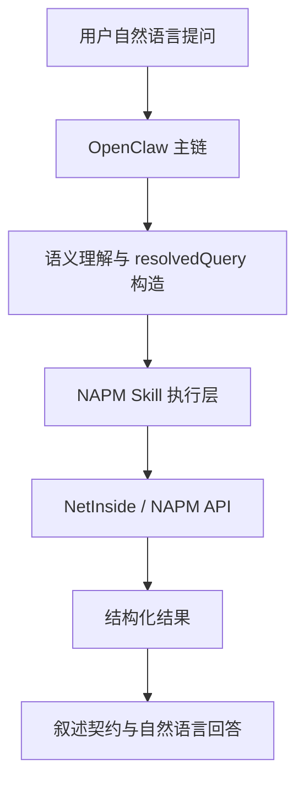
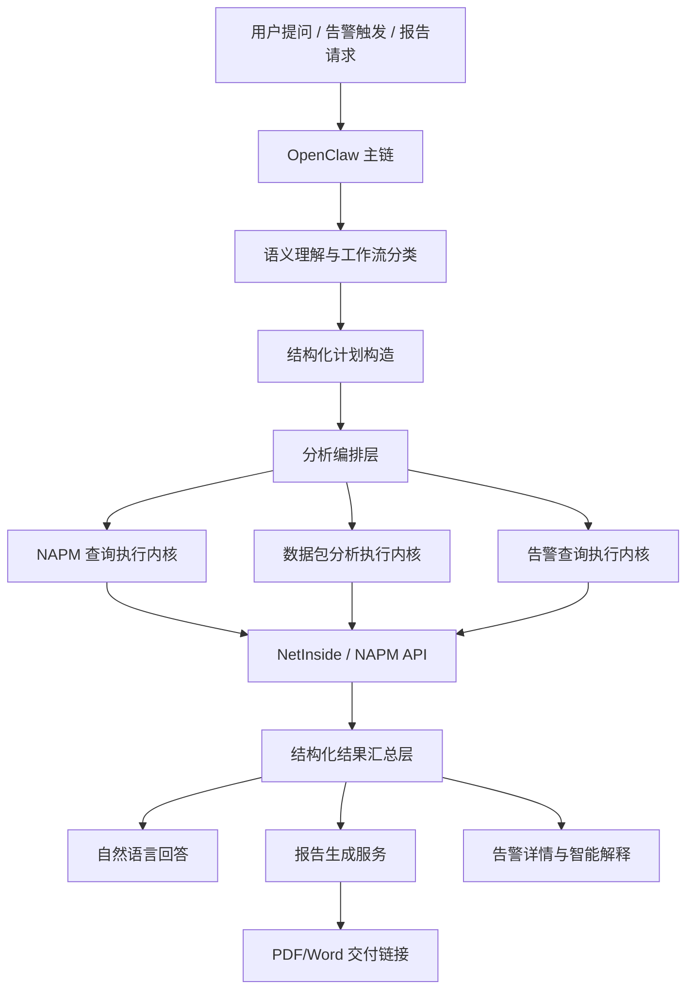
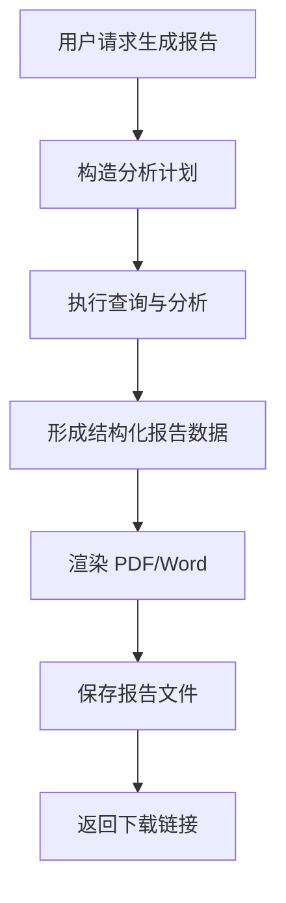
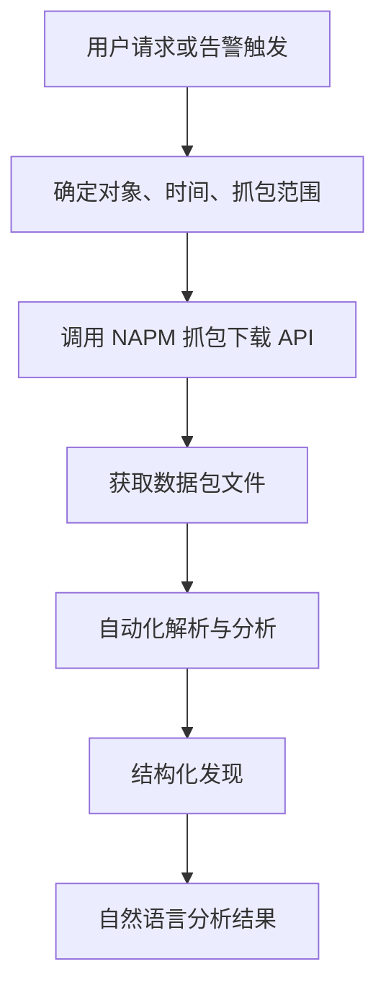
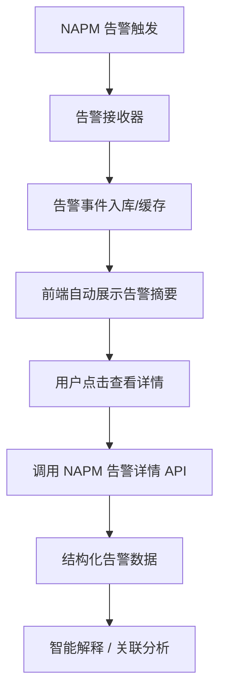

# GAIOP 下一阶段功能融合设计方案

版本：V1.0  
日期：2026-05-26  
适用范围：产品研发、架构演进、研发协同、Codex 开发参考

## 1. 文档目标

本文档面向观枢 GAIOP 下一阶段能力建设，围绕以下四个功能方向给出完整可行的设计方案，并明确它们如何融合进现有基础问答与分析架构中：

1. 复杂问题分析与复合查询分析
2. 自动生成分析报告
3. 数据包自动化分析
4. 告警接收、查看与智能解释

本文档目标不是给出零散功能点说明，而是建立一套可直接指导研发落地的统一方案，使后续开发能沿着现有 GAIOP 架构自然扩展，而不是演化成新的平行系统。

---

## 2. 当前基础能力现状

目前 GAIOP 已基本完成以下基础能力：

- 基于 OpenClaw 的自然语言问答入口
- NAPM 对象、指标、时间、服务模式的基础语义理解
- 基于 `resolvedQuery` 的结构化查询执行
- metadata / topValues / averageValues / timeValues / overview 等基础能力
- 业务、应用、业务组、下钻路径、指标清单等问答能力
- 基础 narration contract 与最终中文回答生成

当前基础架构可以概括为：



下一阶段新增能力，应全部建立在这条主链之上，而不是旁路实现。

---

## 3. 下一阶段总体建设目标

下一阶段的核心目标是把 GAIOP 从“查询问答系统”升级为“智能分析与交付平台”。

重点升级包括：

- 从单步查询提升到复杂多步分析
- 从即时回答提升到结构化报告交付
- 从指标分析扩展到数据包分析
- 从用户主动提问扩展到告警主动触发与联动分析

整体目标如下：

1. 支持复杂关联分析  
2. 支持报告化交付  
3. 支持更底层的数据包级智能分析  
4. 支持告警驱动的问题发现与解释  
5. 保持现有自然语言交互体验不变  
6. 保持统一主链与统一对象模型，不引入新的架构割裂

---

## 4. 融合原则

为避免新增功能破坏现有架构，后续所有能力应遵循以下原则：

### 4.1 单一入口原则

所有用户交互、告警联动、报告生成、数据包分析请求，都统一通过 OpenClaw 主链进入，不允许各功能直接绕过主链自行解释用户意图。

### 4.2 单一对象模型原则

业务、应用、工作组、IP、会话、页面族、用户、自动识别应用等对象，统一使用现有对象本体，不允许新功能自行定义新口径。

### 4.3 单一结构化查询原则

新增复杂分析也必须先落成结构化中间表示，而不是直接在自然语言层串多个 API。

### 4.4 分层执行原则

每个功能都应拆为：

- 语义理解层
- 结构化计划层
- 执行层
- 结果汇总层
- 交付层

### 4.5 调试与正式输出分离原则

研发调试链路可保留，但不能污染正式用户答案、报告内容和告警详情输出。

---

## 5. 下一阶段总体架构

建议在现有架构基础上，引入“分析编排层”和“交付扩展层”。

### 5.1 总体架构图



### 5.2 新增核心层

建议新增两层：

- `Analysis Orchestration Layer`
  负责复杂分析、多步分析、复合查询的组织与调度

- `Delivery Layer`
  负责报告生成、附件输出、下载链接与结果分发

---

## 6. 功能一：复杂问题分析与复合查询分析

### 6.1 目标

支持如下问题：

- 某个应用慢的根因分析
- 某个业务系统异常的综合分析
- 对单个对象做整体诊断
- 对多个对象进行横向对比分析
- 先找异常对象，再自动展开分析

这类问题的特点是：

- 不是单一查询
- 存在对象、指标、时间、上下文的关联
- 需要多步查询与结果归纳
- 最终输出的是“分析结论”，而不是单个数值

### 6.2 核心设计

建议新增：

- `AnalysisPlanBuilder`
- `CompositeAnalysisExecutor`
- `InsightSynthesizer`

### 6.3 工作方式

复杂分析问题不再直接映射到一个 API，而是映射成“分析计划”。

建议引入统一结构：

```json
{
  "workflowType": "composite_analysis",
  "analysisType": "root_cause_analysis",
  "targetObjects": [
    {
      "type": "WebApplication",
      "argument": "可观测239web"
    }
  ],
  "analysisSteps": [
    {
      "stepType": "overview",
      "goal": "baseline_summary"
    },
    {
      "stepType": "metric_topn",
      "goal": "find_top_error_clients"
    },
    {
      "stepType": "metric_average",
      "goal": "response_time_check"
    },
    {
      "stepType": "metric_timeseries",
      "goal": "recent_change_trend"
    }
  ]
}
```

### 6.4 分析步骤建议

复杂分析可拆成标准步骤模板：

- `baseline_summary`
  获取对象整体状态

- `error_breakdown`
  错误类型与错误对象拆解

- `latency_breakdown`
  时延、响应时间、连接性能拆解

- `traffic_breakdown`
  流量、吞吐、用户访问、页面访问拆解

- `trend_check`
  近期趋势判断

- `peer_compare`
  与同类对象对比

- `downstream_context`
  沿 drill-down 路径展开上下文

### 6.5 输出形态

复杂分析的回答应不是流水账，而应统一为：

1. 结论摘要
2. 关键发现
3. 支撑证据
4. 建议动作

### 6.6 多对象综合分析

支持：

- 比较多个业务系统的访问、错误、性能差异
- 对多个工作组做横向评估
- 对多个应用输出优先级排序

建议统一结构：

```json
{
  "analysisType": "comparative_analysis",
  "targetObjects": [...],
  "comparisonDimensions": ["traffic", "latency", "errors", "stability"]
}
```

### 6.7 价值

该能力使 GAIOP 从“智能查询”升级为“智能分析助手”，可直接承担一部分初级分析师和运维工程师的工作。

---

## 7. 功能二：自动生成分析报告

### 7.1 目标

在交互界面中，系统不仅返回即时答案，还能生成完整报告，并给出 PDF 或 Word 的下载链接。

推荐默认输出 PDF，原因：

- 展现稳定
- 适合留档与外发
- 不易因编辑环境变化导致样式错乱

Word 可作为扩展选项，用于需要二次编辑的场景。

### 7.2 报告类型

建议分三类：

- `quick_report`
  单次提问的快速分析报告

- `diagnostic_report`
  针对单对象或单事件的深度分析报告

- `comparative_report`
  针对多对象横向分析的对比报告

### 7.3 设计方式

建议新增：

- `ReportPlanBuilder`
- `ReportRenderer`
- `ReportArtifactService`

### 7.4 报告内容结构

推荐统一模板：

1. 报告标题
2. 问题背景
3. 分析范围
4. 数据时间
5. 核心结论
6. 详细发现
7. 指标图表
8. 对象清单或对比对象
9. 风险判断
10. 建议动作
11. 附录（原始指标摘要）

### 7.5 报告生成流程



### 7.6 实现建议

研发使用 Codex 开发时，可优先采用：

- Markdown/HTML 作为中间报告模板
- Headless 浏览器或标准 PDF 渲染引擎导出 PDF
- 将文件统一放在受控输出目录
- 前端展示短期有效链接或内部下载 URL

### 7.7 数据来源

报告内容统一从：

- 当前分析结果
- narration contract
- 图表数据结构

生成，不直接拼接原始日志式文本。

### 7.8 价值

自动报告能力可支持：

- 故障留档
- 会议汇报
- 运维复盘
- 管理摘要
- 对客户/内部团队的正式交付

---

## 8. 功能三：数据包自动化分析

### 8.1 目标

NAPM 已保存各地址或相关对象的数据包，并提供标准化下载 API。GAIOP 应接入该能力，对数据包进行自动化分析，并返回分析结果。

### 8.2 典型场景

- 某个地址为什么慢，查看对应数据包
- 某业务存在重传，分析抓包结果
- 某告警触发后，自动拉取相关数据包做二次解释
- 用户手动指定时间与对象，请求自动化抓包分析

### 8.3 功能定位

数据包分析不替代 NAPM 指标分析，而是作为更底层的补充分析能力。

建议在系统中定义为：

- `packet_analysis`

作为独立 workflow。

### 8.4 核心设计

建议新增：

- `PacketCaptureLocator`
- `PacketArtifactFetcher`
- `PacketAnalysisExecutor`
- `PacketInsightSynthesizer`

### 8.5 执行流程



### 8.6 分析内容建议

数据包分析至少支持：

- 会话基本信息提取
- 协议识别
- RTT / 重传 / 丢包线索
- 连接建立异常
- HTTP/TLS 基本异常线索
- 请求/响应时序特征
- 明显超时、重传、握手失败等模式识别

### 8.7 技术实现建议

研发用 Codex 开发时，建议分两层：

1. `packet fetch layer`
   只负责下载、缓存、文件管理

2. `packet analysis layer`
   负责调用标准工具链或分析模块做解析

建议分析结果统一输出为结构化 JSON，再交给 OpenClaw 生成自然语言。

### 8.8 与复杂分析联动

复杂分析发现“应用慢、连接异常、重传偏高”后，可自动建议或自动触发数据包分析。

### 8.9 价值

该能力能把 GAIOP 从指标层智能分析进一步扩展到包级智能诊断，显著提升故障定位深度。

---

## 9. 功能四：告警接收、查看与智能解释

### 9.1 目标

NAPM 已具备内置告警与手工定义告警能力，GAIOP 应支持：

- 实时接收告警
- 前端自动展示告警消息
- 点击查看告警详情
- 对告警进行智能解释
- 对告警触发自动关联分析

### 9.2 功能范围

建议分为四类能力：

- `alert_ingestion`
  告警接收

- `alert_listing`
  告警列表查看

- `alert_detail`
  告警详情查看

- `alert_analysis`
  告警智能解释与联动分析

### 9.3 核心设计

建议新增：

- `AlertEventReceiver`
- `AlertQueryService`
- `AlertNarrationService`
- `AlertLinkedAnalysisService`

### 9.4 执行流程



### 9.5 告警详情内容建议

建议展示：

- 告警名称
- 告警级别
- 告警对象
- 触发时间
- 触发条件
- 当前状态
- 关联指标
- 原始告警描述
- 智能解释结果

### 9.6 告警智能解释

AI 可在告警详情基础上补充：

- 这类告警意味着什么
- 可能影响哪些对象
- 当前最值得继续看的指标是什么
- 是否建议进一步做 overview / packet analysis

### 9.7 告警联动分析

建议支持：

- 打开告警详情时自动触发对象 overview
- 对严重告警自动生成简版分析摘要
- 对关键告警一键生成 PDF 报告

### 9.8 价值

告警能力接入后，GAIOP 将从“被动问答系统”升级为“主动感知与解释系统”。

---

## 10. 四大功能与现有架构的融合方式

### 10.1 统一工作流分类

在现有 workflow 基础上新增：

- `composite_analysis`
- `report_generation`
- `packet_analysis`
- `alert_detail`
- `alert_analysis`

### 10.2 统一结构化计划层

建议在现有 `resolvedQuery` 之外，引入更上层的：

- `analysisPlan`
- `reportPlan`
- `packetAnalysisPlan`
- `alertAnalysisPlan`

这些计划对象负责组织多步执行；底层具体查询仍落为一个或多个 `resolvedQuery`。

### 10.3 统一结果汇总层

所有新能力都应输出统一结构：

```json
{
  "summary": {},
  "structuredFindings": [],
  "supportingEvidence": [],
  "artifacts": [],
  "nextActions": []
}
```

### 10.4 统一交付层

最终都通过：

- 即时自然语言答案
- 报告链接
- 告警详情页面
- 附件分析链接

进行统一交付。

---

## 11. 建议新增模块清单

建议研发新增以下模块：

- `WorkflowClassifier`
- `AnalysisPlanBuilder`
- `CompositeAnalysisExecutor`
- `InsightSynthesizer`
- `ReportPlanBuilder`
- `ReportRenderer`
- `ReportArtifactService`
- `PacketCaptureLocator`
- `PacketArtifactFetcher`
- `PacketAnalysisExecutor`
- `PacketInsightSynthesizer`
- `AlertEventReceiver`
- `AlertQueryService`
- `AlertNarrationService`
- `AlertLinkedAnalysisService`
- `AnswerModeRouter`

---

## 12. 对现有模块的改造建议

### 12.1 OpenClaw 主链

增强：

- 支持更多 workflow 分类
- 支持 `analysisPlan` 和 `reportPlan` 的调用编排

### 12.2 NAPM Skill

增强：

- 支持多步查询编排
- 支持结果汇总与洞察输出
- 支持报告数据结构输出
- 支持 packet 与 alert 能力的统一执行入口

### 12.3 Metadata 与执行层

增强：

- 保持 metadata 与 metric 内核分离
- 为 packet 和 alert 增加新的执行内核

### 12.4 输出层

增强：

- 支持即时答案与报告链接混合输出
- 支持告警详情和分析摘要输出
- 支持正式态与调试态隔离

---

## 13. Codex 研发协作建议

由于研发使用 Codex 开发，建议后续协作方式如下：

### 13.1 以文档驱动模块开发

所有新增模块先有设计文档，再有代码实现。

### 13.2 以统一契约驱动开发

重点沉淀：

- workflow 类型定义
- plan 对象定义
- unified result schema
- artifact schema

### 13.3 以测试矩阵驱动回归

建议为每类能力建立独立测试矩阵：

- complex analysis tests
- report generation tests
- packet analysis tests
- alert detail tests

### 13.4 以分阶段落地推进

推荐分三阶段：

#### 第一阶段

- 复杂分析能力
- 报告生成基础链路

#### 第二阶段

- 数据包分析链路
- 告警接收与详情查看

#### 第三阶段

- 告警联动复杂分析
- 一键报告
- 自动化分析增强

---

## 14. 回归验收建议

### 14.1 复杂分析验收

- 单对象慢根因分析
- 多对象横向综合分析
- discovery + focused analysis

### 14.2 报告验收

- 能正确生成 PDF
- 报告内容与当前分析一致
- 下载链接可打开

### 14.3 数据包分析验收

- 能正确下载抓包文件
- 能输出结构化分析结果
- 能生成自然语言说明

### 14.4 告警验收

- 告警能自动接收
- 前端能看到告警摘要
- 点击能查看详情
- 告警解释与原始数据一致

---

## 15. 预期产品价值

完成上述四大功能后，GAIOP 将从“自然语言查询系统”升级为“智能观测分析平台”，其价值包括：

- 提升复杂问题分析效率
- 提升故障定位深度
- 提升分析结果交付能力
- 提升告警处理效率
- 提升平台智能化程度
- 提升产品差异化竞争力

---

## 16. 结论

下一阶段四项能力不是孤立功能，而是 GAIOP 从基础问答走向智能分析平台的关键升级。

建议研发严格沿现有统一架构演进：

- 保持自然语言入口
- 保持统一对象模型
- 保持统一 workflow 分类
- 保持结构化计划与结构化执行
- 保持统一结果汇总与统一交付

只有这样，新增的复杂分析、报告、数据包分析和告警能力，才能真正融合成一个完整、稳定、可扩展的产品体系。
